

  <h1 style="text-align: center;font-weight: bold">Praktikum 1 SysOp</h1>
  <h4 style="text-align: center;">Dosen Pengampu : Dr. Ferry Astika Saputra, S.T., M.Sc.</h4>

 

  
  <h3 style="text-align: center;">Disusun Oleh : </h3>
  

    <strong>Mochammad Fahril Rizal (3123500013)</strong> 
    <strong>Adrian Yoga Chrisarianto (3123500021)</strong> 
    <strong>Muhammad Arief Wicaksono Putra Santoso (3122500022)</strong>
  

<h3 style="text-align: center;line-height: 1.5">Politeknik Elektronika Negeri Surabaya Departemen Teknik Informatika Dan Komputer Program Studi Teknik Informatika 2023/2024</h3>
  

## Daftar Isi
1. [Pendahuluan](#about-os-debian-12)
1. [Soal 1](#1-sebutkan-proses-booting)
2. [Soal 2](#2-bagaimana-cara-install-debian-12-di-virtual-machine)
3. [Referensi](#referensi)

# About OS Debian 12
Sistem operasi (OS) adalah program yang, setelah pertama kali dimuat ke komputer melalui program boot, mengelola semua program aplikasi lain di komputer. Program aplikasi memanfaatkan sistem operasi dengan membuat permintaan layanan melalui antarmuka program aplikasi yang ditentukan ( API ). Selain itu, pengguna dapat berinteraksi langsung dengan sistem operasi melalui antarmuka pengguna, seperti antarmuka baris perintah (CLI) atau UI grafis (GUI).   
Debian adalah sebuah sistem operasi berbasis Linux yang berisi perangkat lunak bebas dan sumber terbuka untuk komputer. Debian, yang dikembangkan oleh komunitas sukarelawan dari seluruh dunia, menekankan kebebasan perangkat lunak, kestabilan, dan keamanan. Sistem manajemen paket Debian, yang dikenal sebagai "dpkg" dan "APT", menawarkan berbagai paket perangkat lunak yang dapat diinstal dan dikelola.

# SOAL
### 1. Sebutkan proses booting
**Jawab:**
## Proses Booting

Proses booting adalah proses awal saat sebuah komputer atau perangkat sistem dimulai dan memuat sistem operasi serta perangkat lunak yang diperlukan untuk menjalankan perangkat tersebut. Berikut adalah langkah-langkah umum dalam proses booting sebuah komputer:

1. Power On: 
Komputer dinyalakan atau direstart.

2. POST (Power-On Self-Test): 
Pada tahap ini, BIOS (Basic Input/Output System) atau UEFI melakukan beberapa pemeriksaan untuk memastikan bahwa perangkat keras dasar berfungsi dengan baik. Ini termasuk menguji memori, menguji perangkat keras seperti drive disk, keyboard, dan mouse, serta mengecek keberadaan dan keutuhan BIOS atau UEFI itu sendiri.

3. Inisialisasi Perangkat Keras: 
Setelah melewati POST dengan berhasil, BIOS atau UEFI mulai menginisialisasi perangkat keras seperti kartu grafis, disk drive, dan perangkat lainnya. Proses ini melibatkan pengenalan perangkat keras yang terpasang dan menyediakannya untuk sistem operasi untuk digunakan.

4. Boot Loader: 
Setelah inisialisasi perangkat keras selesai, BIOS atau UEFI mencari boot loader di media penyimpanan yang telah ditentukan, biasanya hard drive atau SSD. Jika ada beberapa sistem operasi yang terinstal, pemuat boot, seperti GRUB (Grand Unified Bootloader) untuk sistem Linux, memungkinkan pengguna untuk memilih sistem operasi mana yang akan dimuat. Selanjutnya, loader boot memuat kernel sistem operasi yang dipilih ke dalam memori.

5. Kernel Pemuatan: 
Kernel sistem operasi, seperti kernel Linux, dimuat ke dalam memori setelah boot loader memilih sistem operasi yang akan dimuat. Manajemen perangkat keras, alokasi sumber daya, dan menjalankan berbagai tugas yang diperlukan untuk menginisialisasi sistem adalah semua tanggung jawab kernel.

6. Process Init: 
Proses inicialisasi diluncurkan setelah kernel dimuat. Proses init, yang berjalan setelah kernel, bertanggung jawab untuk menginisialisasi sistem dan menjalankan proses yang diperlukan.

7. Ruang Pengguna: 
Setelah proses init selesai, sistem operasi memulai menjalankan berbagai proses di ruang pengguna. Ini termasuk layanan sistem, program pengguna, dan, jika diperlukan, antarmuka grafis.

8. Prompt Login atau GUI: 
Pada akhirnya, pengguna dapat melihat prompt login untuk sistem berbasis teks atau antarmuka grafis (GUI) jika diaktifkan, dan memulai sesi dengan masuk ke dalam sistem.

### 2. Bagaimana cara install debian 12 di virtual machine
**Jawab:**
## Installation
1. Masuk ke link downloaad virtualbox dan klik download

2. Pilih sesuai **Sistem Oprasi Device** anda,
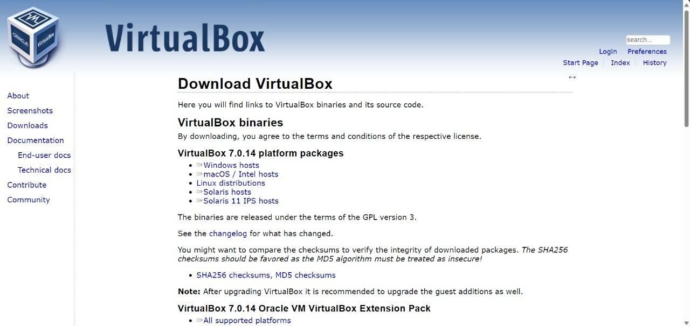

3. Buka **VirtualBox** anda, dan klik **yes**

4. Klik **Next**

5. Lanjut Klik **Instal** 

6. Tunggu hingga proses selesai

7. Selanjutnya klik **Finish**

8. Anda berhasil masuk ke **VirtualBox**, klik icon + **Add** 

9. Isikan **Nama**, dan masukan file **iso**

10. Atur Base Memory menjadi **4096mb**, dan processor menjadi **2 CPU**, klik **next**

11. Selanjutnya atur Djsk Size menjadi **25GB**, dan klik **next**

13. Klik **FInish**

14. Pilih English lalu klik **continue**

15. Pilih **other**

16. Pilih **Asia**

17. Pilih **Indonesia**

18. Pilih **United States**
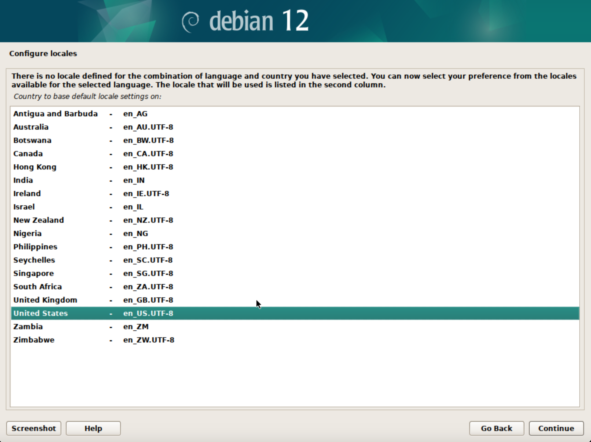

19. Pilih **American English**
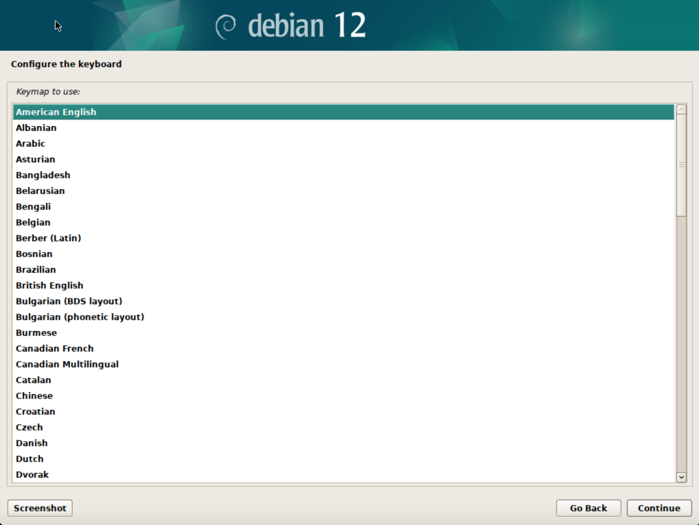

20. Tunggu hingga proses selesai

21. Tuliskan **Hostname** anda

22. klik **continue**
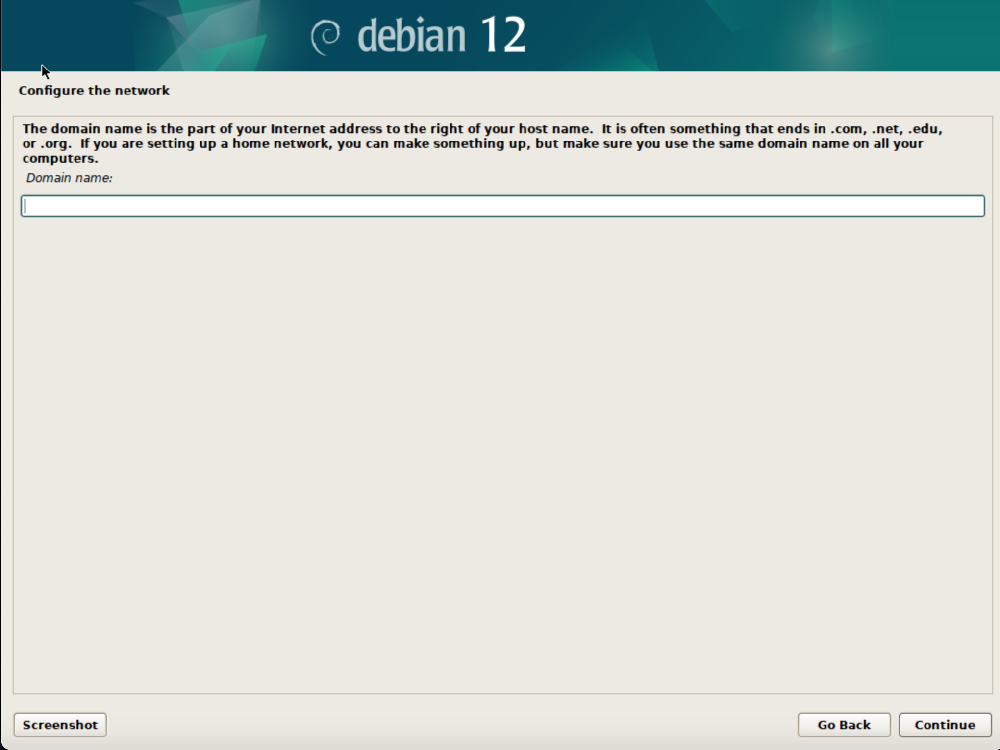

23. Buat **Password** anda, setelah itu klik **continue**
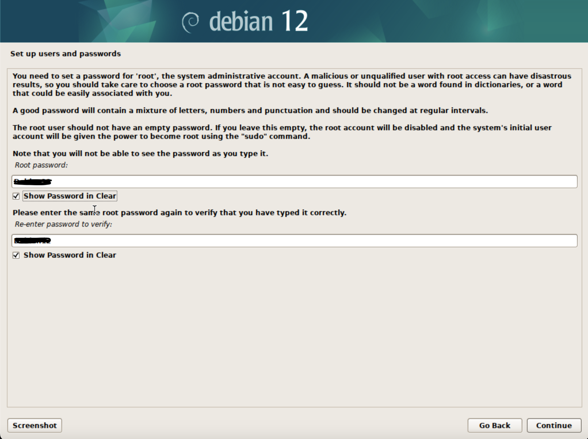

24. Tulis **Nama Lengkap** anda

25. Tuliskan **Username** untuk **account** anda
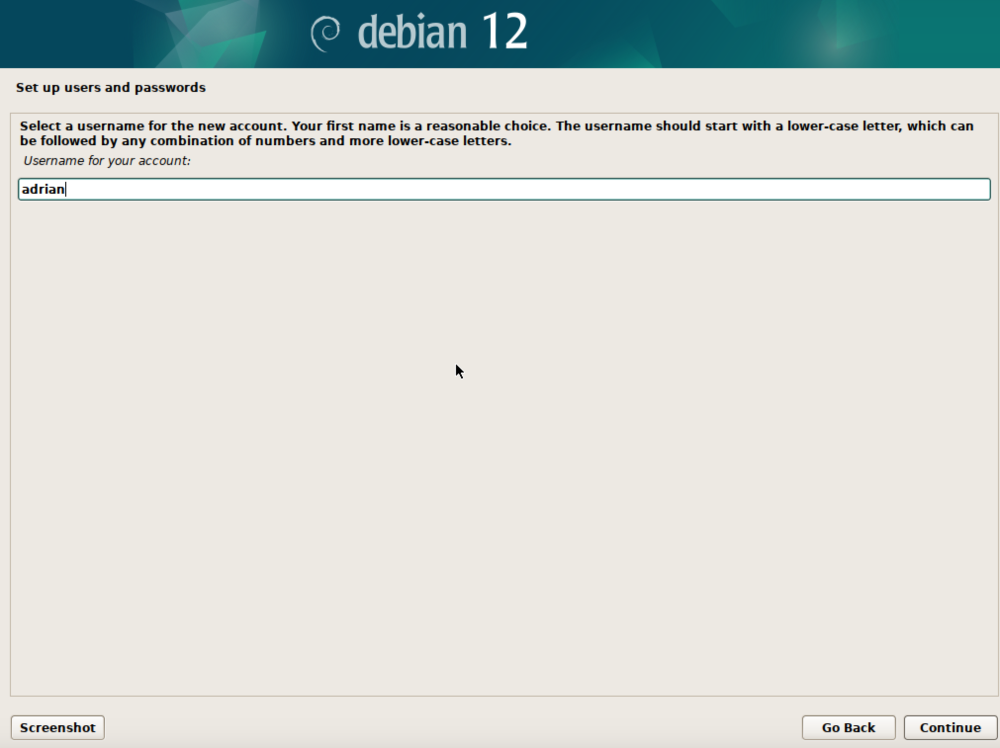

26. Tulis **root password lalu** tekan **continue**

27. Pilih sesuai **zona waktu** anda

28. Pada **Particion method** pilih **manual**

29. Pilih sesuai gambar dibawah

30. Pilih option **yes**, lalu kilik **continue**

31. Pilih sesuai gambar dibawah
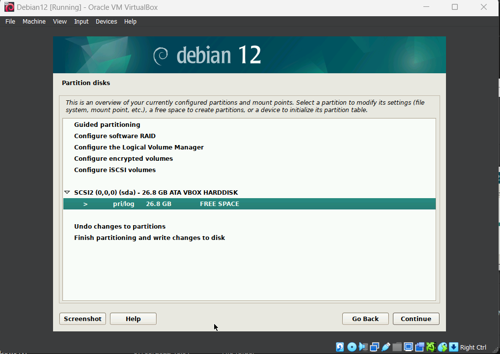

32. Pilih **swao areas**, setelah itu klik **continue**

33. Pilih opsi **Done setting up the partition**

34. Pilih **Finish**

35. Pilih **yes**,lalu klik **continue**
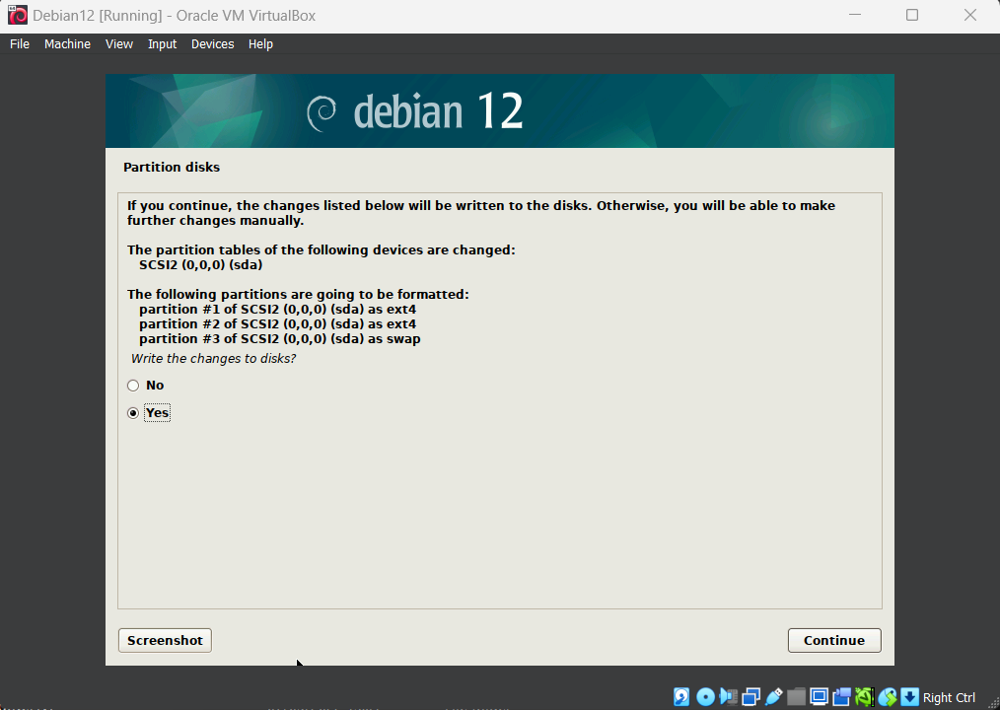

36. Tunggu hingga proses selesai

37. Pilih **no**

38. Pilih option **Indonesia**, lalu klik **continue**

39. Pilih **kebo.pens.ac.id**
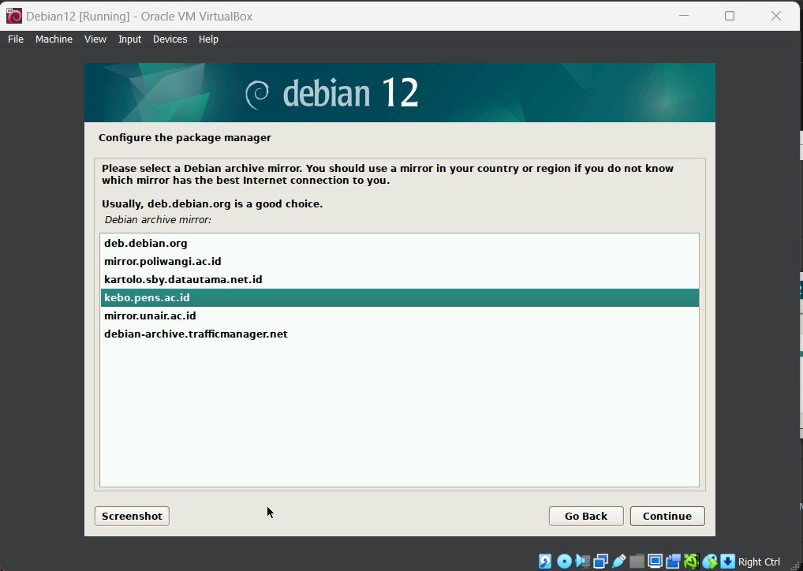

40. Klik **continue**

41. Tunggu hingga proses selesai

42. Pilih option **No**

43. Tunggu hingga proses selesai
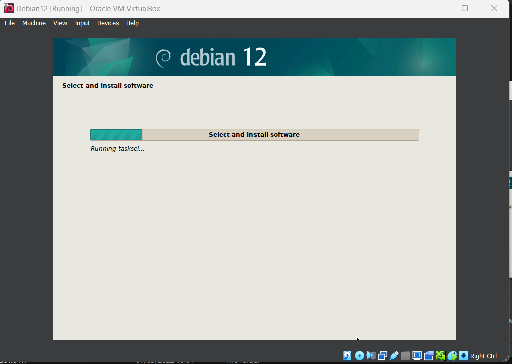

44. pilih option sesuai dengan gambar dibawah ini

45. Tunggu hingga proses selesai

46. Pilih option **yes**, lalu klik **continue**
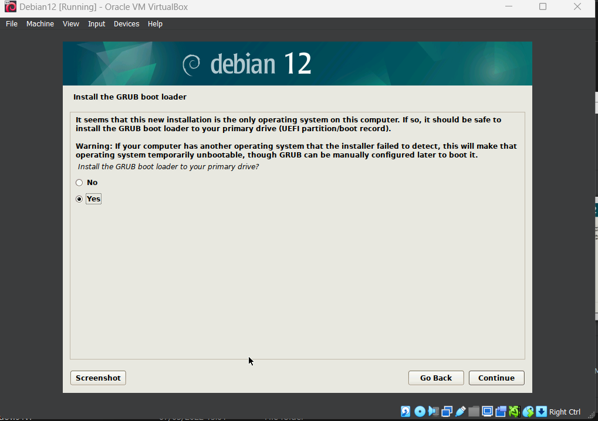

47. Pilih opsi **/dev/sda (ata-VBOX_VBf5fb021a-7667d996)**
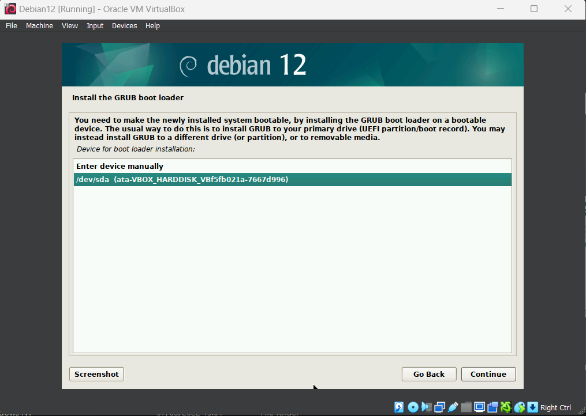

48. Klik **continue**
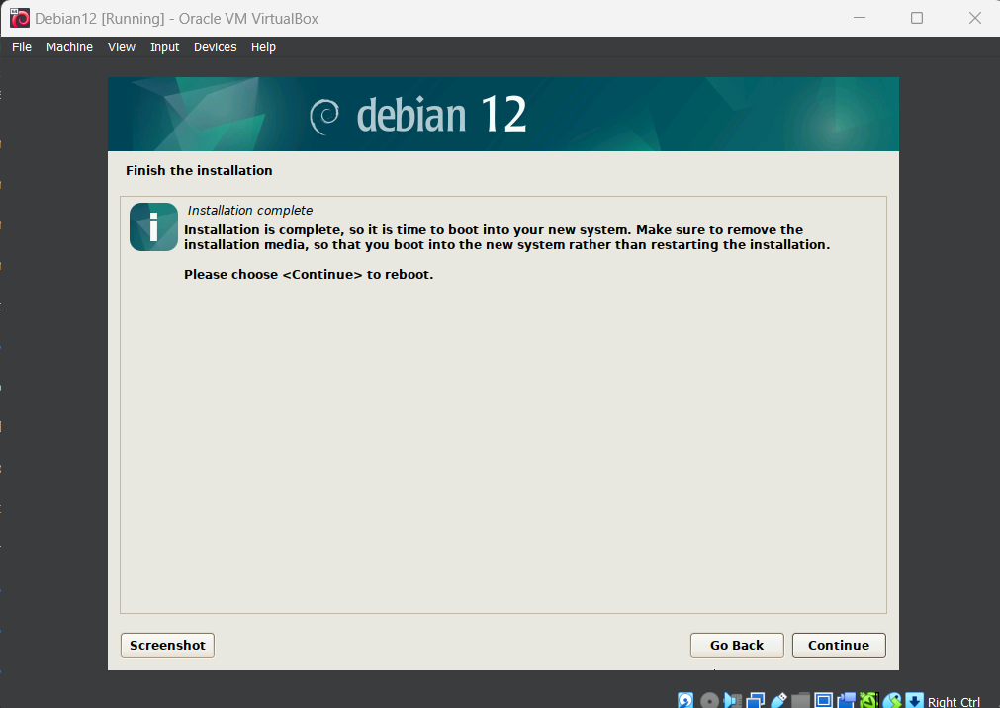

49. Setelah selesai maka tampilan anda akan seperti dibawah ini

## Referensi
- [Apa itu sistem operasi](https://www.techtarget.com/whatis/definition/operating-system-OS)

- [Debian](https://id.wikipedia.org/wiki/Debian)

- [Debian Download](https://www.debian.org/download)

- [VirtualBox Wiki](https://www.virtualbox.org/wiki)

- [VMware Fusion Download](https://customerconnect.vmware.com/downloads/details?downloadGroup=FUS-1350&productId=1375&rPId=110933)

- [Video Tutorial](https://www.youtube.com/watch?v=hoRdh96O9wM)"# DownloadDebian-12" 
"# DownloadDebian-12" 
