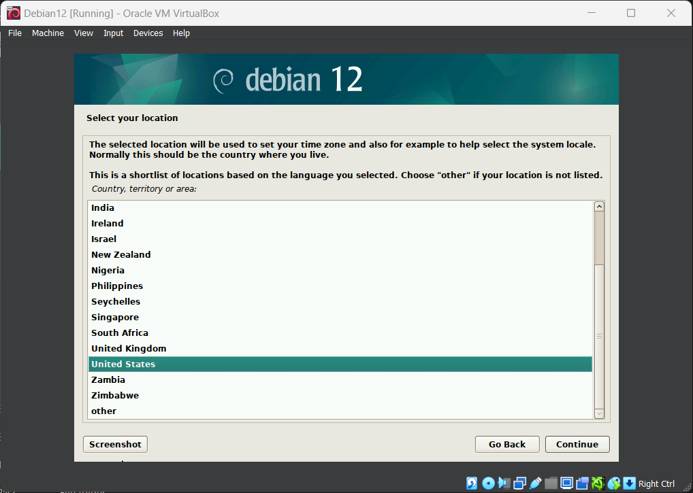

# About Debian 12

Debian adalah sebuah sistem operasi berbasis Linux yang berisi perangkat lunak bebas dan sumber terbuka untuk komputer. Debian, yang dikembangkan oleh komunitas sukarelawan dari seluruh dunia, menekankan kebebasan perangkat lunak, kestabilan, dan keamanan. Sistem manajemen paket Debian, yang dikenal sebagai "dpkg" dan "APT", menawarkan berbagai paket perangkat lunak yang dapat diinstal dan dikelola.

## Proses Booting

Proses booting adalah proses awal saat sebuah komputer atau perangkat sistem dimulai dan memuat sistem operasi serta perangkat lunak yang diperlukan untuk menjalankan perangkat tersebut. Berikut adalah langkah-langkah umum dalam proses booting sebuah komputer:

1. Power On: 
Komputer dinyalakan atau direstart.

2. POST (Power-On Self-Test): 
Pada tahap ini, BIOS (Basic Input/Output System) atau UEFI melakukan beberapa pemeriksaan untuk memastikan bahwa perangkat keras dasar berfungsi dengan baik. Ini termasuk menguji memori, menguji perangkat keras seperti drive disk, keyboard, dan mouse, serta mengecek keberadaan dan keutuhan BIOS atau UEFI itu sendiri.

3. Inisialisasi Perangkat Keras: 
Setelah melewati POST dengan berhasil, BIOS atau UEFI mulai menginisialisasi perangkat keras seperti kartu grafis, disk drive, dan perangkat lainnya. Proses ini melibatkan pengenalan perangkat keras yang terpasang dan menyediakannya untuk sistem operasi untuk digunakan.

4. Boot Loader: 
Setelah inisialisasi perangkat keras selesai, BIOS atau UEFI mencari boot loader di media penyimpanan yang telah ditentukan, biasanya hard drive atau SSD. Jika ada beberapa sistem operasi yang terinstal, pemuat boot, seperti GRUB (Grand Unified Bootloader) untuk sistem Linux, memungkinkan pengguna untuk memilih sistem operasi mana yang akan dimuat. Selanjutnya, loader boot memuat kernel sistem operasi yang dipilih ke dalam memori.

5. Kernel Pemuatan: 
Kernel sistem operasi, seperti kernel Linux, dimuat ke dalam memori setelah boot loader memilih sistem operasi yang akan dimuat. Manajemen perangkat keras, alokasi sumber daya, dan menjalankan berbagai tugas yang diperlukan untuk menginisialisasi sistem adalah semua tanggung jawab kernel.

6. Process Init: 
Proses inicialisasi diluncurkan setelah kernel dimuat. Proses init, yang berjalan setelah kernel, bertanggung jawab untuk menginisialisasi sistem dan menjalankan proses yang diperlukan.

7. Ruang Pengguna: 
Setelah proses init selesai, sistem operasi memulai menjalankan berbagai proses di ruang pengguna. Ini termasuk layanan sistem, program pengguna, dan, jika diperlukan, antarmuka grafis.

8. Prompt Login atau GUI: 
Pada akhirnya, pengguna dapat melihat prompt login untuk sistem berbasis teks atau antarmuka grafis (GUI) jika diaktifkan, dan memulai sesi dengan masuk ke dalam sistem.
## Installation
1. Buka...

## Link Download

[Link download debian 12](https://www.debian.org/download)

[Link download virtualbox](https://www.virtualbox.org/wiki/Downloads)

[Link download VMware fusion](https://customerconnect.vmware.com/downloads/details?downloadGroup=FUS-1350&productId=1375&rPId=110933)

