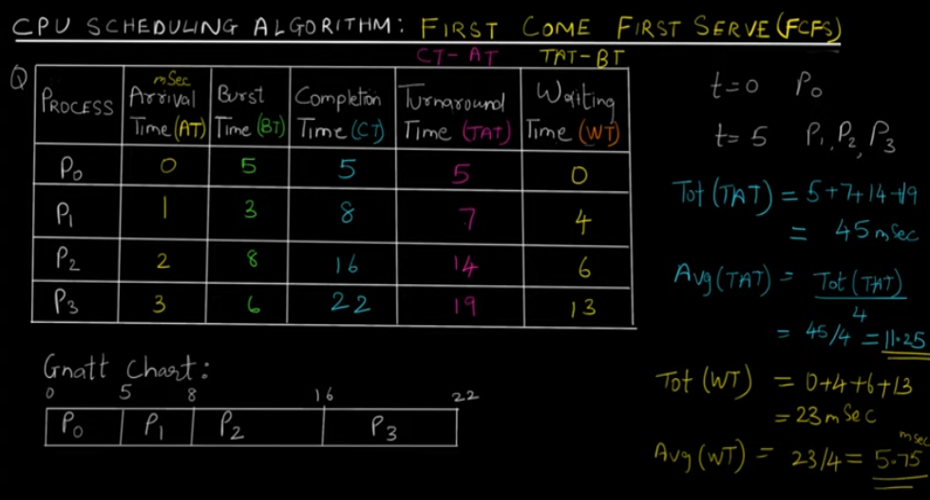
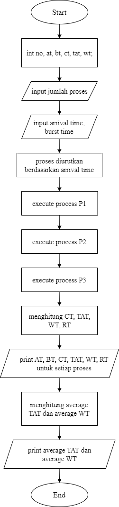
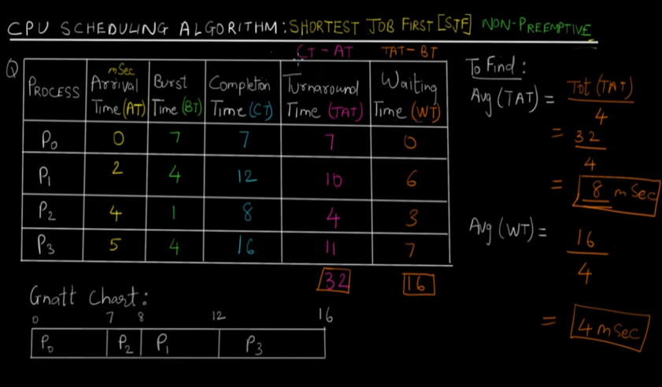
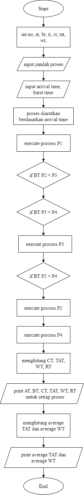
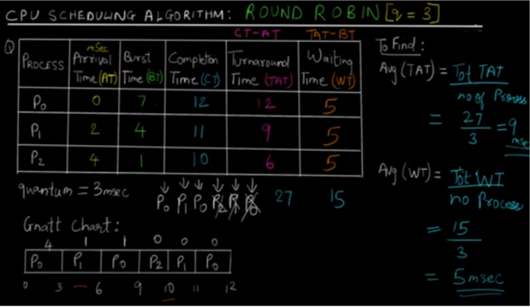
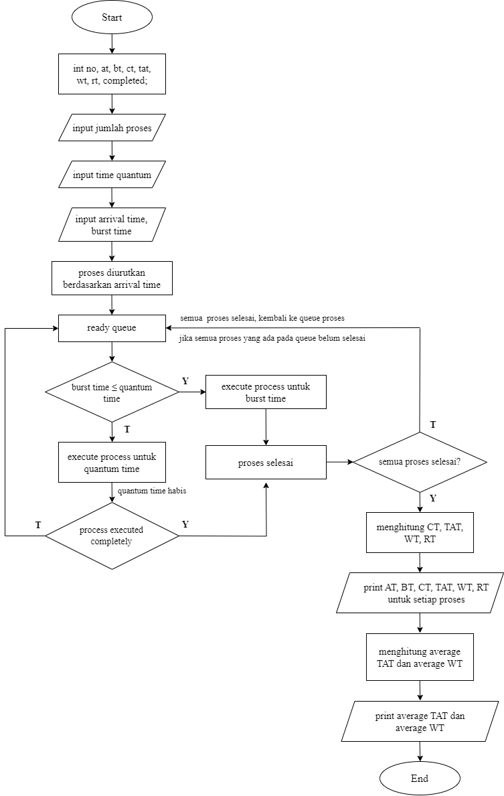

  <h1 style="text-align: center;font-weight: bold">Praktikum 11 Process Scheduling</h1>
  <h4 style="text-align: center;">Dosen Pengampu : Dr. Ferry Astika Saputra, S.T., M.Sc.</h4>

 

  
  <h3 style="text-align: center;">Disusun Oleh : </h3>
  

    <strong>Muhammad Arief Wicaksono Putra Santoso (3123500013)</strong> 
  

<h3 style="text-align: center;line-height: 1.5">Politeknik Elektronika Negeri Surabaya Departemen Teknik Informatika Dan Komputer Program Studi Teknik Informatika 2023/2024</h3>
  

## Scheduling Algorithms

### First-Come First-Serve Algorithm (FCFS)

#### Contoh perhitungan proses secara teori

#### Flowchart FCFS

#### Analisis
First-Come First-Serve (FCFS) Scheduling adalah seperti sistem antrian linier, dimana proses yang pertama datang (arrival time paling awal) akan dijalankan atau dilayani terlebih dahulu, sehingga proses berjalan berurutan. Namun, jika antriannya panjang dan proses yang dilayani memiliki durasi yang tidak merata, maka FCFS bisa menjadi kurang efisien.

--- 

### Shortest Job First (SJF)

#### Contoh perhitungan proses secara teori

#### Flowchart SJF

#### Analisis
Shortest Job First (SJF) Scheduling adalah algoritma penjadwalan yang efektif untuk meminimalkan waktu tunggu rata-rata dan meningkatkan kinerja sistem, terutama ketika terdapat proses dengan burst time yang tidak merata. Proses ini berjalan dengan memprioritaskan jumlah burst time yang paling sedikit dan melihat arrival time nya. Proses berjalannya adalah proses yang pertama kali datang akan di execute sampai selesai dahulu, lalu proses yang ada di ready queue akan dibandingkan manakah yang memiliki burst time yang paling sedikit, akan di-execute. Jika ada kondisi dimana suatu proses memiliki burst time yang sama, maka yang didahulukan adalah proses yang arrival timenya lebih kecil (yang datang lebih dulu).

---

### Round Robin (RR)

#### Contoh perhitungan proses secara teori

#### Flowchart Round Robin

#### Analisis
Round-Robin (RR) Scheduling merupakan salah satu algoritma scheduling pada CPU dimana semua proses yang dijalankan oleh algoritma ini akan dieksekusi secara Cyclic. Dengan kata lain, algoritma ini akan menjalankan suatu proses dalam batas waktu tertentu dan apabila proses tersebut telah berjalan melewati batas waktu yang ditentukan, maka proses ini akan otomatis diberhentikan sementara dan dimasukkan ke dalam antrian proses (queue) yang paling belakang (kemudian algoritma ini akan lanjut menjalankan proses lain dari queue yang paling depan). Dari percobaan diatas, detail output dari queue bagaimana proses berjalan yaitu dimulai dari P1 -> P2 -> P1 -> P3 -> P2.