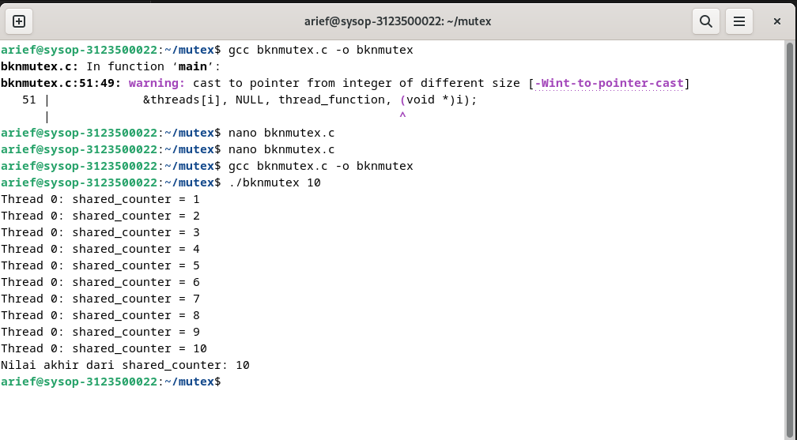
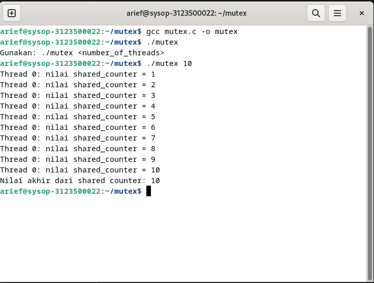

<div align="center">
  <h1 style="text-align: center;font-weight: bold">Praktikum 12<br>MUTEX</h1>
  <h4 style="text-align: center;">Dosen Pengampu : Dr. Ferry Astika Saputra, S.T., M.Sc.</h4>
</div>
<br />
<div align="center">
  
  <h3 style="text-align: center;">Disusun Oleh : </h3>
  <p style="text-align: center;">
    <strong>Muhammad Arief Wicaksono Putra Santoso (3123500022)</strong><br>
  </p>
<h3 style="text-align: center;line-height: 1.5">Politeknik Elektronika Negeri Surabaya<br>Departemen Teknik Informatika Dan Komputer<br>Program Studi Teknik Informatika<br>2023/2024</h3>
  <hr><hr>
</div>

## Daftar Isi
- [Dasar Teori](#dasar-teori)
  - [Program Tanpa Mutex](#program-tanpa-mutex)
  - [Output :](#output-)
  - [Program Dengan Mutex](#program-dengan-mutex)
  - [Output :](#output--1)
  - [Kesimpulan](#kesimpulan)

# Dasar Teori
Mutex, singkatan dari "mutual exclusion," adalah mekanisme sinkronisasi yang digunakan dalam pemrograman multithreaded untuk mencegah dua atau lebih thread mengakses sumber daya bersama (seperti variabel, struktur data, atau perangkat keras) pada saat yang bersamaan. Tujuannya adalah untuk menghindari kondisi balapan (race conditions), yang bisa menyebabkan perilaku yang tidak diinginkan atau tidak terduga pada program.


## Program Tanpa Mutex
```c
// beri komentar
#include <pthread.h>
#include <stdio.h>
#include <stdlib.h>

// Global variable
int shared_counter = 0;

// beri komentar
void *thread_function(void *thread_id)
{
    //menginisiasi threat
    pthread_t tid = (pthread_t)thread_id;

    // Increment global var
    shared_counter++;

    // beri komentar
    printf("Thread %ld: nilai shared_counter = %d\n", (long)tid,
           shared_counter);

    // beri komentar
    return NULL;
}

int main(int argc, char *argv[])
{
    // beri komentar
    if (argc != 2)
    {
        printf("Gunakan: %s <number_of_threads>\n", argv[0]);
        exit(EXIT_FAILURE);
    }
    // mengambil nilai masukan jumlha dari thread melalui argumen
    int num_threads = atoi(argv[1]);

    // beri komentar
    pthread_t *threads = (pthread_t *)malloc(
        num_threads * sizeof(pthread_t));

    // membuat threads
    for (int i = 0; i < num_threads; i++)
    {
        int status = pthread_create(&threads[i], NULL,
                                    thread_function,
                                    (void *)threads[i]);
        if (status != 0)
        {
            printf("Error: pthread_create() returned error "
                   "code %d\n",
                   status);
            exit(EXIT_FAILURE);
        }
    }

    // Wait for all threads to finish execution
    for (int i = 0; i < num_threads; i++)
    {
        int status = pthread_join(threads[i], NULL);
        if (status != 0)
        {
            printf("Error: pthread_join() returned error "
                   "code %d\n",
                   status);
            exit(EXIT_FAILURE);
        }
    }

    // Free the memory allocated for the thread IDs
    free(threads);

    // Print the final value of the shared counter
    printf("Nilai akhir dari shared counter: %d\n",
           shared_counter);

    // Return success
    return 0;
}
```

## Output : 



## Program Dengan Mutex
```c
#include <pthread.h>
#include <stdio.h>
#include <stdlib.h>


int shared_counter = 0;

pthread_mutex_t shared_counter_mutex = PTHREAD_MUTEX_INITIALIZER;


void *thread_function(void *thread_id)
{
    
    long tid = (long)thread_id;

  
    pthread_mutex_lock(&shared_counter_mutex);

    
    shared_counter++;


    printf("Thread %ld: shared_counter = %d\n", tid,
           shared_counter);

    pthread_mutex_unlock(&shared_counter_mutex);

   
    return NULL;
}

int main(int argc, char *argv[])
{
   
    if (argc != 2)
    {
        printf("Penggunaan %s <number_of_threads>\n", argv[0]);
        exit(EXIT_FAILURE);
    }

   
    int num_threads = atoi(argv[1]);

    pthread_t *threads = (pthread_t *)malloc(
        num_threads * sizeof(pthread_t));


    for (int i = 0; i < num_threads; i++)
    {
        int status = pthread_create(
            &threads[i], NULL, thread_function, (void *)i);
        if (status != 0)
        {
            printf("Error: pthread_create() returned error "
                   "code %d\n",
                   status);
            exit(EXIT_FAILURE);
        }
    }

   
    for (int i = 0; i < num_threads; i++)
    {
        int status = pthread_join(threads[i], NULL);
        if (status != 0)
        {
            printf("Error: pthread_join() returned error "
                   "code %d\n",
                   status);
            exit(EXIT_FAILURE);
        }
    }

    // Free the memory untuk thread IDs
    free(threads);

    
    printf("Nilai akhir dari shared_counter: %d\n",
           shared_counter);

    // Return success
    return 0;

}
```

## Output : 



## Kesimpulan
Mutex (mutual exclusion) adalah mekanisme sinkronisasi penting dalam pemrograman multithreaded yang mencegah kondisi balapan dengan memastikan bahwa hanya satu thread dapat mengakses sumber daya bersama pada satu waktu. Ini dilakukan melalui operasi penguncian (lock) dan pembukaan kunci (unlock). Meskipun mutex menambahkan overhead performa, penggunaannya esensial untuk menjaga integritas data dan mencegah hasil yang tidak konsisten.