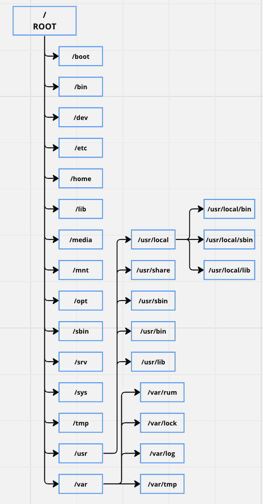

## 1. Standar Struktur Direktori dari Debian

## Pengenalan
Di Windows, Anda menggunakan format ini untuk mengakses direktori

D:\Folder\subfolder\file.txt

Di Linux, ini adalah format dasar

/Folder/subfolder/file.txt

Linux memiliki garis miring ke depan, tidak seperti Windows. Selain itu, di Linux, nama drive (C:, D:, dll.) tidak ada. Saat boot, "partisi root" dipasang di /. Semua file, folder, perangkat, dan drive dipasang di bawah /. Meskipun contoh ini tidak terlihat secara eksplisit, penting untuk diingat bahwa file dan folder Linux sensitif terhadap huruf besar-kecil.

/Folder/subfolder/file.txt tidak sama dengan /folder/subfolder/file.txt

## Gambaran Struktur Direktori Linux
Di Unix dan Linux, struktur direktori terpadu menggabungkan semua direktori di bawah "sistem file root". Tidak peduli apakah sistem file dipasang secara fisik, semua direktori diatur secara hierarkis di bawah sistem file root.

Meskipun sebagian besar distribusi Linux terkadang menyimpang dari standar, struktur direktori Linux mengikuti "Struktur Hierarki Direktori (FHS)" yang diawasi oleh Free Standards Group.

**"/" Akar**

Struktur Direktori dimulai dengan sistem file Root "/" dan memang direktori root untuk seluruh struktur. Partisi di mana / (direktori root) akan ditempatkan pada sistem yang kompatibel dengan UNIX atau UNIX.

**/boot**

Direktori /boot berisi file Boot loader termasuk Grub atau Lilo, Kernel, initrd dan file konfigurasi system.map

**/sys**

Ini berisi Kernel, Firmware dan file terkait sistem.

**/sbin**

Berisi Binari Sistem penting dan alat Administrasi Sistem yang penting untuk operasi dan kinerja sistem

**/sasi**

Berisi binari penting untuk pengguna dan utilitas yang diperlukan dalam mode pengguna tunggal. Contohnya, termasuk kucing, ls, cp dll.

**/lib**

Berisi file perpustakaan untuk semua binari yang disimpan di direktori /sbin & /bin

**/dev**

Direktori /dev berisi file dan driver sistem penting.

**/dll**

Direktori /etc/ berisi file konfigurasi Sistem penting termasuk /etc/hosts, /etc/resolv.conf, nsswitch.conf, default dan file konfigurasi jaringan. Ini sebagian besar adalah file konfigurasi sistem dan aplikasi khusus host.

**/rumah**

Semua direktori rumah pengguna disimpan di bawah direktori ini dengan pengecualian direktori rumah root yang disimpan di bawah direktori /root. Direktori ini menyimpan file pengguna, pengaturan pribadi seperti .profile, dll.

**/media**

Titik pemasangan umum untuk media yang dapat dilepas seperti CD-ROM, USB, Floppies dll

**/mnt**

Titik pemasangan umum untuk sistem file sementara. Ini berguna terutama ketika pemecahan masalah dari CDROM dll di mana Anda mungkin harus memasang sistem file Root dan mengedit konfigurasi.

**/memipisi**

Direktori yang jarang digunakan di Linux untuk Paket Perangkat Lunak Opsional. Ini banyak digunakan di UNIX OS seperti Sun Solaris di mana paket perangkat lunak diinstal

**/usr**

Sub hierarki ke sistem file root yang merupakan direktori data Pengguna. Berisi utilitas dan aplikasi khusus pengguna. Anda akan melihat lagi banyak sistem file yang penting tetapi tidak kritis dipasang. Di sini Anda akan menemukan lagi direktori bin, sbin & lib yang berisi pengguna non-kritis dan binari sistem dan perpustakaan terkait dan direktori berbagi. Juga ditemukan di sini adalah direktori termasuk dengan termasuk file

**/usr/sbin**

Berisi binari sistem non-esensial Non-kritis dan utilitas jaringan

**/usr/bin**

Berisi binari perintah Non-Essential Non-critical untuk pengguna.

**/usr/lib**

File perpustakaan untuk binari di direktori /usr/bin & /usr/sbin.

**/usr/berbagi**

Direktori data bersama yang tidak bergantung pada platform

**/usr/lokal**

Sub hierarki di bawah direktori /usr yang memiliki data spesifik Sistem Lokal termasuk pengguna dan binari sistem dan perpustakaan mereka

**/var**

Direktori /var sebagian besar dipasang sebagai sistem file terpisah di bawah root di mana di semua konten variabel seperti log, file spool untuk printer, crontab, di pekerjaan, surat, proses yang sedang berjalan, file kunci dll. Perawatan harus diambil dalam merencanakan sistem file dan pemeliharaan ini karena ini dapat terisi cukup cepat dan ketika FileSystem penuh dapat menyebabkan masalah operasional sistem dan aplikasi.

**/tmp**

Sistem file sementara yang menyimpan file sementara yang dihapus saat sistem reboot. Ada juga direktori /var/tmp yang menyimpan file sementara juga. satu-satunya perbedaan antara keduanya adalah bahwa direktori /var/tmp menyimpan file yang dilindungi saat reboot sistem. Dengan kata lain, file /var/tmp tidak dibilas saat reboot.

Kemudian Anda memiliki sistem file virtual (psuedo) /proc yang berada di memori dan dipasang di bawah kernel penahan Root dan statistik proses dalam format file teks.

 

catatan : Struktur direktori Linux sangat umum, dan dapat membingungkan bagi pengguna baru. Sebagian besar distribusi memiliki struktur yang sama dari sistem direktori dasar.

## REFERENSI
- [Gambaran Struktur Direktori Linux](https://awesomeopensource.com/project/elangosundar/awesome-README-templates)