

  <h1 style="text-align: center;font-weight: bold">Praktikum 2 SysOp Komposisi Motherboard</h1>
  <h4 style="text-align: center;">Dosen Pengampu : Dr. Ferry Astika Saputra, S.T., M.Sc.</h4>

 

  
  <h3 style="text-align: center;">Disusun Oleh : </h3>
  

    <strong>Mochammad Fahril Rizal (3123500013)</strong> 
    <strong>Adrian Yoga Chrisarianto (3123500021)</strong> 
    <strong>Muhammad Arief Wicaksono Putra Santoso (3122500022)</strong>
  

<h3 style="text-align: center;line-height: 1.5">Politeknik Elektronika Negeri Surabaya Departemen Teknik Informatika Dan Komputer Program Studi Teknik Informatika 2023/2024</h3>
  

## Daftar Isi
1. [Pendahuluan](#about-motherboard)
2. [Komponen Motherboard](#komponen-motherboard)
    - [CPU](#1-cpu)
    - [RAM](#2-ram)
    - [Chipset](#3-chipset)
    - [BIOS](#4-bios-basic-input-output-system)
    - [CMOS](#5cmos-complementary-metal-oxide-semiconductor)
    - [I/O Port](#6-io-port)
3. [Referensi](#referensi)

# About Motherboard
Motherboard (mainboard, main circuit board, MB, mboard, backplane board, base board, system board, mobo; or in Apple computers logic board) adalah papan sirkuit cetak utama (PCB) di komputer. 

Komponen ini memungkinkan perangkat-perangkat elektronik penting pada suatu sistem terhubung satu sama lain, misalnya unit pemrosesan sentral (CPU) dan memori. Selain itu juga menyediakan konektor untuk perangkat tambahan lain seperti mesin pencetak, pemindai, atau mikrofon. Tidak seperti backplane, papan induk biasanya berisi sub-sistem penting, seperti prosesor pusat, pengontrol input/output dan memori chipset, konektor antarmuka, dan komponen lain yang terintegrasi untuk penggunaan umum.

# Komponen Motherboard
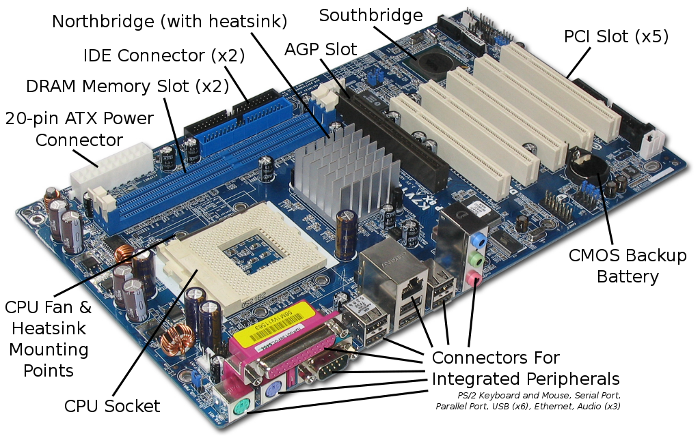
Dalam menjalankan tugas itu, Motherboard terdiri dari beberapa komponen yang secara umum meliputi:

## 1. CPU
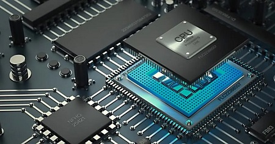

CPU (Control Processing Unit) adalah komponen utama yang bertanggung jawab atas tugas pemrosesan data dan menjalankan instruksi-instruksi program. CPU tersedia dalam berbagai model dan. masing-masing memerlukan slot tertentu pada Motherboard. 

Sebuah CPU dapat memiliki satu atau beberapa core. CPU dengan satu core hanya dapat menjalankan satu tugas pada satu waktu, sedangkan CPU dengan multicore dapat menjalankan beberapa tugas secara bersamaan.

### CPU memiliki beberapa komponen pendukung untuk memproses data menjalankan instruksi, yaitu :
1. Control Unit (CU) -> Pengatur lalu lintas dan kegiatan data yang ada di dalam komputer seperti input dan output. Aktivitas bisa dieksekusi tanpa ada tumpang tindih dan dilakukan secara teratur.

2. Artimatics Logical Unit (ALU) -> Komponen yang melakukan perhitungan aritmatika sesuai perintah yang diperoleh. Perhitungan digunakan supaya komputer dalam membaca instruksi dengan benar. Di dalam komponen ini, prosesor benar-benar melakukan pekerjaan yang penting pada sebuah sistem.

3. Register Unit (RU) -> Komponen ini adalah alat penyimpanan yang lebih kecil daripada memory utama dan memiliki kecepatan akses cukup tinggi. Data yang telah diolah CU dan ALU akan disimpan di komponen ini untuk nantinya diolah kembali.

### Cara kerja CPU :
1. Menggunakan ALU untuk melakukan operasi matematis

2. Memindahkan data dari satu lokasi memori ke lokasi lain

3. Mengambil keputusan serta melompat ke instruksi lain

4. Prosesor akan menerima perintah masuk input dari keyboard, mouse atau penginput data lain yang terhubung dengan komputer. Setelah itu menerjemahkan perintah tersebut untuk kemudian teruskan outputnya ke hardware atau software terkait.

## 2. RAM
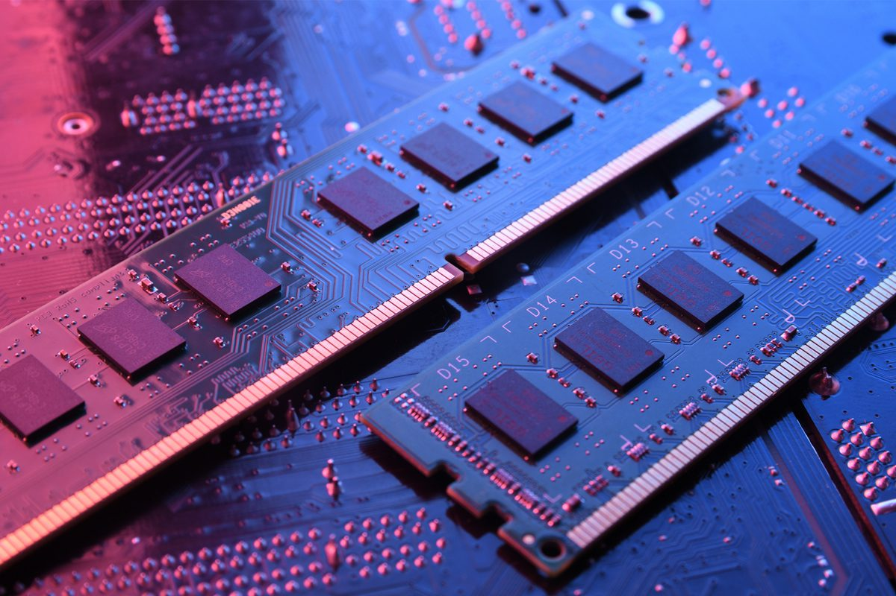
RAM (Random Access Memory) merupakan hardware yang terdapat di dalam perangkat gadget seperti komputer, laptop, dan smartphone. 

RAM berfungsi sebagai tempat penyimpanan data sementara dan hanya bekerja saat perangkat tersebut hidup atau beroperasi. Hal ini dimaksudkan bahwa, saat perangkat elektronik yang dijalankan oleh suatu aplikasi program akan menggunakan RAM untuk menempatkan data sementara. Kapasitas RAM di dalam suatu perangkat sangat berpengaruh pada tingkat kecepatan proses data di perangkat tersebut. Sehingga kegiatan yang dilakukan pada perangkat seperti proses penyimpanan data, membuka data, dan menjalankan program akan semakin cepat sesuai besarnya RAM komputer tersebut.

### Jenis RAM
1. Dynamic RAM (DRAM)

    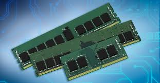
    
    Jenis RAM yang disegarkan atau refresh oleh Central     Processing Unit (CPU) secara berkala agar data yang ada di dalamnya tidak hilang. Keuntungan dari DRAM ini adalah kesederhanaan structural karena hanya membutuhkan satu transistor dan kapasitor yang diperlukan per bit, dibandingkan dengan empat buah transistor S RAM.

2. Sychronous Dynamic RAM (SDRAM)

    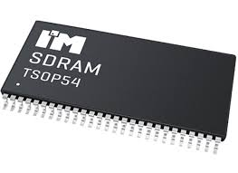

    RAM lanjutan dari DRAM. Namun jenis RAM ini telah mengalami sinkronisasi oleh clock sistem. Umumnya, SDRAM lebih cepat dibandingkan DRAM. Kecepatan RAM ini bisa mencapai 100 hingga 133 MHz. Ciri-ciri dari SD RAM sendiri adalah terdapat dua celah pada bagian kakinya dan diletakkan pada slot DIMM/SDRAM di motherhood, serta mampu menampung memori hingga 1 GB.

3. Double Rate RAM (DDR RAM)

    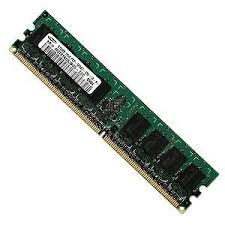

    Jenis RAM dengan teknologi lanjutan dari SD RAM. RAM ini mampu menjalankan dua instruksi sekaligus dalam satuan waktu yang sama. Jenis RAM ini mempunyai kapasitas 184 pin dan mengonsumsi daya listrik yang lebih rendah.

4. Rambus Dynamic RAM (RD RAM)

    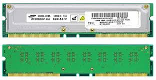

    RAM proses kerjanya lebih cepat dan umumnya lebih mahal dari SD RAM. Jenis SD RAM ini digunakan pada perangkat komputer yang menggunakan Pentium 4 dengan slot memori mencapai 184 pin. Jenis RAM ini menggunakan slot RIMM yang sama dengan SD RAM. Merupakan sebuah teknologi chip dinamis besutan Rambus, Inc ini mempunyai lisensi khusus untuk teknologi semi konduktor yang memproduksi chip.

5. Static RAM (SRAM)

    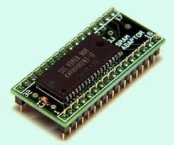

    Jenis RAM yang dapat menyimpan data di dalamnya tanpa harus ada penyegaran atau refresh dari CPU. Jenis RAM ini memiliki proses kerja yang lebih cepat dari DRAM dan SDRAM. Memiliki desain cluster enam transistor yang berguna untuk menyimpan setiap bit informasi. Desain inilah yang membuat SRAM lebih mahal dan lebih cepat. Ya, secara fisik chip, biaya pemanufakturan chip pun kira-kira 30 kali lebih besar dari DRAM. Namun sayangnya, SRAM memiliki kekurangan yaitu biaya produksi yang malah. Hal ini membuat persediaannya hanya dalam kapasitas kecil dan dipergunakan untuk bagian yang benar-benar penting saja.

6. Extended Data Out RAM (EDO RAM)
    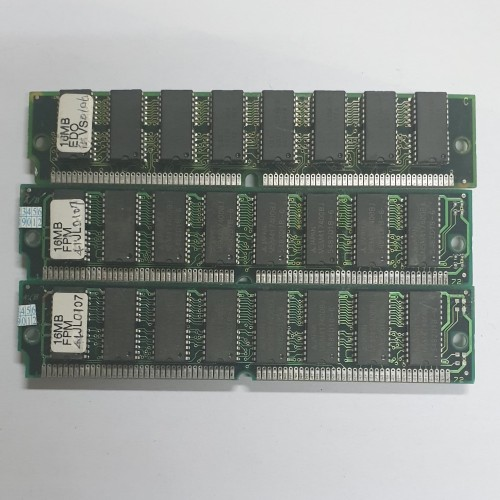

    Jenis RAM yang digunakan pada perangkat dengan OS Pentium dan cocok dipasang pada komputer dengan bus mencapai 66 MHz. Jenis memori ini dapat melakukan proses penyimpanan dan mengambil data dalam waktu bersamaan. Jenis memori ini banyak digunakan untuk menggantikan primary memori yang ada pada komputer terdahulu yakni FPM RAM. Karena bisa menyimpan dan membaca secara bersamaan, maka kecepatan baca tulis pada EDO RAM bisa lebih cepat juga.

7. Non Volatile RAM (NV RAM)

    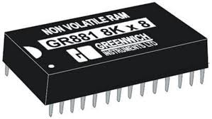

    Jenis memori komputer dengan akses acak yang biasanya digunakan untuk menyimpan konfigurasi yang dilakukan oleh firmware seperti EFI, BIOS, atau firmware-firmware lainnya pada perangkat embedded misalnya router. Pada umumnya NV RAM dirancang dengan manufaktur CMOS agar daya yang dibutuhkan juga kecil. Untuk menghidupkannya agar data yang disimpan tidak hilang, maka NV RAM menggunakan baterai Litium dengan CR-2032. Data yang tersimpan pada memori ini pun tidak akan hilang walaupun daya dimatikan.

8. First Page Mode RAM (FPM DRAM)
    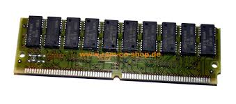

    Jenis RAM ini merupakan bentuk asli atau bentuk awal dari DRAM. Laju transfer maksimum untuk cache L2 mendekati 176 MB per detik. FPM bekerja pada rentang frekuensi 16 MHz hingga 66 MHz dengan akses waktu hingga 50ns.

9. Flash RAM

    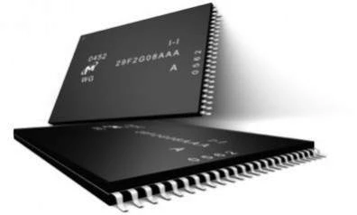

    Jenis memori berkapasitas rendah yang digunakan pada perangkat elektronika seperti TV, VCR, hingga ponsel lama. Momori ini dipasang pada perangkat yang memerlukan refresh dengan daya yang kecil.

10. Small Outline Dual in-line Memory Module (SO-DIMM)
    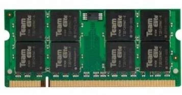

    Jenis memori yang digunakan pada perangkat notebook. Bentuk fisiknya cukup ringkas, kira-kira setengah dari besaran DDR RAM sehingga lebih menghemat ruang. Jenis memori ini biasanya mengikuti perkembangan RAM untuk komputer desktop.

11. Double Date Rate SDRAM (DDR SDRAM)
    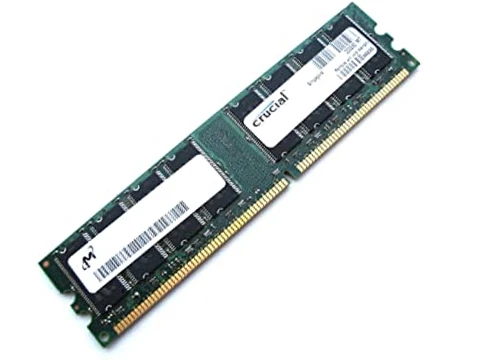

    Jenis RAM ini menjadi salah satu yang memiliki kecepatan sangat tinggi diantara jenis-jenis RAM. Tak heran, RAM ini digunakan diberbagai perangkat saat ini. RAM ini mampu menjalankan dua instruksi sekaligus dalam satuan waktu yang sama. Memori ini memiliki 184 pin. RAM jenis ini juga mengonsumsi daya listrik yang lebih rendah. Jenis-jenis RAM berikutnya seperti DDR2 RAM hingga DDR3 RAM merupakan pengembangan dari DDR SDRAM. Kedua jenis RAM ini digunakan dibanyak komputer saat ini. Karena lebih menghemat daya dan lebih optimal dengan kecepatan tinggi. Untuk kapasitas memori jenis ini pun cukup besar hingga 4 GB per chipnya.

12. Video Graphic RAM (VGRAM)
    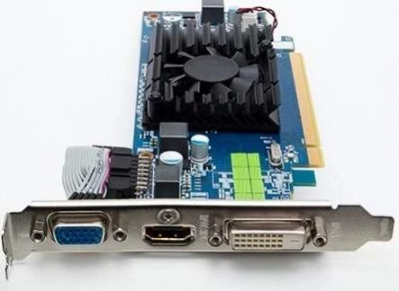

    VGRAM biasanya digunakan untuk menyimpan kandungan pixel bagi sebuah paparan grafik. Penggunaan chip ini akan memberikan performa video yang baik dan mengurangi tekanan pada CPU.

### Komponen RAM
Tipe menjelaskan jenis (variasi) RAM berdasarkan teknologi yang digunakannya, seperti SDRAM, DDR atau DDR2. Hal ini kadang juga disebut sebagai “interface”. Contoh : Visipro DDR 256Mb PC266 berarti menggunakan teknologi DDR.

1. Capacity -> menerangkan seberapa besar kapasitas penyimpanan data RAM dalam satuan Gigabyte (GB) atau Megabyte (MB). Kapasitas merupakan faktor terpenting pada sebuah RAM karena fungsiny sebagai penyimpan data. Contoh : Visipro DDR2 512Mb PC4300 berarti memiliki kapasitas 512 Megabyte.

2. FSB (singkatan dari Front Side Bus) -> besar jalur data antara Processor dam RAM dalam satuan Megahertz. Satuan FSB Processor dan RAM harusnya memiliki angka yg sama agar data dapat ditransfer secara optimal [Lihat pada tabel Dual Channel RAM]. Contoh : Visipro DDR2 256MB PC3200 berarti memiliki FSB 400MHz (PC3200 dibagi 8 byte).

3. Fungsi -> menerangkan fungsi dari RAM, seperti Unbuffered (digunakan pada Desktop), ECC, atau Registered (keduanya digunakan pada Server). Unbuffered merupakan tipe RAM biasa yg digunakan oleh komputer secara umum, ECC (Error Correction Code) biasa dipakai pada komputer Workstation / Low End Server & ECC Registered umum dipakai pada Medium to High End Server. Contoh : Visipro DDR2 1GB PC4300 ECC Registered artinya memiliki fungsi ECC Registered pada modulnya.

4. Bandwith -> besarnya data yang dapat ditransfer atau diolah dalam waktu satu detik (satuan MB/s atau Megabyte per-secon). Umumnya saat ini RAM DDR/DDR2 mencantumkan bandwidth pada Module RAM. Bandwidth bisa didapat dari perkalian FSB x Arsitektur. Arsitektur RAM adalah 64-bit (8byte), sehingga jika DDR PC266 memiliki FSB 266 MHz sama dengan 266 MHz x 8 byte = 2100 MB/s. Ini artinya bahwa DDR PC266 (FSB) sama dengan DDR PC2100 (Bandwidth). Contoh : Visipro DDR2 512MB PC4300 artinya memiliki bandwidth 4300MB/s.

### Cara Kerja RAM
RAM bertindak sebagai memori jangka pendek yang memungkinkan CPU mengakses dan memproses data dengan cepat, yang diperlukan untuk menjalankan berbagai tugas. Kecepatan RAM sangat penting karena mempengaruhi seberapa cepat CPU dapat mengakses data.

## 3. Chipset
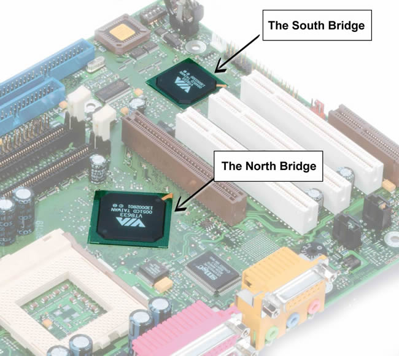
Chipset adalah sekelompok sirkuit yang mengelola transfer data antara CPU, RAM, dan perangkat keras lainnya di Motherboard. Perangkat ini yang berfungsi untuk mengelola komunikasi antar perangkat komputer. Chipset komputer memiliki peranan yang sangat penting karena keberadaan berpengaruh pada kinerja komputer. Chipset pada komputer juga diibaratkan nyawa sebuah komputer sekaligus pengatur lalu lintas aliran data dan penghubung tiap-tiap komponen.

Chipset terdiri dari dua jenis, yaitu : 
1. Northbridge

    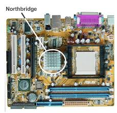

    Chipset ini merupakan jenis chipset yang memiliki tugas penting dalam komputer. Tugas-tugas tersebut adalah menghubungkan processor dengan sistem memori dan graphic controller (AGP dan PCI Express) melalui bus yang berkecepatan tinggi dan juga ke southbridge. Chipset jenis ini juga memiliki nama lain, yakni MCH (Memory Controller Hub).  Chipset northbridge ini berada lebih dekat dengan processor.

2. Southbridge 

Chipset ini berhubungan dengan peripheral melalui jalur penghubung. Tugas utama dari chipset ini adalah mengontrol bus IDE, USB, dukungan PnP (Plug and Play), penghubung antara PCI dan ISA, mengontrol keyboard dan mouse serta sebagai fitur power management pada perangkat lain. Sehingga apabila komputer mengalami masalah pada power management, kemungkinan chipset ini juga mengalami kerusakan.

## 4. BIOS (Basic Input Output System)
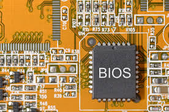

BIOS merupakan program perangkat lunak yang dapat memberikan instruksi dasar pada komputer saat diaktifkan, termasuk proses booting. BIOS bertanggung jawab untuk mendeteksi komponen-komponen perangkat keras dan memuat sistem operasi komputer. Pada beberapa Motherboard, BIOS tradisional digantikan oleh UEFI. UEFI memungkinkan komputer untuk boot lebih cepat, menyediakan lebih banyak alat diagnostik, dan menyediakan antarmuka yang lebih efisien antara sistem operasi dan komponen komputer.

### Fungsi BIOS
1. Inisialisasi (pendeteksian) dan sekaligus pengujian
hardware komputer. Proses ini disebut POST – Power On Self
Test. Ini dilakukan saat komputer di On kan. Ditandai di layar
muncul tampilan text-putih background hitam. Pada komputer
generasi baru sekarang jarang ditampilkan. Untuk
menampilkannya harus masuk ke BIOS dan
membuat setting tertentu dalam BIOS.
2. Me-load menjalankan OS – Operating System (mis. Windows)
3. Men-setting beberapa pengaturan dasar, mis. tanggal, waktu,
sistem storage (penyimpanan), proses booting, cara kerja
komputer.
4. Membantu OS serta program lain dalam mengenali dan
menggunakan hardware yang terpasang.

## 5.CMOS (Complementary Metal Oxide Semiconductor)

CMOS adalah baterai kecil yang terdapat di motherboard setiap komputer. Baterai ini memberikan daya pada chip CMOS. Chip CMOS menyimpan informasi BIOS dan pengaturan komputer, bahkan saat komputer dimatikan. Baterai CMOS memungkinkan pengguna untuk menghindari adanya pengaturan ulang pada konfigurasi BIOS, seperti urutan boot, pengaturan tanggal, dan waktu, setiap kali komputer dihidupkan kembali.

## 6. I/O Port

Input Output Port memiliki pengertian sebagai jalur yang menghubungkan perangkat eksternal dengan perangkat komputer atau elektronik. 
Port ini berguna sebagai pintu gerbang yang memungkinkan transfer data masuk (input) dan keluar (output) dari dan ke perangkat tersebut.

### Fungsi I/O Port
1. Sebagai Transfer Data -> Fungsi paling dasar dari Input Output Port adalah mentransfer data dari perangkat eksternal ke perangkat utama (input) dan sebaliknya (output). Misalnya, ketika kita mengetik di keyboard, data dianggap sebagai input, sedangkan ketika hasil cetakan keluar dari printer, itu dianggap sebagai output.
2. Koneksi Perangkat -> Input Output Port memungkinkan koneksi fisik antara perangkat eksternal dan perangkat utama. Melalui port ini, perangkat seperti printer, monitor, atau mouse dapat terhubung dengan komputer atau perangkat elektronik lainnya.
3. Komunikasi dengan Perangkat Luar -> Input Output Port memungkinkan perangkat utama berkomunikasi dengan perangkat luar, seperti perangkat USB, ponsel pintar, kamera digital, dan perangkat lainnya. 
Dengan adanya Input Output Port, perangkat ini dapat berbagi data dan sumber daya dengan perangkat utama.
4. Kontrol dan Pengaturan -> Input Output Port juga berfungsi untuk mengontrol dan mengatur perangkat eksternal. Sebagai contoh, kita dapat menggunakan Input Output Port untuk mengendalikan volume speaker atau mengatur kecerahan layar monitor.

### Jenis I/O Port
1. USB (Universal Serial Bus) -> USB adalah salah satu Input Output Port paling umum dan serbaguna. Dengan USB, kita dapat menghubungkan berbagai perangkat seperti keyboard, mouse, printer, ponsel, dan perangkat penyimpanan eksternal.
2. HDMI (High Definition Multimedia Interface) -> Port HDMI digunakan untuk mentransfer data audio dan video berkualitas tinggi dari perangkat seperti laptop, konsol game, atau DVD player ke monitor atau TV.
3. Ethernet -> Port Ethernet digunakan untuk menghubungkan perangkat dengan jaringan lokal atau internet, sehingga memungkinkan akses internet dan berbagi data antar perangkat.
4. VGA (Video Graphics Array) -> Port VGA digunakan untuk menghubungkan monitor dengan perangkat komputer, meskipun sekarang telah digantikan oleh teknologi yang lebih canggih seperti HDMI dan DisplayPort.
5. Audio Jack -> Port ini digunakan untuk menghubungkan speaker, headphone, atau mikrofon dengan perangkat audio seperti laptop atau smartphone.
6. Thunderbolt -> Thunderbolt adalah Input Output Port yang serupa dengan USB dan HDMI, tetapi memiliki kecepatan transfer data yang lebih tinggi dan mendukung penghubung daisy-chain (menghubungkan beberapa perangkat sekaligus).

# Referensi
- [Apa itu Motherboard](https://en.wikipedia.org/wiki/Motherboard)
- [Komponen Motherboard](https://tekno.kompas.com/read/2023/11/13/17150067/komponen-komponen-motherboard-dan-fungsinya-yang-perlu-diketahui?page=all)
- [Pengertian dan Cara Kerja Processor](https://asani.co.id/blog/pengertian-prosesor-dan-cara-kerja/)
- [Apa itu CPU](https://aws.amazon.com/id/what-is/cpu/)
- [Komponen RAM](https://diskominfo.kuburayakab.go.id/read/5/apa-itu-ram-ketahui-jenis-dan-fungsinya-yuk)
- [Jenis RAM](https://www.pricebook.co.id/article/tips_tricks/8939/jenis-ram-komputer)
- [Apa itu Chipset](https://www.baktikominfo.id/id/informasi/pengetahuan/menyorot_pentingnya_chipset_komputer_cara_kerja_dan_macamnya-956)
- [Apa itu I/O Port](https://kumparan.com/ragam-info/fungsi-dari-input-output-port-beserta-pengertian-dan-jenisnya-20sMYOIg2XZ/full)

