<div align="center">
  <h1 style="text-align: center;font-weight: bold">Praktikum 4<br>SysOp Operasi Input Output</h1>
  <h4 style="text-align: center;">Dosen Pengampu : Dr. Ferry Astika Saputra, S.T., M.Sc.</h4>
</div>
<br />
<div align="center">
  
  <h3 style="text-align: center;">Disusun Oleh : </h3>
  <p style="text-align: center;">
    <strong>Mochammad Fahril Rizal (3123500013)</strong><br>
    <strong>Adrian Yoga Chrisarianto (3123500021)</strong><br>
    <strong>Muhammad Arief Wicaksono Putra Santoso (3122500022)</strong>
  </p>

<h3 style="text-align: center;line-height: 1.5">Politeknik Elektronika Negeri Surabaya<br>Departemen Teknik Informatika Dan Komputer<br>Program Studi Teknik Informatika<br>2023/2024</h3>
  <hr><hr>
</div>

# Operasi Input Output
Referensi : [Shell Programming](https://www.geeksforgeeks.org/introduction-linux-shell-shell-scripting/?ref=shm_)
## POKOK BAHASAN:
```
* Pipeline
* Redirection
```
## TUJUAN PEMBELAJARAN:
Setelah mempelajari materi dalam bab ini, mahasiswa diharapkan mampu:
* Memahami konsep proses I/O dan redirection
* Memahami standar input, output dan error
* Menggunakan notasi output, append dan here document
* Memahami konsep *PIPE* dan filter
  
## DASAR TEORI:

### 1. PROSES I/O
Sebuah proses memerlukan Input dan Output. Instruksi (command) yang diberikan pada Linux melalui Shell disebut sebagai eksekusi program yang selanjutnya disebut proses. Setiap kali instruksi diberikan, maka Linux kernel akan menciptakan sebuah proses dengan memberikan nomor PID (Process Identity). Proses dalam Linux selalu membutuhkan Input dan menghasilkan suatu Output.

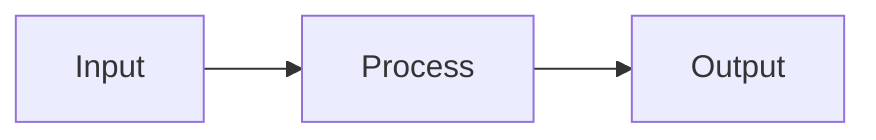

Dalam konteks Linux input/output adalah :
* Keyboard (input)
* Layar (output)
* Files
* Struktur data kernel
* Peralatan I/O lainnya (misalnya Network)

## 2. FILE DESCRIPTOR

Linux berkomunikasi dengan file melalui file descriptor yang direpresentasikan melalui angka yang dimulai dari 0, 1, 2 dan seterusnya. Tiga buah file descriptor standar yang lalu diciptakan oleh proses adalah :
* 0 = keyboard (standar input)
* 1 = layar (standar output)
* 2 = layar (standar error)

Linux tidak membedakan antara peralatan hardware dan file. Linux memanipulasi peralatan hardware dengan memperlakukannya sama dengan ketika memperlakukan sebuah file.

## 3.PEMBELOKAN (REDIRECTION)

Pembelokan dilakukan untuk standard input, output dan error, yaitu untuk mengalihkan file descriptor dari 0, 1 dan 2. Simbol untuk pembelokan adalah :
```mermaid
flowchart LR
    A(Standart Input) -->|Keyboard| B{Process}
    B -->|Monitor| C[Standart Output]
    B -->|Monitor| D[Standart Error]
 ```

## 4. PIPA (PIPELINE)
Mekanisme pipa digunakan sebagai alat komunikasi antar proses.

```mermaid
graph LR
  A(Input) --> B(Proses-1) --> C(Output) --> D(Input) --> E(Proses-2) --> F(Output)
```
Proses-1 menghasilkan output yang selanjutnya digunakan sebagai input oleh Proses-2. Hubungan output input ini dinamakan ``pipa ataiupipelining``, yang menghubungkan Proses-1 dengan Proses-2 dan dinyatakan dengan symbol “|”.
```
    Proses1 | Proses
```

## 5. FILTER
Filter adalah utilitas Linux yang dapat memproses standard input (dari keyboard) dan menampilkan hasilnya pada standard output (layar). Contoh filter adalah cat, sort, grep, pr, head, tail, paste dan lainnya.
Pada sebuah rangkaian pipa : 

        P<sub>1</sub> | P<sub>2</sub> | P<sub>3</sub> ... | P<sub>n-1</sub> | P<sub>n</sub>

Maka P2 sampai dengan P<sub>n-1</sub> berfungsi sebagai filter. P1 (awal) dan Pn (terakhir) boleh tidak filter. Utilitas yang bukan filter misalnya who, ls, ps, lp, lpr, mail dan lainnya.
Beberapa perintah Linux yang digunakan untuk proses penyaringan antara lain :
* Perintah ``grep``
  Digunakan untuk menyaring masukannya dan menampilkan baris-baris yang hanya mengandung pola yang ditentukan. Pola ini disebut regular expression.
* Perintah ``wc``
  Digunakan untuk menghitung jumlah baris, kata dan karakter dari baris-baris masukan yang diberikan kepadanya. Untuk mengetahui berapa baris gunakan option –l, untuk mengetahui berapa kata, gunakan option –w dan untuk mengetahui berapa karakter, gunakan option –c. 
  Jika salah satu option tidak digunakan, maka tampilannya adalah jumlah baris, jumlah kata dan jumlah karakter.
* Perintah ``sort``
  Digunakan untuk mengurutkan masukannya berdasarkan urutan nomor ASCII dari karakter.
* Perintah ``cut``
  Digunakan untuk mengambil kolom tertentu dari baris-baris masukannya, yang ditentukan pada option –c.
* Perintah ``uniq``
  Digunakan untuk menghilangkan baris-baris berurutan yang mengalami duplikasi, biasanya digabungkan dalam pipeline dengan ``sort``.

## TUGAS PENDAHULUAN:

## Jawablah pertanyaan-pertanyaan di bawah ini :

1. Apa yang dimaksud redirection?
2. Apa yang dimaksud pipeline?
3. Apa yang dimaksud perintah di bawah ini :
    echo, cat, more, sort, grep, wc, cut, uniq

## PERCOBAAN:

1. Login sebagai user.
2. Bukalah Console Terminal dan lakukan percobaan-percobaan di bawah ini. Perhatikan hasil setiap percobaan.
3. Selesaikan soal-soal latihan.


## Percobaan 1 : File descriptor

1. Output ke layar (standar output), input dari system (kernel)
    ```
    $ ps
    ```
    Hasil Output

   Perintah $ ps digunakan untuk menampilkan proses yang sedang berjalan pada sistem (kernel) dan kemudian ditampilkan pada layar (proses status). Input berasal dari kernel, dan output berasal dari layar.

   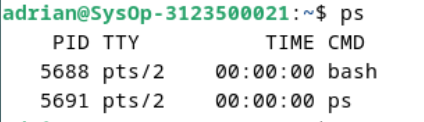

2. Output ke layar (standar output), input dari keyboard (standard input)
   ```
    $ cat
    hallo, apa khabar
    hallo, apa khabar
    exit dengan ^d
    exit dengan ^d
    [Ctrl-d]
   ```
   Hasil Output

   $ cat merupakan perintah mengambil input dari keyboard dan menampilkan output ke layar.


   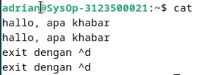

3. Input nama direktori, output tidak ada (membuat direktori baru), bila terjadi error maka tampilan error pada layar (standard error)
   ```
   $ mkdir mydir
   $ mkdir mydir **(Terdapat pesan error)**
   ```
   Hasil Output

   Perintah $ mkdir digunakan untuk membuat direktori baru di sistem file. Itu akan membuat direktori jika direktori yang diinginkan belum ada, tetapi jika direktori dengan nama yang sama sudah ada, maka akan terjadi kesalahan.

    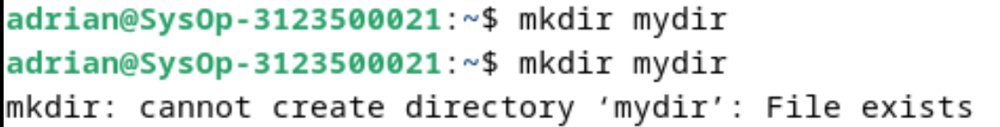

## Percobaan 2 : Pembelokan (redirection)
1. Pembelokan standar output
   ```
    $ cat 1> myfile.txt
    Ini adalah teks yang saya simpan ke file myfile.txt
   ```
   Hasil Output

   Operator **>** digunakan untuk melakukan pembelokan output standar. Perintah **cat** dalam kasus ini menyalin atau "mengeluarkan" teks yang Anda berikan ke file tertentu, dalam hal ini **myfile.txt**. Ini berarti Anda tidak menampilkan teks di terminal, tetapi menyimpannya ke dalam file.

    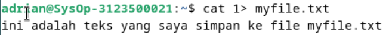

2. Pembelokan standar input, yaitu input dibelokkan dari keyboard menjadi dari file
   ```
    $ cat 0< myfile.txt
    $ cat myfile.txt
   ```
   Hasil Output

   0< merupakan metode pembelokan standar input, yaitu input dibelokkan dari
   keyboard menjadi dari file. Alternatifnya yaitu dengan menggunakan <

   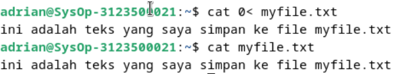

3. Pembelokan standar error untuk disimpan di file
   ```
    $ mkdir mydir (Terdapat pesan error)
    $ mkdir mydir 2> myerror.txt
    $ cat myerror.txt
   ```
   Hasil Output

   2> merupakan metode pembelokan standar error untuk kemudian disimpan di file

   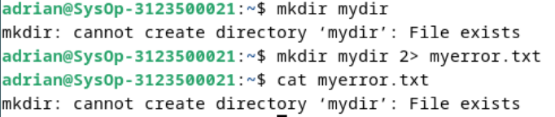

4. Notasi 2>&1 : pembelokan standar error (2>) adalah identik dengan file descriptor 1.
   ```
    $ ls filebaru (Terdapat pesan error)
    $ ls filebaru 2> out.txt
    $ cat out.txt
    $ ls filebaru 2> out.txt 2>&
    $ cat out.txt
   ```
   Hasil Output

   Notasi 2>&1 : pembelokan standar error (2>) adalah identik dengan file descriptor 1.

   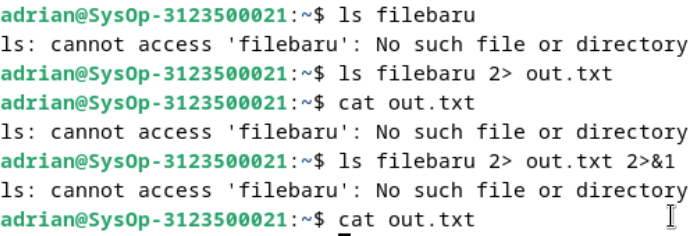

5. Notasi 1>&2 (atau >&2) : pembelokan standar output adalah sama dengan file descriptor 2 yaitu standar error
   ```
   $ echo “mencoba menulis file” 1> baru
   $ cat filebaru 2> baru 1>&
   $ cat baru
   ```
   Hasil Output

   Notasi 1>&2 (atau >&2) : pembelokan standar output adalah sama dengan file descriptor 2
   yaitu standar error

   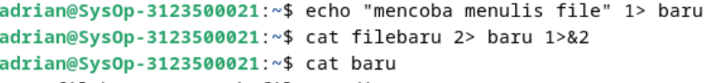

6. Notasi >> (append)
   ```
   $ echo “kata pertama” > surat
   $ echo “kata kedua” >> surat
   $ echo “kata ketiga” >> surat
   $ cat surat
   $ echo “kata keempat” > surat
   $ cat surat
   ```
   Hasil Output

   Notasi >> (append) digunakan untuk membelokkan tampilan standard output ke file tanpa
   menghapus isi sebelumnya.

   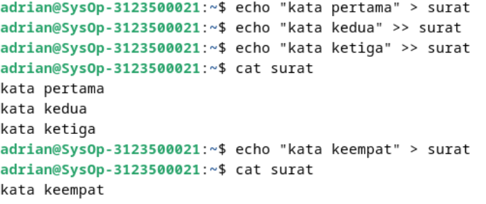

7. Notasi here document (<<++ .... ++) digunakan sebagai pembatas input dari keyboard. Perhatikan bahwa tanda pembatas dapat digantikan dengan tanda apa saja, namun harus sama dan tanda penutup harus diberikan pada awal baris
   ```
   $ cat <<++
   Hallo, apa kabar?
   Baik-baik saja?
   Ok!
   ++
   $ cat <<%%%
   Hallo, apa kabar?
   Baik-baik saja?
   Ok!
   %%%
   ```
   Hasil Output

   Notasi here document (<<++ .... ++) digunakan untuk pembatas input dari keyboard.
   Perhatikan bahwa tanda pembatas dapat digantikan   dengan tanda apa saja tetapi harus sama
   dan tanda penutup harus diberikan pada awal baris  

   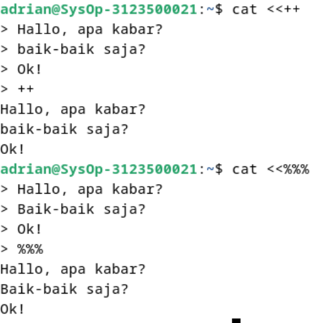

8. Notasi – (input keyboard) adalah representan input dari keyboard. Artinya menampilkan file 1, kemudian menampilkan input dari keyboard dan menampilkan file 2. Perhatikan bahwa notasi “-“ berarti menyelipkan input dari keyboard
  ```
  $ cat myfile.txt – surat
  ```
  Hasil Output

  Perintah cat myfile.txt - surat akan menampilkan isi dari file myfile.txt diikuti oleh input dari keyboard, dan kemudian menampilkan isi dari file surat

   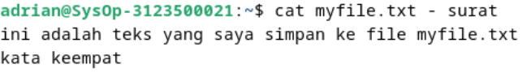


## Percobaan 3 : Pipa (pipeline)

1. Operator pipa (|) digunakan untuk membuat eksekusi proses dengan melewati data langsung ke data lainnya.
   ```
   $ who
   $ who | sort
   $ who | sort –r
   $ who > tmp
   $ sort tmp
   $ rm tmp
   $ ls –l /etc | more
   $ ls –l /etc | sort | more
   ```
   Hasil Output

   Perintah pertama, $ who, menampilkan daftar pengguna yang sedang login. Kemudian, perintah $ who | sort mengurutkan daftar pengguna tersebut secara alfabetis. Perintah berikutnya, $ who | sort -r, mengurutkan daftar pengguna secara terbalik, dari yang terakhir ke yang pertama. Perintah $ who > tmp menyimpan daftar pengguna ke dalam file sementara bernama tmp. Perintah $ sort tmp kemudian mengurutkan isi file tmp. Setelah selesai, perintah $ rm tmp menghapus file tmp. Selanjutnya, perintah $ ls -l /etc | more menampilkan detail dari semua file dan direktori dalam direktori /etc, satu layar pada satu waktu. Perintah terakhir, $ ls -l /etc | sort | more, menampilkan detail file dan direktori dalam /etc yang sudah diurutkan secara alfabetis, satu layar pada satu waktu.

   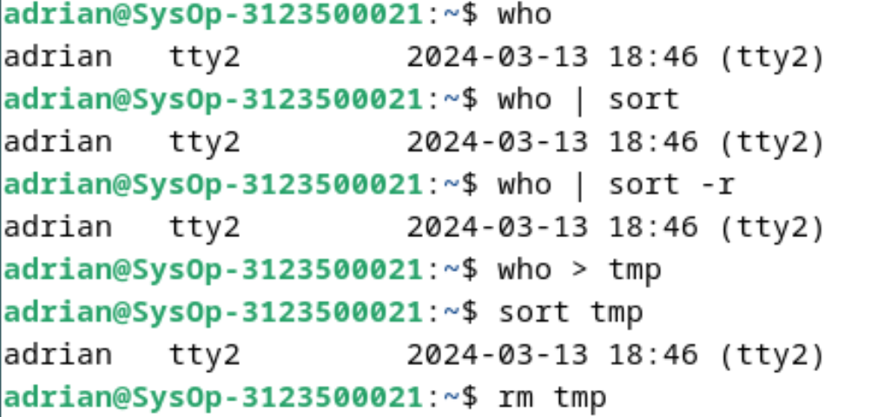
   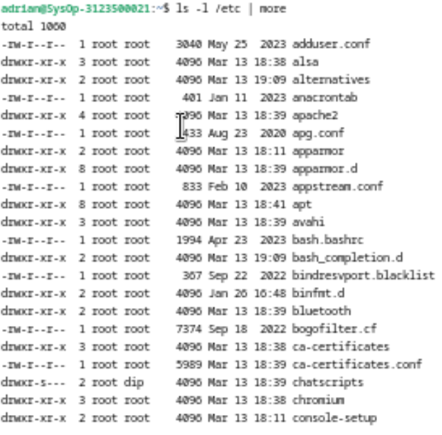
   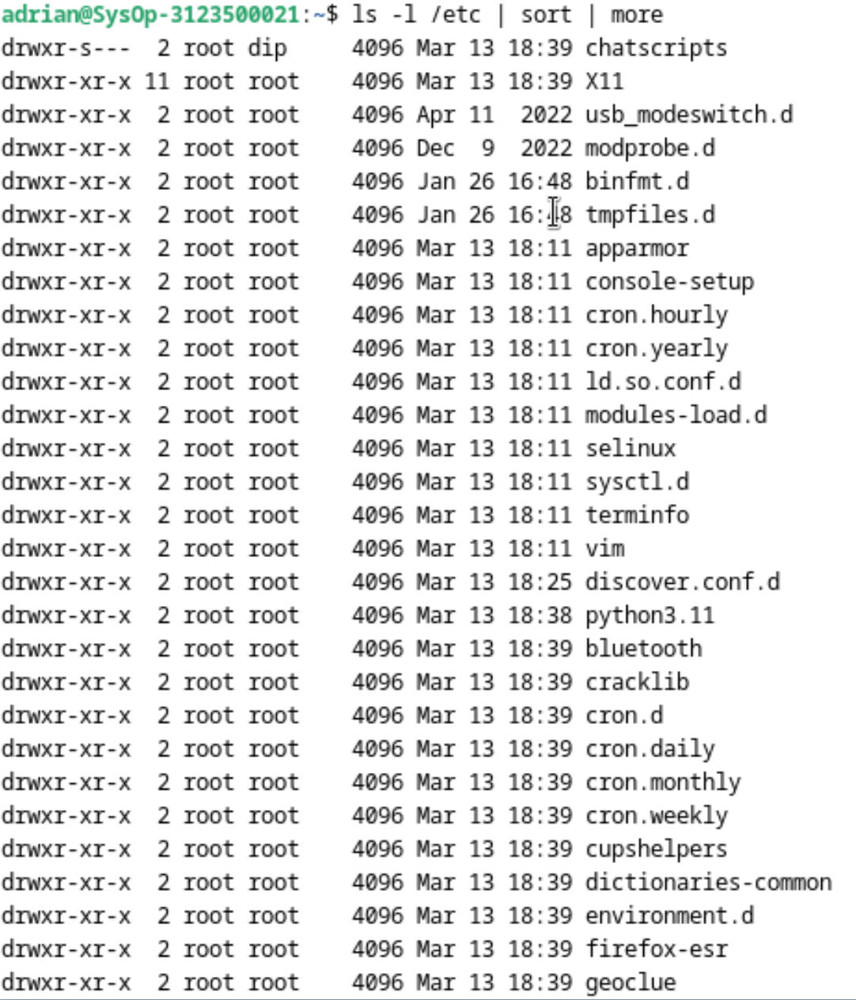
   
2. Untuk membelokkan standart output ke file, digunakan operator ">"
   ```
   $ echo hello
   $ echo hello > output
   $ cat output
   ```
   Hasil Output

   Pertama, perintah $ echo hello mencetak kata "hello" ke output standar. Kemudian, perintah $ echo hello > output digunakan untuk mengalihkan output dari perintah echo hello ke dalam file bernama "output". Jika file tersebut belum ada, maka akan dibuat. Setelah itu, perintah $ cat output digunakan untuk menampilkan isi dari file "output". Hasilnya, isi dari file "output" akan sama dengan output dari perintah echo hello, yaitu "hello".

   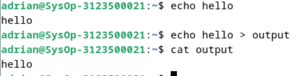

3. Untuk menambahkan output ke file digunakan operator ">>"
   ```
   $ echo bye >> output
   $ cat output
   ```
   Hasil Output

   perintah echo bye >> output menambahkan kata "bye" ke dalam file "output" tanpa menghapus isinya yang sudah ada sebelumnya, sedangkan perintah cat output digunakan untuk menampilkan isi file "output", yang sekarang berisi "hello bye".

   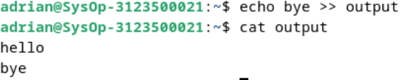

4. Untuk membelokkan standart input digunakan operator "<"
   ```
   $ cat < output
   ```
   Hasil Output

    operator "<" digunakan untuk mengalihkan input standar dari file "output" ke perintah cat. Ini berarti bahwa cat akan membaca isi dari file "output" sebagai input, bukan langsung dari terminal. Hasilnya, cat akan menampilkan isi dari file "output" ke terminal. Jadi, perintah $ cat < output akan menampilkan isi dari file "output" ke terminal.

   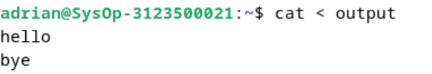

5. Pembelokan standart input dan standart output dapat dikombinasikan tetapi tidak boleh menggunakan nama file yang sama sebagai standart input dan output.
   ```
   $ cat < output > out
   $ cat out
   $ cat < output >> out
   $ cat out
   $ cat < output > output
   $ cat output
   $ cat < out >> out (Proses tidak berhenti)
   [Ctrl-c]
   $ cat out
   ```
   Hasil Output

   pembelokan standar input dan output digunakan secara bersamaan. Awalnya, isi dari file "output" disalin ke dalam file "out" menggunakan perintah $ cat < output > out. Kemudian, perintah $ cat out digunakan untuk menampilkan isi dari file "out". Namun, saat mencoba menambahkan isi file "output" ke dalam "out" menggunakan $ cat < output >> out, proses tersebut gagal karena menggunakan nama file yang sama. Percobaan menimpa isi file "output" dengan isi yang sama menggunakan $ cat < output > output juga tidak berhasil. Terakhir, percobaan untuk menambahkan isi file "out" ke dalam "out" sendiri dengan $ cat < out >> out menyebabkan proses terjebak dalam pengulangan tak terbatas, sehingga perlu dihentikan menggunakan tombol Ctrl-c. Setelahnya, isi dari file "out" tetap tidak berubah.

   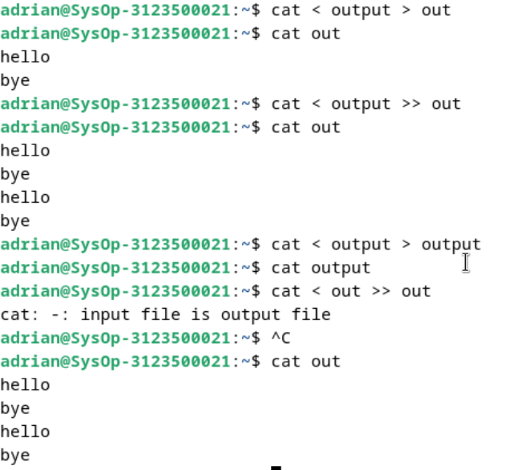

## Percobaan 4 : Filter
1. Pipa juga digunakan untuk mengkombinasikan utilitas sistem untuk membentuk fungsi yang lebih kompleks
   ```
    $ w –h | grep <user>
    $ grep <user> /etc/passwd
    $ ls /etc | wc
    $ ls /etc | wc –l
    $ cat > kelas1.txt
    Badu
    Zulkifli
    Yulizir
    Yudi
    Ade
    [Ctrl-d]
    $ cat > kelas2.txt
    Budi
    Gama
    Asep
    Muchlis
    [Ctrl-d]
    $ cat kelas1.txt kelas2.txt | sort
    $ cat kelas1.txt kelas2.txt > kelas.txt
    $ cat kelas.txt | sort | uniq
   ```
   Hasil Output

   Pertama, perintah $ w -h | grep <user> digunakan untuk menampilkan informasi pengguna yang sedang login dengan nama pengguna tertentu. Perintah berikutnya, $ grep <user> /etc/passwd, digunakan untuk mencari nama pengguna tertentu dalam file /etc/passwd.

   Selanjutnya, perintah $ ls /etc | wc digunakan untuk menghitung jumlah baris, kata, dan byte dalam output dari perintah ls /etc, sementara perintah $ ls /etc | wc -l digunakan untuk menghitung jumlah file dan direktori dalam direktori /etc.

   Kemudian, pengguna diminta untuk memasukkan teks ke dalam file kelas1.txt menggunakan perintah cat > kelas1.txt, diikuti dengan memasukkan teks ke dalam file kelas2.txt menggunakan perintah cat > kelas2.txt. Setelah itu, isi dari kedua file tersebut digabungkan menggunakan perintah cat kelas1.txt kelas2.txt | sort, yang akan menyortir daftar nama-nama dalam kedua file secara alfabetis.

   Setelah menggabungkan isi kedua file tersebut, perintah $ cat kelas1.txt kelas2.txt > kelas.txt digunakan untuk menyimpan hasil gabungan ke dalam file baru bernama kelas.txt. Kemudian, perintah $ cat kelas.txt | sort | uniq digunakan untuk menyortir nama-nama dalam file kelas.txt dan menghapus baris yang duplikat menggunakan perintah uniq.

   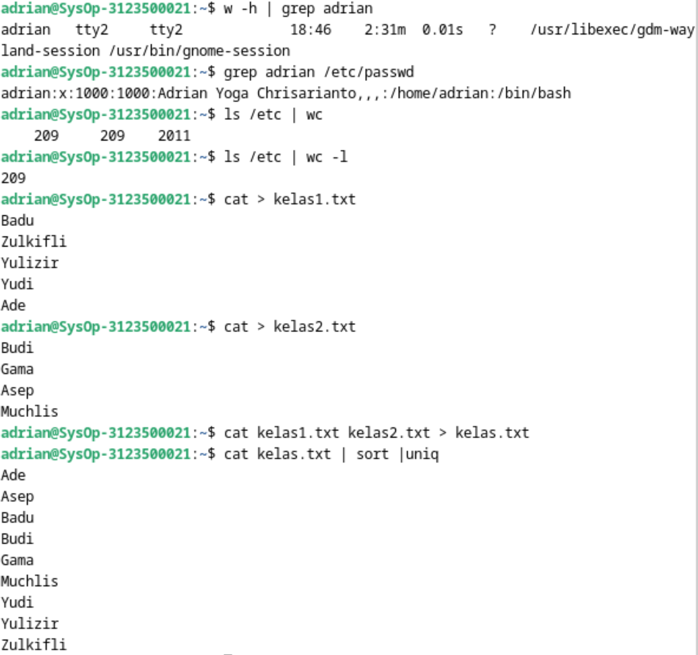

   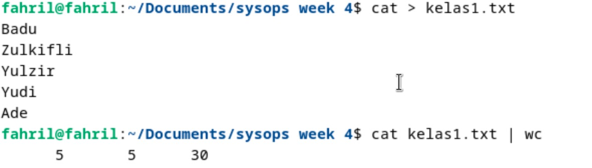

## LATIHAN:

1. Lihat daftar secara lengkap pada direktori aktif, belokkan tampilan standard output ke file baru.

   ***JAWAB***

      
   Membuat daftar isi direktori di awal dan menyimpan di file list_direktori.txt

2. Lihat daftar secara lengkap pada direktori /etc/passwd, belokkan tampilan standard output ke file baru tanpa menghapus file baru sebelumnya.

   ***Jawab***

   
Langkah ini akan menambahkan daftar isi direktori "/etc/passwd" ke dalam file "list_direktori.txt" tanpa menghapus isinya

3. Urutkan file baru dengan cara membelokkan standard input.

   ***Jawab***

   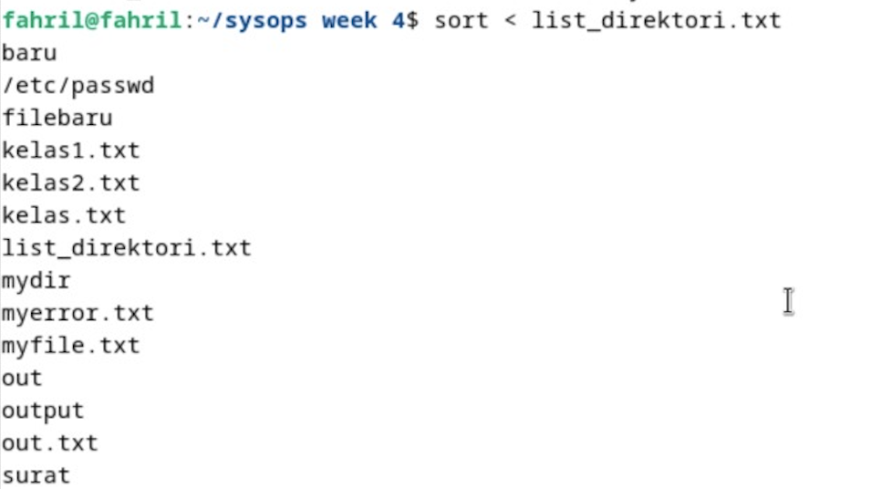
Fungsi sort digunakan untuk mengurutkan daftar yang disimpan dalam file "list_direktori.txt" dan menampilkan hasilnya di terminal

4. Urutkan file baru dengan cara membelokkan standard input dan standard output ke file baru.urut.

   ***Jawab***

   
Langkah ini akan mengurutkan daftar yang disimpan dalam file "list_direktori.txt" dan menyimpan hasilnya ke dalam file baru bernama "urut".


5. Buatlah direktori latihan 2 sebanyak 2 kali dan belokkan standard error ke file rmdirerror.txt.

   ***Jawab***

   
Langkah ini akan mencobamembuat direktori "latihan2" sebanyak 2 kali. Jika direktori sudah ada, akan muncul pesan kesalahan yang akan dialihkan ke file "rmdierror.txt".
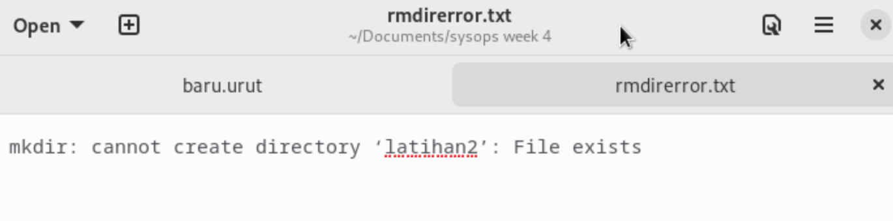

6. Urutkan kalimat berikut :
   ```
   Jakarta
   Bandung
   Surabaya
   Padang
   Palembang
   Lampung
   ```
   Dengan menggunakan notasi **here document (<@@@ ...@@@)** . [HINT](https://www.geeksforgeeks.org/how-to-use-here-document-in-bash-programming/)
  
   ***Jawab***

   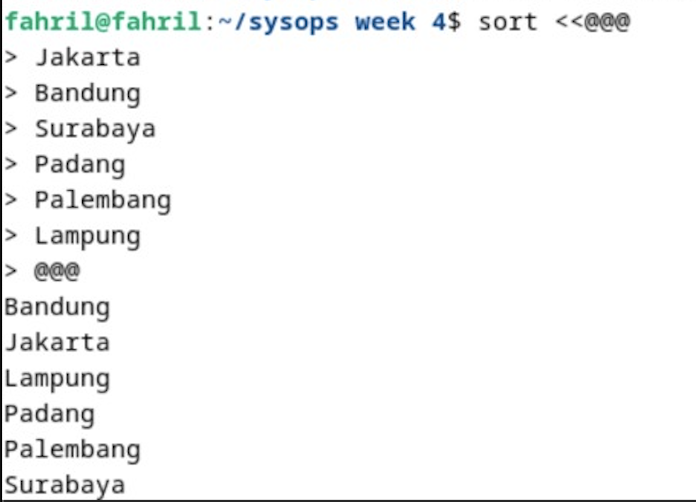
Seperti soal yang sebelumnya fungsi sort berfungsi untuk mengurutkan kalimat menurut alfabet

7. Hitung jumlah baris, kata dan karakter dari file baru.urut dengan menggunakan filter dan tambahkan data tersebut ke file baru.

   ***Jawab***

   
Langkah ini akan menghitung jumlah baris, kata dan karakter dari file "baru.urut" dan menambahkan hasilnya ke dalam file "urut.txt"
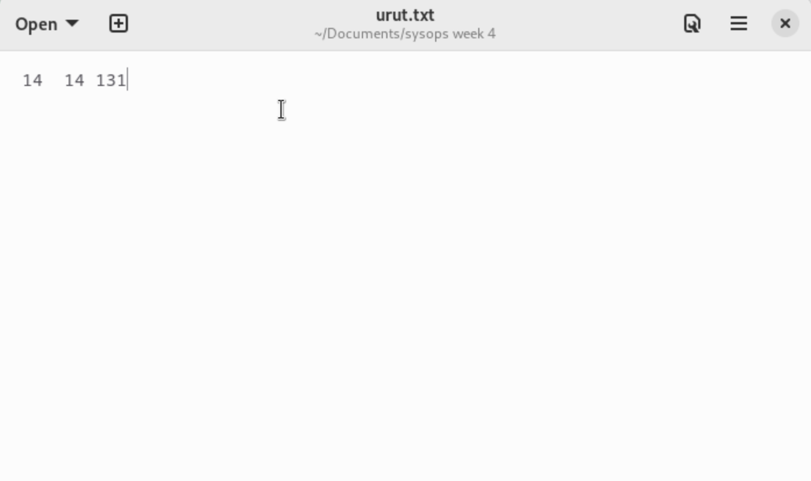

8. Gunakan perintah di bawah ini dan perhatikan hasilnya.
   ```
    $ cat > hello.txt
    dog cat
    cat duck
    dog chicken
    chicken duck
    chicken cat
    dog duck
    [Ctrl-d]
    $ cat hello.txt | sort | uniq
    $ cat hello.txt | grep “dog” | grep –v “cat”
   ```
   ***Jawab***

   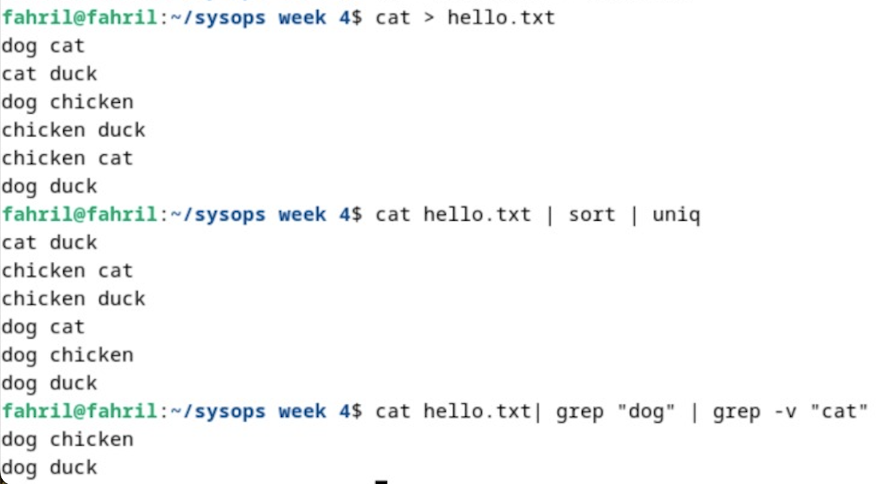
Langkah ini membuat file "hello.txt" dengan beberapa baris kata. Kemudian perintah "sort uniq" digunakan untuk mengurutkan dan menghapus kata yang sama. Kemudian untuk perintah grep "dog" | grep -v "cat" berfungsi untuk melakukan pencarian kata "dog" tanpa kata "cat".

### KESIMPULAN
Redirection (Pembelokan): Redirection adalah proses mengalihkan input dan output standar dari atau ke file, perangkat, atau proses lain. Dalam Linux, ini dapat dilakukan menggunakan operator ">" untuk output standar dan "<" untuk input standar. Operator ">>" digunakan untuk menambahkan output ke file tanpa menghapus isinya sebelumnya. Redirection juga dapat digunakan untuk mengalihkan output atau input standar dari atau ke file-file lainnya.

Pipeline (Pipa): Pipeline adalah mekanisme di Linux yang memungkinkan output dari satu proses menjadi input dari proses berikutnya secara langsung. Ini dilakukan dengan menggunakan operator "|". Pipeline memungkinkan untuk menghubungkan beberapa perintah atau utilitas sistem untuk membentuk fungsi yang lebih kompleks.

Perintah-perintah Penting:

- echo: Digunakan untuk menampilkan teks ke layar atau mengalihkannya ke file.
- cat: Digunakan untuk menampilkan isi dari file atau menggabungkan beberapa file.
- more: Digunakan untuk menampilkan isi file satu layar pada satu waktu.
- sort: Digunakan untuk mengurutkan baris-baris dalam file.
grep: Digunakan untuk mencari pola teks dalam file.
- wc: Digunakan untuk menghitung jumlah baris, kata, dan karakter dalam file.
- cut: Digunakan untuk memilih bagian tertentu dari setiap baris dalam file.
- uniq: Digunakan untuk menghapus baris-baris yang duplikat dari file.

## LAPORAN RESMI:

1. Analisa hasil percobaan 1 sampai dengan 4, untuk setiap perintah jelaskan    tampilannya.
2. Kerjakan latihan diatas dan analisa hasilnya
3. Berikan kesimpulan dari praktikum ini.