<div align="center">
  <h1 style="text-align: center;font-weight: bold">Praktikum 5<br>SysOp Proses dan Manajemen Proses</h1>
  <h4 style="text-align: center;">Dosen Pengampu : Dr. Ferry Astika Saputra, S.T., M.Sc.</h4>
</div>
<br />
<div align="center">
  
  <h3 style="text-align: center;">Disusun Oleh : </h3>
  <p style="text-align: center;">
    <strong>Muhammad Arief Wicaksono Putra Santoso (3123500022)</strong>
  </p>
<h3 style="text-align: center;line-height: 1.5">Politeknik Elektronika Negeri Surabaya<br>Departemen Teknik Informatika Dan Komputer<br>Program Studi Teknik Informatika<br>2023/2024</h3>
  <hr><hr>
</div>

## Daftar Isi
1. [Dasar teori](#dasar-teori)
2. [Tugas](#tugas)
    - [Tugas Pendahuluan](#tugas-pendahuluan)
    - [Percobaan](#percobaan)
3. [Kesimpulan](#kesimpulan)

# Proses dan Manajemen Proses

### POKOK BAHASAN

    ✓ Proses pada Sistem Operasi Linux
    ✓ Manajemen Proses pada Sistem Operasi Linux

### TUJUAN BELAJAR

Setelah mempelajari materi dalam bab ini, mahasiswa diharapkan mampu:

    ✓ Memahami konsep proses pada sistem operasi Linux.
    ✓ Menampilkan beberapa cara menampilkan hubungan proses parent dan child.
    ✓ Menampilkan status proses dengan beberapa format berbeda.
    ✓ Melakukan pengontrolan proses pada shell.
    ✓ Memahami penjadwalan prioritas.

## DASAR TEORI

#### 1. KONSEP PROSES PADA SISTEM OPERASI LINUX

Proses adalah program yang sedang dieksekusi. Setiap kali menggunakan utilitas sistem atau program aplikasi dari shell, satu atau lebih proses ”child” akan dibuat oleh shell sesuai perintah yang diberikan. Setiap kali instruksi dibe rikan pada Linux shell, maka kernel akan menciptakan sebuah proses-id. Proses ini disebut juga dengan terminology Unix sebagai sebuah Job. Proses Id (PID) dimulai dari 0, yaitu proses INIT, kemudian diikuti oleh proses berikutnya (terdaftar pada /etc/inittab).
Beberapa tipe proses :

- Foreground
    - Proses yang diciptakan oleh pemakai langsung pada terminal (interaktif, dialog)
- Batch
    - Proses yang dikumpulkan dan dijalankan secara sekuensial (sa  u persatu). Prose Batch tidak diasosiasikan (berinteraksi) dengan terminal.
- Daemon
    - Proses yang menunggu permintaan (request) dari proses lainnya dan menjalankan tugas sesuai dengan permintaan tersebut. Bila tidak ada request, maka program ini akan berada dalam kondisi “idle” dan tidak menggunakan waktu hitung CPU. Umumnya nama proses daemon di UNIX berakhiran d, misalnya inetd, named, popd dll

#### 2. SINYAL

Proses dapat mengirim dan menerima sinyal dari dan ke proses lainnya. Proses mengirim sinyal melalui instruksi “kill” dengan format.

    kill [-nomor sinyal] PID

Nomor sinyal : 1 s/d maksimum nomor sinyal yang didefinisikan system Standar nomor sinyal yang terpenting adalah :

| No Sinyal | Nama    | Deskripsi                                                                             |
| --------- | ------- | ------------------------------------------------------------------------------------- |
| 1         | SIGHUP  | Hangup, sinyal dikirim bila proses terputus, misalnya melalui putusnya hubungan modem |
| 2         | SIGINT  | Sinyal interrupt, melalui ^C                                                          |
| 3         | SIGQUIT | Sinyal Quit, melalui ^\                                                          |                                                                           |
| 9         | SIGKILL | Sinyal Kill, menghentikan proses                                                      |
| 15        | SIGTERM | Sinyal terminasi software                                                    |

#### 3. MENGIRIM SINYAL

Mengirim sinyal adalah satu alat komunikasi antar proses yaitu memberitahukan proses yang sedang berjalan bahwa ada sesuatu yang harus dikendalikan. Berdasarkan sinyal yang dikirim ini maka proses dapat bereaksi dan administrator/programmer dapat menentukan reaksi tersebut. Mengirim sinyal menggunakan instruksi

    kill [-nomor sinyal] PID

Sebelum mengirim sinyal PID proses yang akan dikirim harus diketahui terlebih dahulu.

#### 4. MENGONTROL PROSES PADA SHELL

Shell menyediakan fasilitas job control yang memungkinkan mengontrol beberapa job atau proses yang sedang berjalan pada waktu yang sama. Misalnya bila melakukan pengeditan file teks dan ingin melakukan interrupt pengeditan untuk mengerjakan hal lainnya. Bila selesai, dapat kembali (switch) ke editor dan melakukan pengeditan file teks kembali.</br>
Job bekerja pada <strong>foreground</strong> atau <strong>background</strong>. Pada foreground hanya diper untukkan untuk satu job pada satu waktu. Job pada foreground akan mengontrol shell - menerima input dari keyboard dan mengirim output ke layar. Job pada background tidak menerima input dari terminal, biasanya berjalan tanpa memerlukan interaksi</br>
Job pada foreground kemungkinan dihentikan sementara (suspend), dengan menekan [Ctrl-Z]. Job yang dihentikan sementara dapat dijalankan kembali pada foreground atau background sesuai keperluan dengan menekan <strong>”fg”</strong> atau <strong>”bg”</strong>. Sebagai catatan, menghentikan job seme ntara sangat berbeda dengan melakuakan interrupt job (biasanya menggunakan [Ctrl-C]), dimana job yang diinterrup akan dimatikan secara permanen dan tidak dapat dijalankan lagi.

#### 5. MENGONTROL PROSES LAIN

Perintah ps dapat digunakan untuk menunjukkan semua proses yang sedang berjalan pada mesin (bukan hanya proses pada shell saat ini) dengan format :

    ps –fae atau
    ps -aux

Beberapa versi UNIX mempunyai utilitas sistem yang disebut top yang menyediakan cara interaktif untuk memonitor aktifitas sistem. Statistik secara detail dengan proses yang berjalan ditampilkan dan secara terus-menerus di-refresh . Proses ditampilkan secara terurut dari utilitas CPU. Kunci yang berguna pada top adalah

    s – set update frequency
    u – display proses dari satu user
    k – kill proses (dengan PID)
    q – quit

Utilitas untuk melakukan pengontrolan proses dapat ditemukan pada sistem UNIX adalah perintah killall. Perintah ini akan menghentikan proses sesuai PID atau job number proses.

## TUGAS PENDAHULUAN
1. Apa yang dimaksud dengan proses?
    - Program yang sedang dieksekusi.
2. Apa yang dimaksud dengan perintah untuk menampilkan suatu proses seperti ps, pstree.
    - __ps__ digunakan untuk menunjukkan semua proses yang sedang berjalan pada mesin (bukan hanya proses pada shell saat ini).
    - __pstree__ mempunyai fungsi yang sama seperti _ps_ Tetapi informasinya dalam bentuk tree (pohon).
3. Sebutkan opsi yang dapat diberikan pada perintah ps
    - __$ps__ digunakan untuk melihat kondisi proses yang ada.
    - __$ps -u__ untuk melihat faktor/element lainnya.
    - __$ps -u__ digunakan untuk mencari proses yang spesifik pemakai.
    - __$ps -a__ digunakan untuk mencari proses lainnya (all).
    - __$ps -au__ mencari proses lainnya (all user).
    - __$ps -eH__ untuk semua proses, H untuk hirarki tampilan proses.
    - __$ps -e__ untuk menampilkan status proses dengan karakter grafis.
4. Apa yang dimaksud dengan sinyal? Apa perintah untuk mengirim sinyal?
    - Proses dapat mengirim dan menerima sinyal dari dan ke proses lainnya. sebuah pesan yang dikirim oleh sistem operasi atau proses lain ke proses untuk memberikan notifikasi atau meminta tindakan tertentu.Instruksi _kill_ adalah perintah untuk mengirimkan sinyal dengan format __`kill [-nomor sinyal] PID`__.
5. Apa yang dimaksud dengan proses foreground dan background pada job control?
    - Job __`Foreground`__ akan mengontrol __`shell -`__ untuk menerima input dari keyboard dan mengirim output ke layar. Job __`Background`__ tidak menerima input dari terminal, biasanya berjalan tanpa memerlukan interaksi.
6. Apa yang dimaksud perintah-perintah penjadwalan prioritas seperti top,   nice, renice
    - __top__ sebuah cara interaktif untuk memonitor aktifitas sistem.
    - __nice__ digunakan untuk mengubah prioritas pada proses.
    - __renice__ digunakan untuk mengubah prioritas pada proses.

## PERCOBAAN
1. Login sebagai user.
2. Download program C++ untuk menampilkan bilangan prima yang bernama _primes_.
3. Lakukan percobaan-percobaan di bawah ini kemudian analisa hasil percobaan.
4. Selesaikan soal-soal latihan.

## Percobaan 1 (Status Proses)
1. Pindah ke _command line terminal_ (tty2) dengan menekan __Ctrl+Alt+F2__ / __fn+opt+ctrl+f3__ dan login ke terminal sebagai user.
2. Instruksi ps (_process status_) digunakan untuk melihat kondisi proses yang ada. PID adalah Nomor Identitas Proses, TTY adalah nama terminal dimana proses tersebut aktif, STAT berisi S (_Sleeping_) dan R (_Running_), __COMMAND__ merupakan instruksi yang digunakan.
     ```
    $ ps
    ```
    
3. Untuk melihat faktor/elemen lainnya, gunakan option –u (user). %cpu adalah presentasi CPU time yang digunakan oleh proses tersebut, %mem adalah presentasi system memori yang digunakan proses, SIZE adalah jumlah memori yang digunakan, RSS (_Real System Storage_) adalah jumlah memori yang digunakan, __START__ adalah kapan proses tersebut diaktifkan.
    ```
    $ ps -u
    ```
    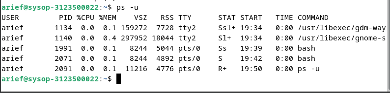
4. Mencari proses yang spesifik pemakai. Proses diatas hanya terbatas pada proses milik pemakai dimana pemakai tersebut melakukan login.
    ```
    $ ps –u < user >
    ```
    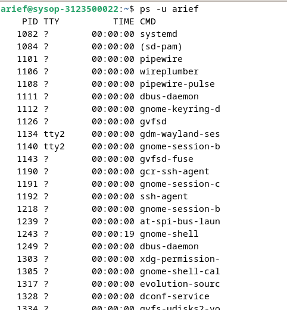
5. Mencari proses lainnya gunakan opsi a (_all_) dan au (_all user_).
    ```
    $ ps –a
    ```
    
6. __Logout__ dan tekan __Alt+F7__ / __⌘+Option+⇠__ untuk kembali ke mode grafis.

## Percobaan 2 (Menampilkan Hubungan Proses Parent dan Child)
1. Pindah ke _command line terminal_ (tty2) dengan menekan __Ctrl+Alt+F2__ / __fn+opt+ctrl+f3__ dan login ke terminal sebagai user.
2. Ketik __ps –eH__ dan tekan __Enter__. Opsi __e__ memilih semua proses dan opsi __H__ menghasilkan tampilan proses secara hierarki. Proses child muncul dibawah proses parent. Proses child ditandai dengan awalan beberapa spasi.
    ```
    $ ps -eH
    ```
    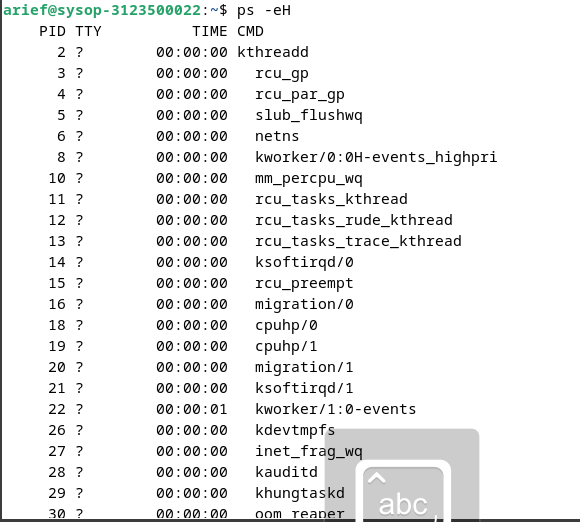
3. Ketik __ps –e f__ dan tekan __Enter__. Tampilan serupa dengan langkah 2. Opsi __–f__ akan menampilkan status proses dengan karakter grafis (\ dan _)
    ```
    $ ps –e f
    ```
    
4. Ketik __pstree__ dan tekan __Enter__. Akan ditampilkan semua proses pada sistem dalam bentuk hirarki parent/child. Proses parent di sebelah kiri proses child. Sebagai contoh proses __init__ sebagai parent (_ancestor_) dari semua proses pada sistem. Beberapa child dari __init__ mempunyai child. Proses __login__ mempunyai proses __bash__ sebagai child. Proses __bash__ mempunyai proses child __startx__. Proses startx mempunyai child __xinit__ dan seterusnya.
    ```
    $ pstree
    ```
    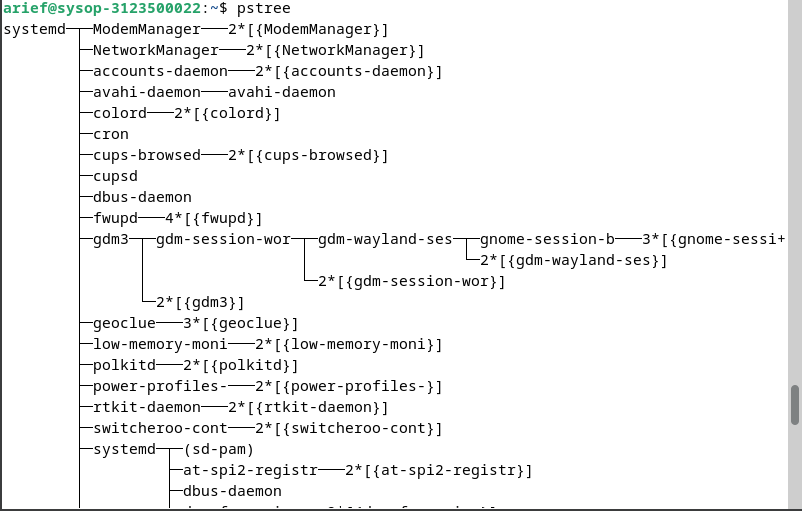
5. Ketik __pstree grep mingetty__ dan tekan __Enter__. Akan menampilkan semua proses __mingetty__ yang berjalan pada system yang berupa _console virtual_. Selain menampikan semua proses, proses dikelompokkan dalam satu baris dengan suatu angka sebagai jumlah proses yang berjalan.
    ```
    $ pstree grep mingetty
    ```
    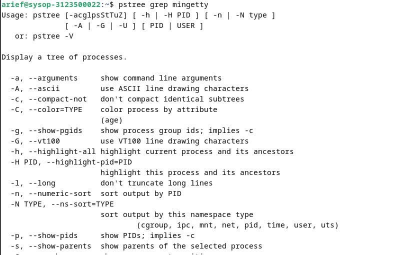
6. Untuk melihat semua PID untuk proses gunakan opsi __–p__.
    ```
    $ pstree –p
    ```
    
7. Untuk menampilkan proses dan ancestor yang tercetak tebal gunakan opsi __–h__.
    ```
    $ pstree –h
    ```
    

## Percobaan 3 (Menampilkan Status Proses dengan Berbagai Format)
1. Pindah ke _command line terminal_ (tty2) dengan menekan __Ctrl+Alt+F2__ dan login ke terminal sebagai user.
2. Ketik __ps –e | more__ dan tekan __Enter__. Opsi __-e__ menampilkan semua proses dalam bentuk 4 kolom : PID, TTY, TIME dan CMD.
    ```
    $ ps –e | more
    ```
    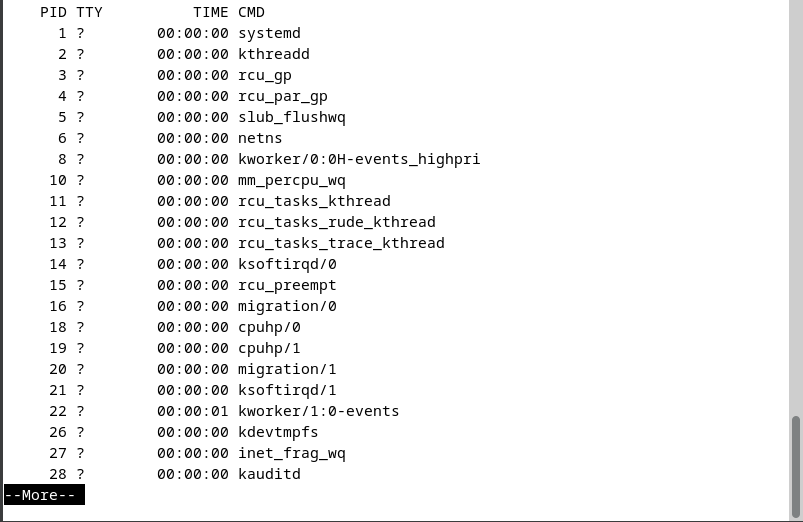
    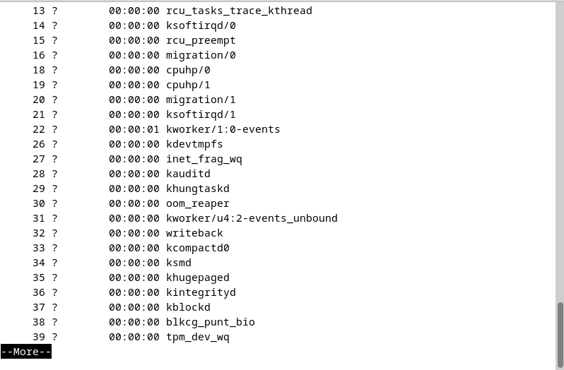

    Jika halaman penuh terlihat prompt --More-- di bagian bawah screen, tekan q untuk kembali ke prompt perintah.

3. Ketik __ps ax | more__ dan tekan __Enter__. Opsi __a__ akan menampilkan semua proses yang dihasilkan terminal (TTY). Opsi __x__ menampilkan semua proses yang tidak dihasilkan terminal. Secara logika opsi ini sama dengan opsi __–e__. Terdapat 5 kolom : PID, TTY, STAT, TIME dan COMMAND.
    ```
    $ ps ax | more
    ```
    
    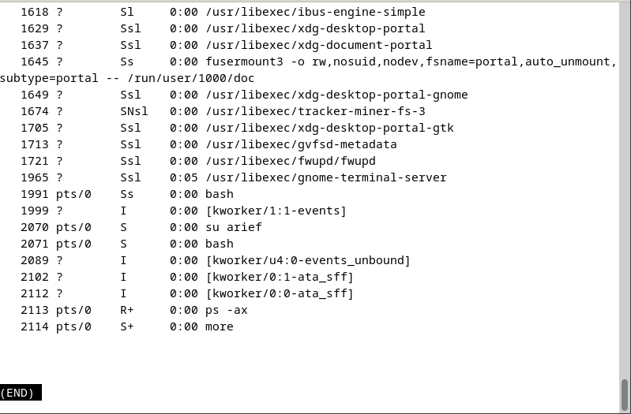

    Jika halaman penuh terlihat prompt --More-- di bagian bawah screen, tekan __q__ untuk kembali ke prompt perintah.

4. Ketik __ps –e f | more__ dan tekan __Enter__. Opsi __–e f__ akan menampilkan semua proses dalam format daftar penuh.
    ```
    $ ps ef | more
    ```
    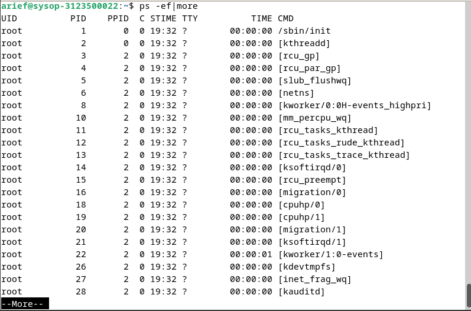
    

    Jika halaman penuh terlihat prompt --More-- di bagian bawah screen, tekan __q__ untuk kembali ke prompt perintah.

5. Ketik __ps –eo pid, cmd | more__ dan tekan __Enter__. Opsi __–eo__ akan menampilkan semua proses dalam format sesuai definisi user yaitu terdiri dari kolom PID dan CMD.
    ```
    $ ps –eo pid,cmd | more
    ```
    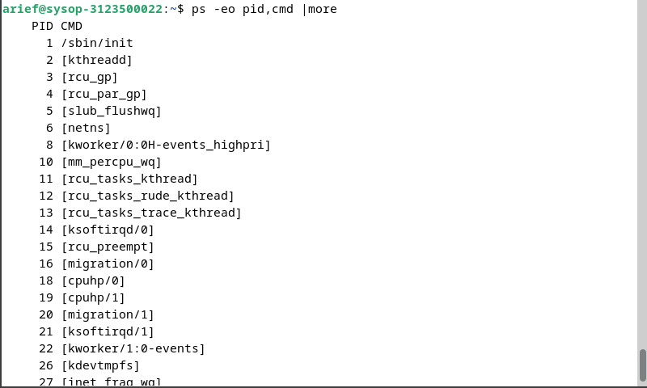
    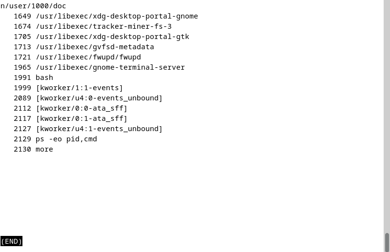

    Jika halaman penuh terlihat prompt --More-- di bagian bawah screen, tekan __q__ untuk kembali ke prompt perintah.

6. Ketik __ps –eo pid,ppid,%mem,cmd | more__ dan tekan __Enter__. Akan menampilkan kolom PID, PPID dan %MEM. PPID adalah proses ID dari proses parent. %MEM menampilkan persentasi memory system yang digunakan proses. Jika proses hanya menggunakan sedikit memory  system akan ditampilkan 0.
    ```
    $ ps –eo pid,ppid,%mem,cmd | more
    ```
    
    
7. Logout dan tekan Alt+F7 untuk kembali ke mode grafis
## Percobaan 4 (Mengontrol proses pada shell)
1. Pindah ke command line terminal (tty2) dengan menekan Ctrl+Alt+F2 dan login ke terminal sebagai user.
2. Gunakan perintah yes yang mengirim output y yang tidak pernah berhenti
    ```
    $ yes
    ```
    gunakan Ctrl-C untuk menghentikan

    
    
3. Belokkan standart output ke /dev/null
    ```
    $ yes > /dev/null
    ```
    gunakan Ctrl-C untuk menghentikan

    
    
4. Salah satu cara agar perintah yes tetap dijalankan tetapi shell tetap digunakan untuk hal yang lain dengan meletakkan proses pada background dengan menambahkan karakter & pada akhir perintah.
    ```
    $ yes > /dev/null &
    ```
    Angka dalam ”[ ]” merupakan job number diikuti PID.

    
5. Untuk melihat status proses gunakan perintah jobs.
    ```
    $ jobs
    ```
    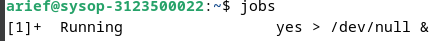
6. Untuk menghentikan job, gunakan perintah kill diikuti job number atau PID proses. Untuk identifikasi job number, diikuti prefix dengan karakter ”%”.
    ```
    $ kill %<nomor job> contoh : kill %1
    ```
    
7. Lihat status job setelah diterminasi
    ```
    $ jobs
    ```
    

## Kesimpulan
Proses dan manajemen proses memainkan peran kunci dalam operasi sistem Linux, mengatur dan mengelola eksekusi program serta penggunaan sumber daya sistem. Konsep proses dalam sistem operasi Linux mencakup pengelompokan program yang sedang berjalan ke dalam unit-unit yang dapat dikelola, dengan masing-masing memiliki identitas unik yang disebut PID (Process ID). Ini memungkinkan sistem untuk melacak dan mengontrol proses secara efisien.

Salah satu aspek penting dari manajemen proses adalah pengiriman sinyal. Sinyal adalah pesan yang dikirim oleh sistem operasi atau proses lain ke proses untuk memberikan notifikasi atau meminta tindakan tertentu. Dalam lingkungan Linux, sinyal ini dapat digunakan untuk berbagai tujuan, termasuk menghentikan, menghentikan, atau merestart proses. Perintah kill digunakan untuk mengirim sinyal ke proses dengan format kill [-nomor sinyal] PID.

Pengguna juga dapat mengontrol proses pada shell menggunakan berbagai perintah. Perintah ps adalah salah satu alat yang paling umum digunakan untuk menampilkan informasi tentang proses yang sedang berjalan pada sistem. Misalnya, dengan ps -u, pengguna dapat melihat proses yang berhubungan dengan pengguna tertentu, sedangkan ps -a dan ps -e dapat digunakan untuk menemukan proses lain atau menampilkan semua proses yang sedang berjalan pada sistem. Perintah pstree memberikan informasi serupa seperti ps, tetapi dalam format pohon yang lebih mudah dipahami.

Manajemen proses juga melibatkan kontrol atas prioritas eksekusi. Perintah nice dan renice memungkinkan pengguna untuk mengubah prioritas proses, memberi mereka lebih sedikit atau lebih banyak sumber daya sistem relatif terhadap proses lain. Ini penting untuk mengoptimalkan kinerja sistem, memastikan bahwa proses-proses kritis mendapatkan prioritas yang tepat sesuai dengan kebutuhan mereka.

Selain itu, dalam konteks manajemen proses, kita juga memahami perbedaan antara proses yang berjalan di latar belakang (background) dan proses yang berjalan di latar depan (foreground). Proses latar depan menerima input dari keyboard dan mengirim output ke layar, sementara proses latar belakang biasanya berjalan tanpa memerlukan interaksi langsung dengan pengguna.

Keseluruhan, pemahaman tentang konsep proses, pengiriman sinyal, penggunaan perintah untuk mengontrol proses pada shell, serta pemahaman tentang perbedaan antara proses latar depan dan latar belakang adalah kunci dalam manajemen efektif dari eksekusi program dan penggunaan sumber daya sistem pada sistem operasi Linux.