<div align="center">
  <h1 style="text-align: center;font-weight: bold">Praktikum 8<br>Bash Programing</h1>
  <h4 style="text-align: center;">Dosen Pengampu : Dr. Ferry Astika Saputra, S.T., M.Sc.</h4>
</div>
<br />
<div align="center">
  
  <h3 style="text-align: center;">Disusun Oleh : </h3>
  <p style="text-align: center;">
    <strong>Mochammad Fahril Rizal (3123500013)</strong><br>
    <strong>Adrian Yoga Chrisarianto (3123500021)</strong><br>
    <strong>Muhammad Arief Wicaksono Putra Santoso (3122500022)</strong>
  </p>
<h3 style="text-align: center;line-height: 1.5">Politeknik Elektronika Negeri Surabaya<br>Departemen Teknik Informatika Dan Komputer<br>Program Studi Teknik Informatika<br>2023/2024</h3>
  <hr><hr>
</div>

# Daftar Isi
1. [Apa itu bash Programming](#bash-programming).
2. [Bash - Variabel](#bash---variables).
3. [Bash - Comments](#bash---comments).
4. [Bash - Arrays](#bash---arrays).
5. [Bash - Expansion](#bash---expansion).
6. [Bash - Condional Expression](#bash---conditional-expression).
7. [Bash - Case Statements](#bash---case-statements).
8. [Bash - Special Characters](#bash---special-characters).
9. [Bash - Loops](#bash---loops).
10. [Bash - Append String](#bash---append-string).
11. [Bash - Functions](#function).
12. [Bash - Operators](#bash---operators).
13. [Bash - Numbers Comparison](#bash---numbers-comparison).
14. [Bash - Check Directory](#bash---check-directory).
15. [Bash - File Name](#bash---file-name).
16. [Bash - Split String](#bash---split-string).
17. [Bash - String Length](#bash---string-length).
18. [Bash - bashrc](#bash---bashrc).
19. [Bash - Ternary Operator](#bash---ternary-operator).
20. [Bash - Lowercase](#bash---lowercase).
21. [Bash - Uppercase](#bash---uppercase).
22. [Bash - Substring](#bash---substring).
23. [Bash - variable set](#bash---variable-set).
24. [Bash - Iterate Nos](#bash---iterate-nos).


## Bash Programming 

### Apa itu bash?

Bash, kependekan dari Bourne Again Shell, adalah open source command line interpreter dan scripting language. Ini menafsirkan perintah yang dimasukkan pengguna, baik secara interaktif atau dari file skrip.

Ini berfungsi sebagai interface untuk memanggil perintah, memungkinkan system function csemuas.

Ada 2 tipe dari mode bash

- **Interactive Mode**
    Juga disebut sebagai command intepreter, memungkinkan eksekusi perintah di terminal. Ini mengeksekusi perintah secara berurutan jika ada beberapa perintah.

- **Non-interactive Mode**
    Ini merujuk pada scrpts, memungkinkan Anda menulis Bash syntax yang berisi rangkaian beberapa perintah untuk eksekusi skrip.

### Apa Perbedaan dari Bash dan Shell

Shell, alias for Bourne Shell, adalah command-line interpreter untuk OS Unix dan Linux. Bash, alias Bourne Again Shell, adalah versi yang disempurnakan.

### Untuk apa skrip bash digunakan?

Skrip Bash memiliki banyak kasus penggunaan, termasuk:
- Menulis skrip untuk mengotomatiskan tugas pemrograman
- Menyinkronkan tugas untuk menyalin file
- Menjalankan tugas cron untuk penjadwalan

### Bagaimana cara menulis kode di bash?

Untuk menulis kode dalam skrip Bash, ikuti langkah-langkah berikut:
- Di terminal, buat file menggunakan `vi test.sh`.
- Tambahkan `#!/bin/bash` di bagian atas file.
- Tambahkan beberapa cuplikan kode shell.
- Simpan file shell dengan `.sh` ekstensi.
- Jalankan skrip shell menggunakan `./test.sh` perintah di terminal.

### Apakah bash termasuk bahasa pengkodean?

Bash menjalankan perintah dari terminal atau file. Ini adalah bahasa pemrograman yang beroperasi pada sistem operasi kernel Unix/Linux, berisi semua fitur untuk menulis kode lengkap.

Bash adalah tipe shell khusus yang menerima masukan dari perintah, menjalankan kode, dan memproses masukan, serta mengembalikan hasilnya.

### Jenis Shell

Ada berbagai jenis shell di OS Unix.

<table>
<thead>
<tr>
  <th style="background-color: gray; color: white">Tipe Cangkang</th>
  <th style="background-color: gray; color: white">Alias</th>
  <th style="background-color: gray; color: white">Garis Pertama</th>
<tr>
</thead>
<tbody>
  <tr>
  <td>SH</td>
  <td>Bourne Shell</td>
  <td>#!/bin/sh</td>
  </tr>
   <tr>
  <td>bash</td>
  <td>Bourne Again Shell</td>
  <td>#!/bin/bash</td>
  </tr>
   <tr>
  <td>cshell</td>
  <td>C shel</td>
  <td>#!/bin/csh</td>
  </tr>
  <tr>
  <td>tcsh</td>
  <td>TENEX C shell</td>
  <td>#!/bin/tcsh</td>
  </tr>
  <tr>
  <td>ksh</td>
  <td>Korn shell</td>
  <td>#!/bin/ksh</td>
  </tr>
</tbody>
</table>

### Perbedaan dari Command Line dan Script di bash

Mari kita lihat perbedaan antara baris perintah dan skrip

Opsi baris perintah

- Baris perintah memiliki prompt yang menerima masukan dari pengguna
- Perintah tidak disimpan ke file.
- Ini hanya mendukung satu perintah pada satu waktu.

File skrip

- Mendukung banyak perintah dalam satu file
- Prompt masih dapat ditulis dalam file skrip
- Hanya satu baris dalam sebuah file yang dijalankan secara berurutan

## Bash - Variables

**Deklarasi Variable**: Untuk membuat variable, maka harus memberikan nilai padanya

``` 
variableName=VariableValue
```

Keterangan: 

- variableName: dapat berisi kombinasi huruf apa saja, angka, dan garis bawah
- variableValue: adalah nilai yang disimpan dalam variabel, dan dapat berupa angka, string atau boolean. Simbol `=` digunakan untuk memberikan nilai pada suatu variabel.

Misalnya

```
AGE=25
```

### Cara menggunakan variabel di bash

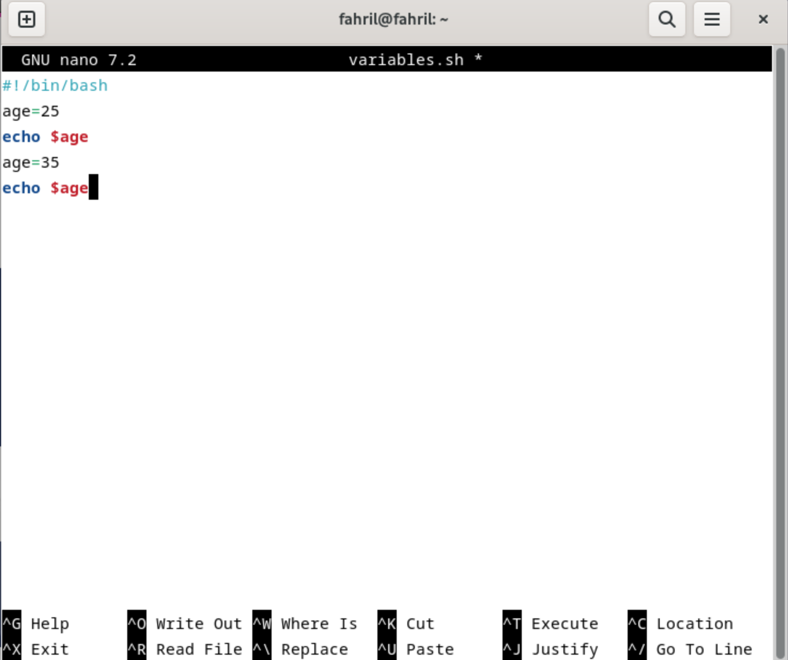

Pertama, deklarasikan variabel *AGE* dan beri nilai 25. Kemudian, gunakan `echo` untuk menampilkan outputnya. Simbol dolar `$` sebelum nama variabel sangat penting untuk mengakses nilainya. Untuk deklarasi variable di shell mirip dengan beberapa bahasa pemograman seperti, php, perl, bash dan beberapa framework javascript

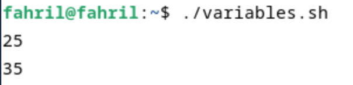

### Bash Shell Read Only variables


Setelah variabel diberi nilai, kita dapat mengubahnya menjadi nilai baru menggunakan operator penugasan =.

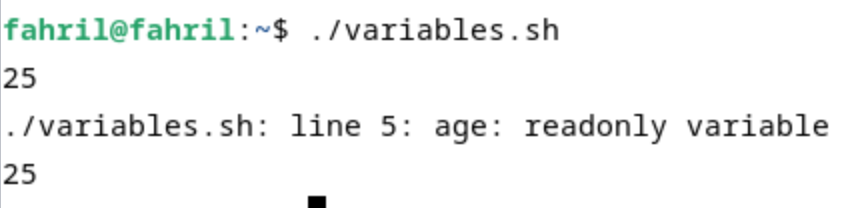

### Bash Unset Variable

Keyword _`unset`_ membantu menghapus nilai dari variabel yang ditentukan. Variabel tetap dapat diakses tetapi akan mencetak nilai kosong.

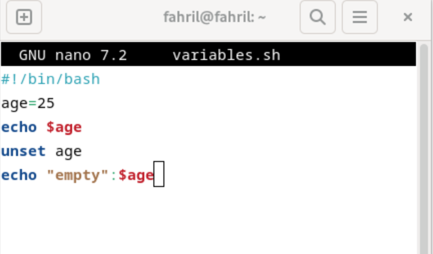

Output:

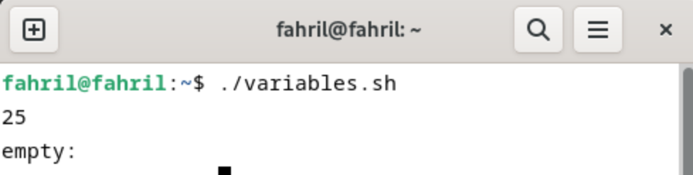

### Variables Scope

Setiap variabel yang dideklarasikan harus memiliki cakupan, yang menentukan di mana variabel tersebut dapat digunakan dalam program.

Misalnya, jika suatu variabel dideklarasikan di dalam suatu fungsi, maka variabel tersebut hanya tersedia di dalam fungsi tersebut dan tidak dapat diakses di luar fungsi tersebut.

Dalam Bash, cakupan variabel dapat didefinisikan dengan dua cara:

- Global Variable: Variabel yang dideklarasikan di luar fungsi atau blok kode khusus dan dapat diakses dari seluruh bagian skrip.
- Local Variable: Variabel yang dideklarasikan di dalam fungsi atau blok kode khusus dan hanya dapat diakses di dalam fungsi atau blok tersebut.

Terkadang kita ingin membaca konten file menggunakan bash programming. 
Ada berbagai macam cara yang dapat kita lakukan

### Bagaimana cara membaca file baris demi baris di bash Shell?
- menggunakan perulangan while

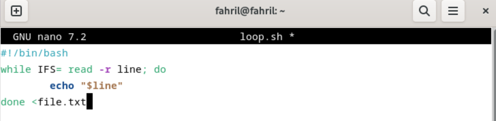

Output

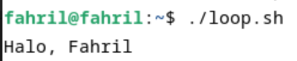

Output diatas merupakan isi dari file `file.txt` 

## Bash - Comments

Komentar dalam skrip bash shell adalah pernyataan kode yang berisi teks yang bisa dibaca oleh pengguna, namun dilewati oleh shell saat eksekusi. Setiap bahasa pemrograman memiliki fitur komentar, yang memberikan deskripsi pada baris kode atau pernyataan.

Sama seperti bahasa pemograman lain, bash memungkinkan penggunaan dua jenis komentar, yaitu:

- **Komentar satu baris**
- **Komentar multi-baris**

Komentar berfungsi sebagai dokumentasi program.

### Komentar satu baris di bash shell 

Komentar satu baris dalam skrip shell dilambangkan dengan simbol `#` di awal setiap baris.

Komentar ini mengandung string yang memberikan informasi tentang baris kode terkait dalam skrip shell.

Penting untuk menempatkan komentar satu baris pada baris terpisah untuk kejelasan.

Untuk menulis komentar satu baris, gunakan simbol `#` di awal komentar. Komentar satu baris selalu dimulai dengan simbol `#`.

**Syntax:**

```
# Single-line comments
```

Berikut ini adalah contoh komentar satu baris dalam skrip shell.

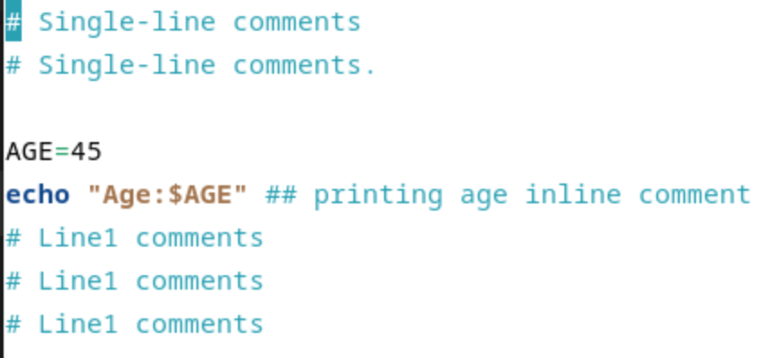

Output

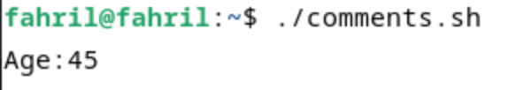

### Komentar multi-baris dalam skrip shell
**Syntax:**

```
: ' 
Multi-line comments
Multi-line comments
Multi-line comments
'
```
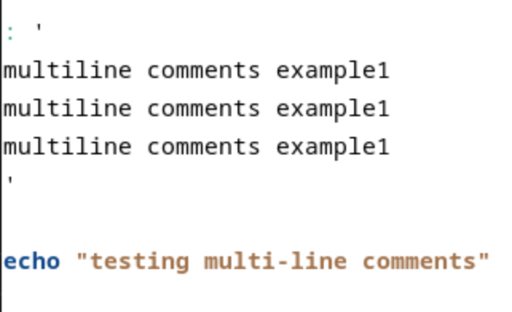
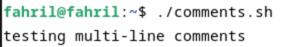


### Kesimpulan

Sama seperti bahasa pemograman lainnya, shell juga dapat menambahkan komentar satu baris dan multi-baris. `#` untuk komentar satu baris `:' '`untuk multi baris.

## Bash - Arrays

Array adalah variabel yang memungkinkan Anda menyimpan lebih dari satu nilai atau data dalam satu variabel. Misalnya, jika Anda memiliki daftar bilangan bulat dari 1 hingga 100, Anda dapat menggunakan array untuk menyimpannya dalam skrip shell, yang akan menghindari kebutuhan untuk mendeklarasikan setiap nilai secara terpisah dengan pernyataan seperti `let number1=1`, dan seterusnya. Dengan menggunakan array, Anda dapat merujuk ke satu variabel dan menyimpan semua nilai tersebut di dalamnya.

### Bagaimana cara mendeklarasikan dan membuat array?

Ada dua jenis array yang dapat kita buat:

- Array yang diindeks: Elemen array disimpan dengan indeks mulai dari nol.
- Array terkait: Array disimpan dengan pasangan nilai kunci.

**Deklarasi sebuah array**

Untuk membuat array, kita perlu mendeklarasikan array.
```
declares -a array; # indexed array
declare -A array; # associative array
```
Sebuah array dideklarasikan dengan kata kunci declaredengan opsi `-a` atau `A`

**Menetapkan nilai tanpa mendeklarasikan Array**

```
arrayvariable[index]=value
```
Artinya, `arrayvariable[indeks]` array dideklarasikan dan diberi nilai.

Array yang diindeks dimulai dari nol dengan panjang array - 1. Indeks 0 mengembalikan elemen pertama, sedangkan indeks -1 mengembalikan elemen terakhir.

Array bisa berisi angka, string, atau campurannya. Mari kita buat contoh array.

### Akses nilai Array

Array berisi indeks untuk mendapatkan elemen. Elemen array dapat diakses menggunakan sintaks di bawah ini.

```
${array_name[index]}
```

### Deklarasi Array angka dan Loop

Array dapat berisi angka Contoh ini berisi array angka dan loop for untuk dicetak

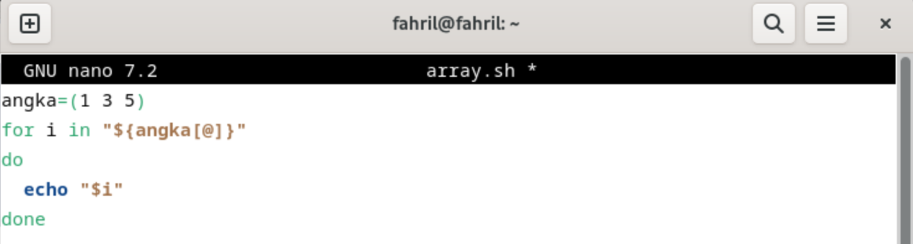

Output:

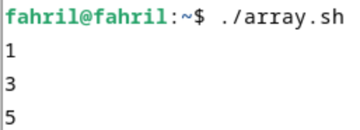

### Deklarasi Array string dan Loop

Array dapat berisi angka Contoh ini berisi array angka dan loop for untuk dicetak

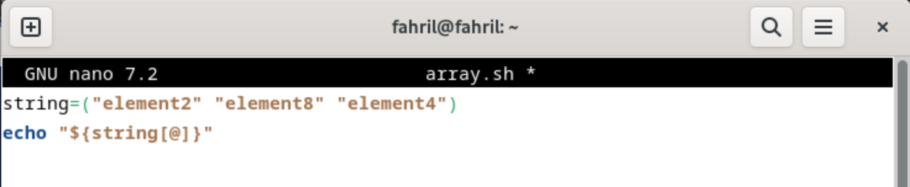

Output:

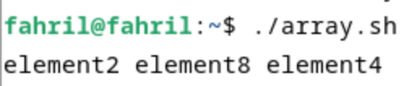

### Akses elemen pertama array

Dalam array, indeks elemen pertama adalah nol, sehingga `array[0]` mengembalikan elemen pertama.

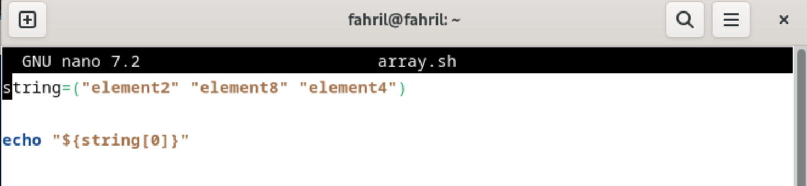

Output:

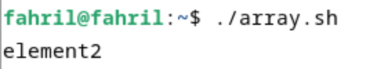

### Dapatkan element terakhir dalam sebuah array

Dalam skrip bash, Anda dapat menggunakan indeks -1 untuk mendapatkan elemen array terakhir.

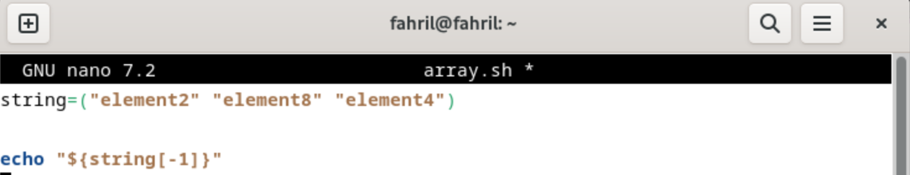

Output:

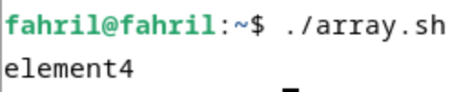

### Iterate atau Loop element array

For loop digunakan untuk mengulangi elemen.

Berikut adalah contoh loop array untuk mencetak semua elemen

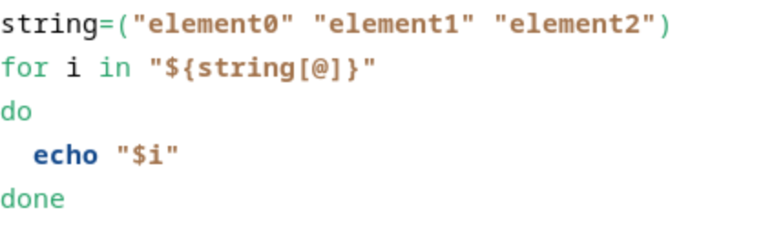

Output:

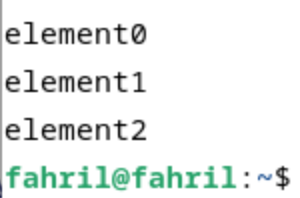

### Cetak semua elemen array

Gunakan [@] atau [*] untuk mencetak semua elemen array.

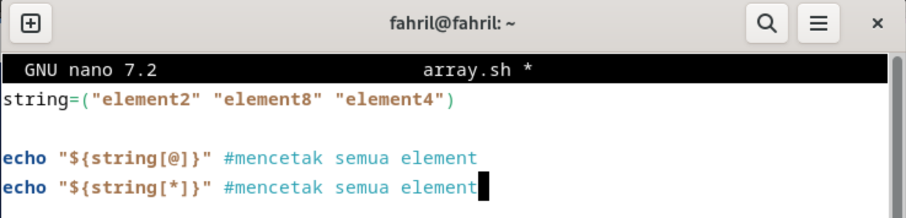

Output:


### Hapus elemen dari array

Anda dapat menghapus elemen dari array menggunakan `unset` indeks tertentu.

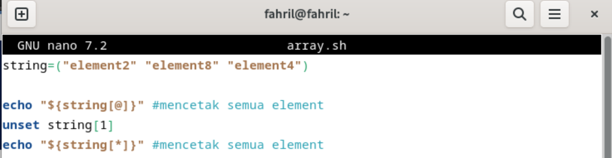

Output:


### Menambahkan elemen ke array

Anda dapat menambahkan elemen di posisi indeks mana pun menggunakan sintaks di bawah ini.

```
array[index]=value
```

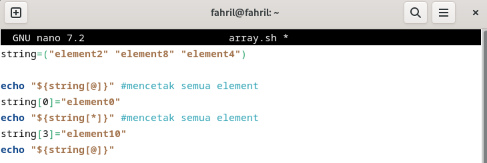

Output:

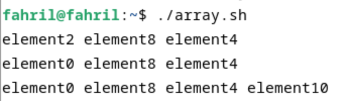

### Array cheat sheet

<table>
<thead>
<tr>
  <th style="background-color: gray; color: white">Example</th>
  <th style="background-color: gray; color: white">Description</th>
<tr>
</thead>
<tbody>
    <tr>
        <td>declare -a array	</td>
        <td>Deklarasi Indexed array</td>
    </tr>
    <tr>
        <td>declare -A array	</td>
        <td>Deklarasi Associative array</td>
    </tr>
    <tr>
        <td>declare -a array=()	</td>
        <td>Deklarasi indexed array array kosong</td>
    </tr>
    <tr>
        <td>array=()</td>
        <td>Membuat array kosong</td>
    </tr>
    <tr>
        <td>array=(1 6 3)</td>
        <td>Inisialisasi array berisi angka</td>
    </tr>
    <tr>
        <td>array=(one two three)</td>
        <td>Inisialisasi array berisi string</td>
    </tr>
    <tr>
        <td>array=(one two 1)</td>
        <td>Inisialisasi array with data campur</td>
    </tr>
    <tr>
        <td>${array[0]}</td>
        <td>Mendapatkan element pertama</td>
    </tr>
    <tr>
        <td>${array[1]}</td>
        <td>Mendapatkan element kedua</td>
    </tr>
    <tr>
        <td>${array[-1]}</td>
        <td>Mendapatkan element terakhir</td>
    </tr>
    <tr>
        <td>${array[@]}</td>
        <td>Mendapatkan semua element</td>
    </tr>
    <tr>
        <td>${array[*]}</td>
        <td>Mendapatkan semua element</td>
    </tr>
    <tr>
        <td>${!array[!]}</td>
        <td>Mendapatkan semua index</td>
    </tr>
    <tr>
        <td>${#array[!]}</td>
        <td>Menghitung panjang array</td>
    </tr>
    <tr>
        <td>array[0]=12</td>
        <td>Add element to array at first position.i.e index=0</td>
    </tr>
    <tr>
        <td>array[-1]=22</td>
        <td>Menambahkan element di posisi terakhir ke array .</td>
    </tr>
    <tr>
        <td>array+=(11)</td>
        <td>Menambahkan value ke array</td>
    </tr>
    <tr>
        <td>${array[@]:k:i}</td>
        <td>Mendapatkan index=1 element dari index=k</td>
    </tr>
</tbody>
</table>

## Bash - Expansion

Perintah dimasukkan ke sistem operasi untuk membuat panggilan sistem dan melakukan tindakan. Perintah masukan pengguna di terminal digunakan untuk melakukan operasi seperti `ls`, `cd`, `mkdir`, dan sebagainya.

Salah satu cara lain adalah dengan menempatkan beberapa perintah dalam satu file, di mana bahasa bash akan membaca dan menjalankannya.

Berikut adalah cara menulis skrip shell di bash:

- Pilih editor atau editor teks.
- Buat file dengan ekstensi `.sh` atau `.bash`.
- Tulis perintah dalam file.
- Simpan file sebagai `hello.sh`.

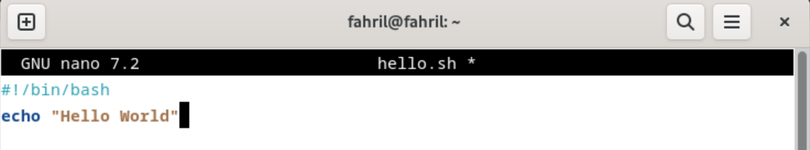

Output:

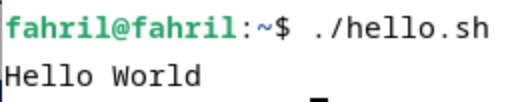

## Bash - Conditional Expression

Ekspresi kondisional dievaluasi saat skrip dieksekusi, dan berdasarkan hasilnya, ia mengeksekusi blok perintah tertentu.

Berikut beberapa jenis ekspresi kondisional di Bash:

- Operator perbandingan string
- Operator perbandingan numerik
- Operator file
- Operator logis

Conditional expressions berisi opsi dan jalur file yang selalu mengembalikan nilai benar atau salah.

Berikut adalah beberapa opsi yang disediakan:

<table>
<thead>
<tr>
  <th style="background-color: gray; color: white">Example</th>
  <th style="background-color: gray; color: white">Description</th>
<tr>
</thead>
<tbody>
    <tr>
        <td>-e file</td>
        <td>Return true jika file ada, jika tidak, maka akan bernilai salah</td>
    </tr>
    <tr>
        <td>-f file</td>
        <td>Return true jika file ada, sebuah file bukan direktori<td>
    </tr>
    <tr>
        <td>-d file</td>
        <td>Return true jika file di direktori yang sama</td>
    </tr>
    <tr>
        <td>-r file</td>
        <td>Return true jika file ada dan readable</td>
    </tr>
    <tr>
        <td>-w file</td>
        <td>Return true jika file writeable</td>
    </tr>
    <tr>
        <td>-x file</td>
        <td>Return true jika file executeable</td>
    </tr>
    <tr>
        <td>-s file</td>
        <td>Return true jika file memiliki ukuran > 0</td>
    </tr>
    <tr>
        <td>-G file</td>
        <td>Return true if file exists and isowned by a Group ID that matches</td>
    </tr>
    <tr>
        <td>-O file</td>
        <td>Return true jika file dimiliki user ID yang sama (sebuah grup)</td>
    </tr>
    <tr>
        <td>-N file</td>
        <td>Return true jika file telah diubah sejak terakhir kali dibaca</td>
    </tr>
    <tr>
        <td>-L file</td>
        <td>Return true jika file adalah symbolic Link</td>
    </tr>
    <tr>
        <td>file1 -ot file2</td>
        <td>Return true jika file1 lebih tua(lama) dari file2 atau file2 ada, file1 tidak ada</td>
    </tr>
    <tr>
        <td>file1 -ne file2</td>
        <td>Return true jika file1 is lebih baru dari file2 atau file1 ada, file2 tidak ada</td>
    </tr>
    <tr>
        <td>file1 -ef file2</td>
        <td>Return true jika kedua file menunjuk ke perangkat dan inode (blok data) yang sama</td>
    </tr>
</tbody>
</table>

## Bash - Case Statements

Pernyataan case mirip dengan switch case dalam bahasa pemrograman lain.

Ini digunakan untuk membandingkan masukan yang diberikan dengan beberapa pola, dan menjalankan perintah di dalam pola yang cocok.

Syntax:

```
case expression in

pattern1)
  ## Commands
  ;;
pattern1)
  ## Commands
  ;;
*)
  ## Default case to execute if none of the pattern is matched
  ;;
```

- Expression adalah variabel atau ekspresi yang valid untuk dievaluasi.
- Ini berisi pola yang didefinisikan di dalam case yang dievaluasi dengan membandingkan expression, mencocokkan case yang ditemukan, dan mengeksekusi perintah di dalamnya.
- Case default (`*`) dijalankan jika tidak ada pola yang cocok.
- Setiap blok pola diakhiri dengan `;;`.
`case` adalah kata awal dan `esac` merupakan kata yang mengakhiri pernyataan case.

Contohnya sebagai berikut:

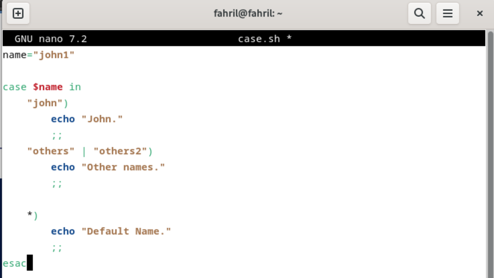

Output:

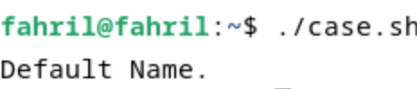

## Bash - Special Characters

Spesial Characters dalam bahasa Bash dievaluasi dengan makna tertentu dalam pengolahan sebuah perintah. Karakter-karakter ini memiliki instruksi khusus yang memberikan makna yang berbeda tergantung pada konteksnya.

Tanda kutip tunggal ('), misalnya, digunakan untuk mendefinisikan sebuah string tanpa interpretasi khusus. Ini berarti semua variabel dan ekspansi tidak diproses dan string yang sama akan dicetak secara harfiah.

Sebagai contoh, dalam perintah `echo` yang pertama, variabel "nama" akan diperluas dan diinterpretasikan sebagai string sebelum dicetak. Namun, dalam perintah `echo` yang kedua, ketika tanda kutip tunggal digunakan, variabel "nama" tidak akan diperluas dan akan dicetak sebagai string literal.

Jika tanda kutip tunggal mengandung tanda kutip tunggal bertingkat, Anda perlu menghindarinya dengan menggunakan karakter ``` backtick ```.

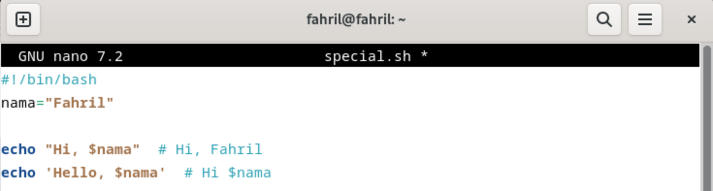

Output : 

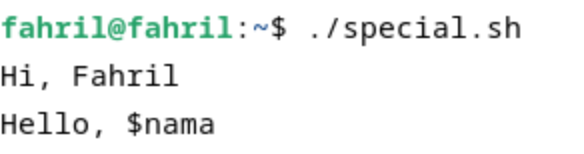

Tanda kutip ganda (") digunakan untuk mendefinisikan string literal dengan makna khusus. Ketika string mengandung variabel dan ekspansi sintaks, tanda kutip ganda akan menginterpretasikan dan memperluasnya, dengan nilai yang dievaluasi saat runtime.

Jika Anda ingin menghindari ekspansi variabel dalam string, Anda dapat menggunakan karakter escape (\) sebelum tanda dolar ($).

Sebagai contoh, dalam perintah `echo` yang pertama, variabel "nama" akan diekspansi dan diinterpretasikan sebagai string sebelum dicetak. Namun, dalam perintah `echo` yang kedua, karakter escape (\) digunakan sebelum tanda dolar ($), sehingga variabel "nama" dicetak sebagai string literal.


Output : 


Karakter Backslash (\) digunakan untuk melarikan karakter-karakter dalam string. Biasanya, ini digunakan dalam string yang diapit oleh tanda kutip ganda (""). 

Dalam contoh pertama, pada perintah `echo`,  akan menampilkan ID proses. Namun, dalam contoh kedua, perintah `echo` berisi \$, yang menyebabkan $$ ditampilkan sebagai string literal dengan karakter escape.

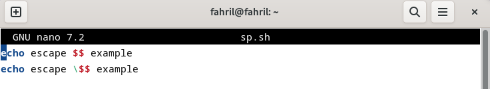

Output : 

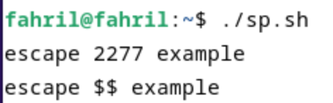

## Bash Shell Conditional Statements

Bash Script menyediakan ekspresi kondisional untuk menjalankan kode yang berbeda berdasarkan kondisi yang ditentukan. Pernyataan if digunakan untuk menjalankan blok kode jika suatu kondisi benar, dengan sintaks if then fi. Pernyataan else digunakan untuk menjalankan kode jika kondisi salah, mengikuti sintaks if then else fi. Pernyataan if..elif..else berguna saat Anda perlu menjalankan kode jika tidak ada dari kondisi sebelumnya yang benar. Sintaksnya adalah sebagai berikut: 

- If-Else Conditional Statements

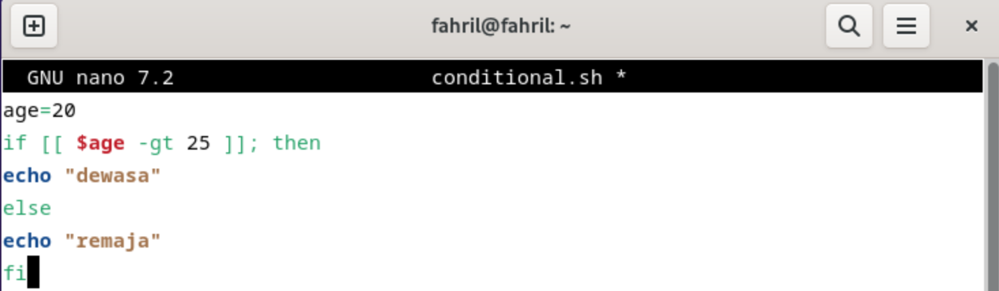

Output : 

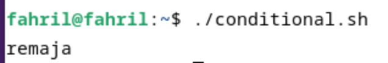

- If..Elif..Else Statements

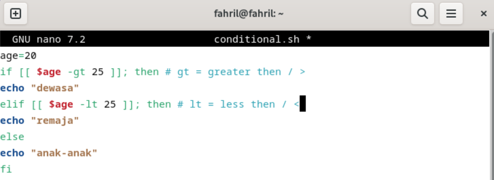

Output : 

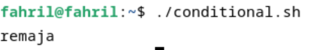

## Bash - Loops

Loop digunakan untuk menjalankan blok kode untuk sejumlah kali tertentu. Misalnya, saat Anda ingin menjalankan perintah secara berulang atau mencetak array. Loop for digunakan dalam Bash. Ada beberapa jenis loop yang tersedia dalam Bash:
- Loop for
- Loop for indeks
- Loop while
- Loop until

##### for loop

Loop for digunakan untuk menjalankan kode beberapa kali berdasarkan kondisi yang ditentukan.

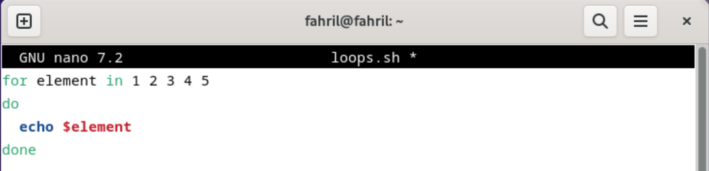

Output : 

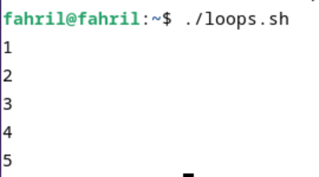

##### for index loop

Loop for indeks mirip dengan loop for dalam bahasa C. Ini menjalankan kode beberapa kali berdasarkan kondisi yang benar. Dimulai dengan nilai awal dan iterasi berisi nilai yang akan ditambahkan dengan 1.

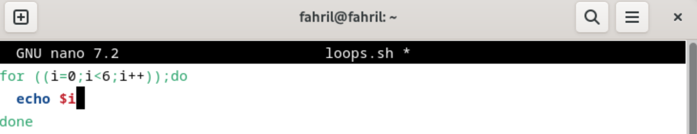

Output : 

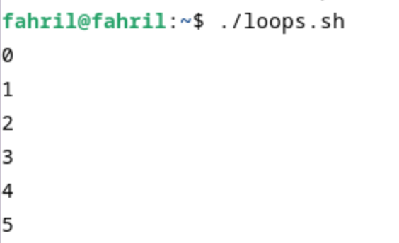

##### while loop in bash

Loop while dalam Bash memungkinkan untuk menjalankan kode secara berulang selama kondisi tertentu benar. Jika kondisinya menjadi salah, loop keluar.

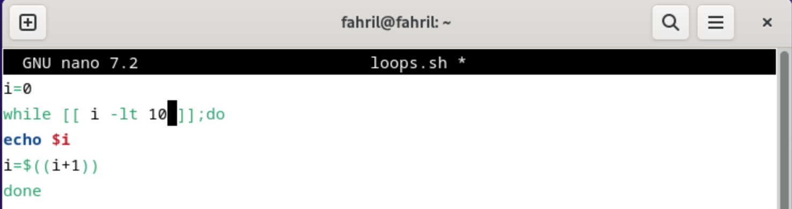

Output : 

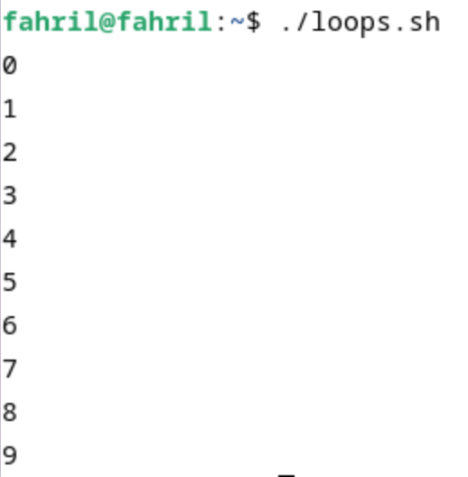

##### Until loop in bash

Kata kunci until dalam Bash digunakan untuk menjalankan kode secara berulang hingga suatu kondisi tertentu menjadi benar, pada saat itu loop keluar.

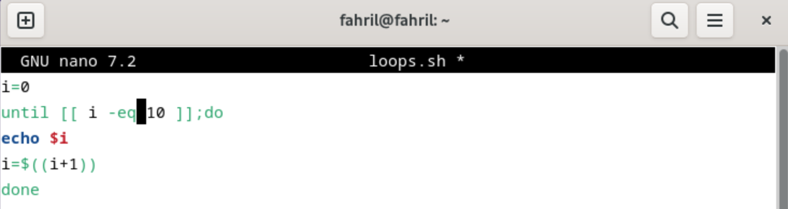

Output : 


## Bash - Append String

contoh pemrograman untuk menggabungkan variabel string menggunakan penambahan sederhana dan operator aritmatika singkat. Ekspresi aritmatika digunakan untuk melakukan operasi matematika. "Ekspresi" adalah istilah yang digunakan dalam matematika untuk menunjukkan suatu operasi. Ini berisi operand dan operator untuk melakukan operasi matematika. Misalnya, a < b adalah suatu ekspresi. Ini dapat berisi operator biner atau uner.

Operator perbandingan digunakan untuk memeriksa nilai satu dengan yang lain dengan membandingkan nilai. Operator-operator tersebut adalah (<, <=, >, >=, ==, !=).

##### Bash Athematic expressions

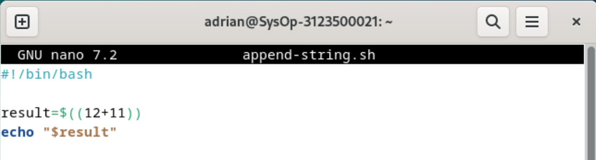

Output : 

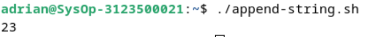

##### Bash Athematic Expansion

seperti ekspresi. Ini menghitung nilai dari suatu ekspresi dan menggantikan hasilnya dengan nilai tersebut, selalu dengan awalan tanda dolar. Misalnya, untuk menghitung rata-rata dari dua angka dan mencetak hasilnya, kita menggunakan sintaks ekspansi yang mengevaluasi ekspresi dan menggantikan hasilnya dengan keluaran dari ekspresi tersebut.

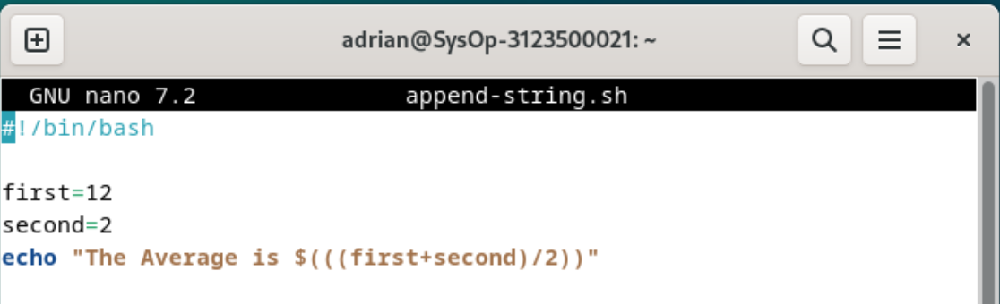

Output : 

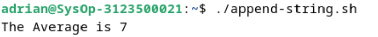

## Function

Function/fungsi adalah potongan kode yang dapat digunakan kembali yang dikelompokkan di bawah satu nama.

Cara mendeklarasikan fungsi, memanggilnya, serta memahami cakupan variabel di dalamnya:

- Deklarasi fungsi
- Memanggil fungsi
- Fungsi dengan argumen
- Ruang lingkup variabel dalam fungsi

Definisi fungsi berisi beberapa baris kode yang akan dieksekusi. Fungsi memiliki nama yang diapit oleh kurung kurawal {}. Mereka dapat dideklarasikan dengan dua cara.

```

function function_name {
# Commands or valid bash code
# multiple lines
}
```

## Bash - Operators

Operator adalah simbol dalam pemrograman yang melakukan operasi pada operand.

```
operand1 operator operand2
```

Macam macam operator : 

<table border="1">
  <tr>
    <th>Operator</th>
    <th>Title</th>
    <th>Description</th>
    <th>Example</th>
  </tr>
  <tr>
    <td>+</td>
    <td>Addition</td>
    <td>penjumlahan dua atau lebih operand</td>
    <td>p + q = 50</td>
  </tr>
  <tr>
    <td>-</td>
    <td>Subtraction</td>
    <td>pengurangan dua atau lebih operand</td>
    <td>q - p = 10</td>
  </tr>
  <tr>
    <td>*</td>
    <td>Multiplication</td>
    <td>perkalian dua atau lebih operand</td>
    <td>p * q = 600</td>
  </tr>
  <tr>
    <td>/</td>
    <td>Divide</td>
    <td>menghasilkan hasil bagi setelah pembagian nilai</td>
    <td>q / p = 1.5</td>
  </tr>
  <tr>
    <td>%</td>
    <td>Modulus</td>
    <td>Mengembalikan sisa setelah pembagian nilai</td>
    <td>q % p = 10</td>
  </tr>
  <tr>
    <td>-expr</td>
    <td>Unary Minus</td>
    <td>balik dari suatu ekspresi</td>
    <td>-(10-7) adalah -3</td>
  </tr>
  <tr>
    <td>~/</td>
    <td>Division Int</td>
    <td>mengembalikan nilai int dari pembagian</td>
    <td>(10~/7) adalah 1</td>
  </tr>
  <tr>
    <td>++</td>
    <td>Increment</td>
    <td>Menambahkan nilai sebesar 1</td>
    <td>++p = 21</td>
  </tr>
  <tr>
    <td>--</td>
    <td>Decrement</td>
    <td>Mengurangkan nilai sebesar 1</td>
    <td>--q = 29</td>
  </tr>
</table>

##### Assignment Operators

Operator penugasan digunakan untuk menetapkan nilai ke variabel. Berikut adalah beberapa contoh operator penugasan yang umum digunakan dalam pemrograman:

- =: Menetapkan nilai dari nilai kanan ke nilai kiri.
- +=: Menambahkan nilai nilai kanan ke nilai kiri.
- -=: Mengurangkan nilai nilai kanan dari nilai kiri.
- *=: Mengalikan nilai nilai kiri dengan nilai kanan.
- /=: Membagi nilai nilai kiri dengan nilai kanan.
- %=: Menetapkan sisa hasil bagi nilai kiri dengan nilai kanan.

##### Bitwise Operators

Operator bitwise digunakan untuk melakukan operasi pada level bit pada operand. Berikut adalah beberapa operator bitwise yang umum digunakan:

<table border="1">
  <tr>
    <th>Operasi</th>
    <th>Simbol</th>
    <th>Deskripsi</th>
    <th>Hasil</th>
  </tr>
  <tr>
    <td>AND</td>
    <td>&amp;</td>
    <td>Operasi AND bitwise dari dua operand</td>
    <td>$op1 &amp; $op2 adalah 0</td>
  </tr>
  <tr>
    <td>AND Equal</td>
    <td>&amp;=</td>
    <td>Operasi AND Equal bitwise dari dua operand</td>
    <td>$op1 &amp;= $op2 adalah 0</td>
  </tr>
  <tr>
    <td>OR</td>
    <td>|</td>
    <td>Operasi OR bitwise dari dua operand</td>
    <td>$op1 | $op2 adalah 7</td>
  </tr>
  <tr>
    <td>XOR</td>
    <td>^</td>
    <td>Operasi XOR bitwise dari dua operand</td>
    <td>$op1 ^ $op2 adalah 7</td>
  </tr>
  <tr>
    <td>Left Shift</td>
    <td>&lt;&lt;</td>
    <td>Operasi Left Shift bitwise dari dua operand</td>
    <td>$op1 &lt;&lt; $op2 adalah 0</td>
  </tr>
  <tr>
    <td>Left Shift Eql</td>
    <td>&lt;&lt;=</td>
    <td>Operasi Left Shift Equal bitwise dari dua operand</td>
    <td>$op1 &lt;&lt;= $op2 adalah 7</td>
  </tr>
  <tr>
    <td>XOR</td>
    <td>^</td>
    <td>Operasi XOR bitwise dari dua operand</td>
    <td>$op1 ^ $op2 adalah 7</td>
  </tr>
  <tr>
    <td>XOR Equal</td>
    <td>^=</td>
    <td>Operasi XOR Equal bitwise dari dua operand</td>
    <td>$op1 ^= $op2 adalah 7</td>
  </tr>
</table>

##### Logical operators

Operator-operator ini digunakan untuk melakukan operasi logika pada variabel, ekspresi, atau data.

##### Numerical Comparision Operator

``` -eq ``` digunakan untuk logika equal/mencari persamaan nilai

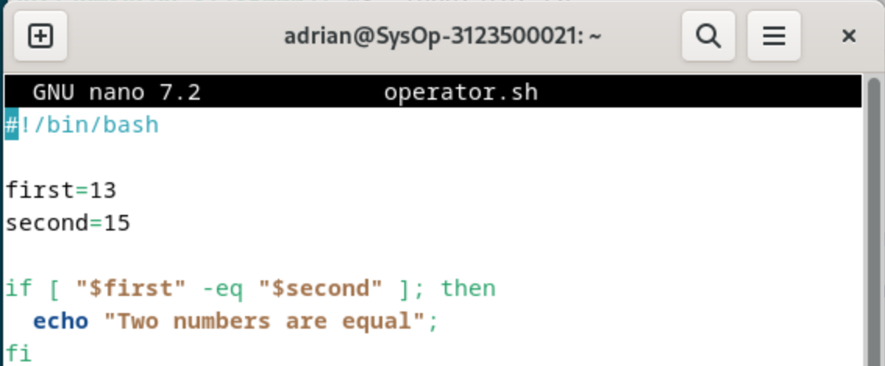

Output : 

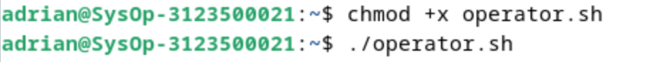

```-ne``` digunakan untuk logika equal, mencari ketidaksamaan nilai

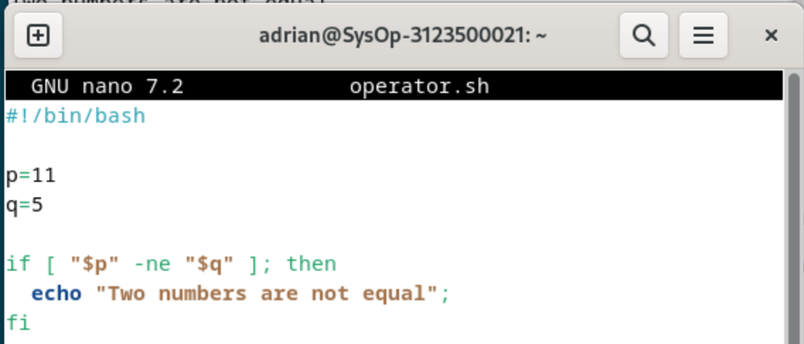

Output : 

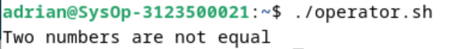

## Bash - Numbers Comparison

Berikut adalah operator perbandingan:

- `-eq`: Sama dengan
  - Memeriksa apakah dua variabel sama
- `-ne`: Tidak sama dengan
  - Memeriksa apakah dua variabel tidak sama
- `-lt`: Kurang dari
  - Memeriksa apakah variabel pertama kurang dari variabel kedua
- `-le`: Kurang dari atau sama dengan
  - Memeriksa apakah variabel pertama kurang dari atau sama dengan variabel kedua
- `-gt`: Lebih dari
  - Memeriksa apakah variabel pertama lebih besar dari variabel kedua
- `-ge`: Lebih besar dari atau sama dengan
  - Memeriksa apakah variabel pertama lebih besar dari atau sama dengan variabel kedua

Kode Gagal 
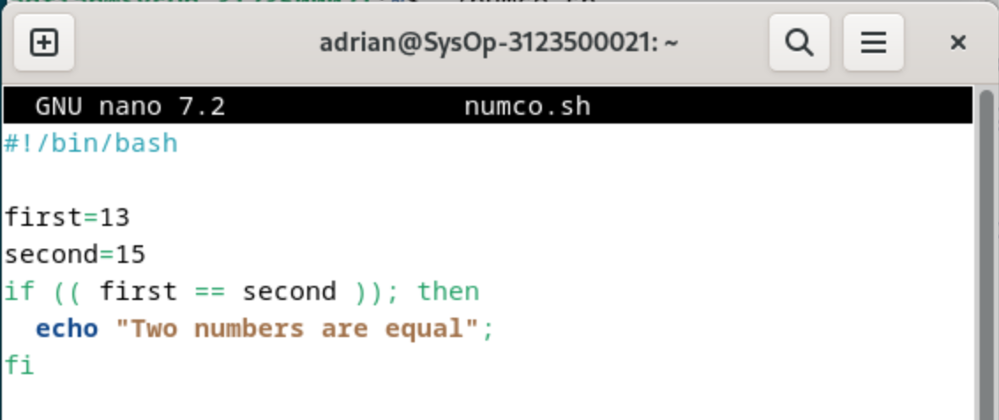

Kode Sukses 
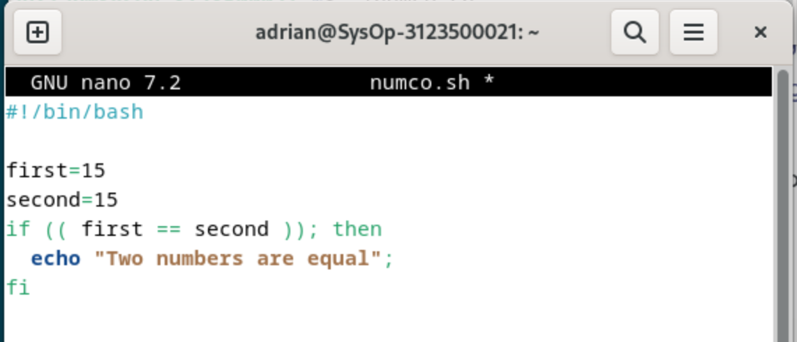

Output Gagal 
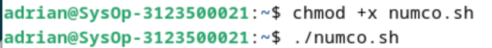

Output Sukses
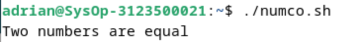

## Bash - Check Directory


Untuk memeriksa apakah sebuah direktori ada atau tidak dalam skrip Bash, Anda dapat menggunakan perintah test dengan opsi -d. Berikut adalah contoh cara melakukannya dalam skrip Bash:

```
#!/bin/bash

directory="/path/to/directory"

if [ -d "$directory" ]; then
    echo "Directory $directory exists."
else
    echo "Directory $directory does not exist."
fi
```

##### How to mkdir only if a directory does not already exist?

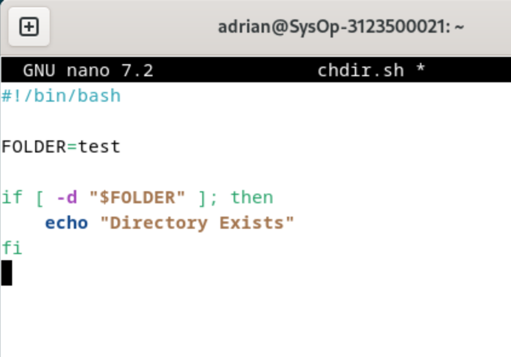

Output : 


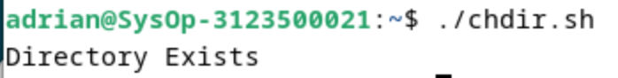

Sebagai alternatif, ekspresi kondisional ternary digunakan sebagai pengganti ekspresi kondisional if.


Output : 


## Bash - File Name

Untuk mendapatkan nama file beserta ekstensinya, perintah basename dapat digunakan untuk menghapus direktori dan mengembalikan hanya nama file untuk jalur yang diberikan, baik itu variabel atau string.

Contoh, jika jalurnya adalah /home/fahril/run.sh, nama file yang dikembalikan adalah run.sh. Proses ini melibatkan pengambilan jalur lengkap dan mengekstrak hanya nama file dengan menghapus jalur. Nama file yang dihasilkan kemudian disimpan dalam sebuah variabel dan dicetak ke konsol.

basename digunakan untuk menghapus direktori dan mengembalikan nama file untuk jalur yang diberikan. Jalur tersebut bisa berupa variabel atau string. Sebagai contoh, jika jalurnya adalah /home/fahril/run.sh, nama file yang dikembalikan adalah run.sh. Dalam hal ini, jalur lengkap diberikan dan mengembalikan nama file dengan menghapus jalur.

```
file_path="/home/fahril/run.sh"
filename=$(basename "$file_path")
echo $filename
```

##### Extract extension for a file path

Untuk mengisolasi ekstensi file dari jalur file yang diberikan, ${filename##*.} dapat digunakan. Ekspresi ini mengembalikan hanya ekstensi file.

Sebagai contoh, pertimbangkan jalur /home/fahril/run.sh, hasil ekstensinya adalah sh.

Awalnya, perintah basename digunakan untuk menghapus jalur direktori dan mengembalikan nama file untuk jalur yang ditentukan, dan nama file ini kemudian digunakan bersama dengan sintaks ekspresi untuk mengembalikan hanya ekstensinya.

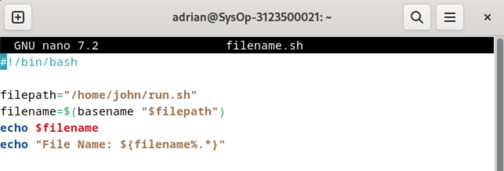

Output : 

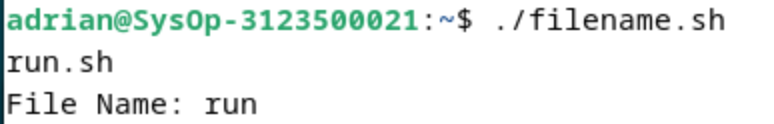

## Bash - Split String


Kadang-kadang, saat bekerja dengan skrip bash, ada kebutuhan untuk memisahkan string berdasarkan delimiter dan mengekstrak beberapa string untuk pengolahan lebih lanjut atau penyimpanan dalam variabel.

##### Split a string using the awk command in a bash shell script

Perintah awk, sebuah utilitas Linux yang kompatibel dengan semua distribusi bash dan shell, digunakan untuk memisahkan sebuah string berdasarkan delimiter yang ditentukan.

Inputnya diberikan menggunakan simbol pipa (|), dan contoh di bawah ini menunjukkan pembagian sebuah string yang berisi titik dua 

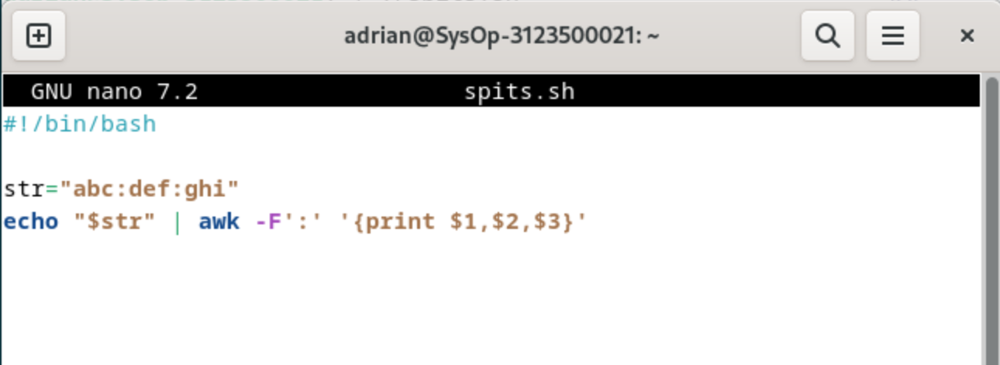

Output : 

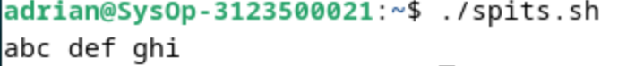

##### split using IFS variable

Di sini, string input terdiri dari elemen-elemen yang dipisahkan oleh tanda hubung. Variabel shell IFS (Internal Field Separator) diatur menjadi tanda hubung, dan string tersebut diiterasi menggunakan loop for.

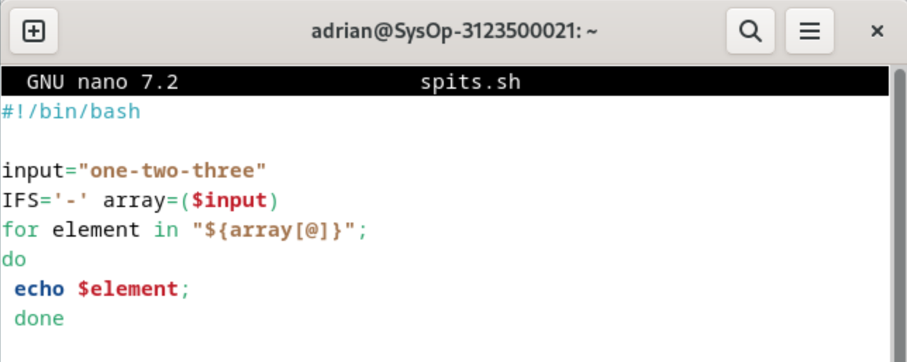

Output : 

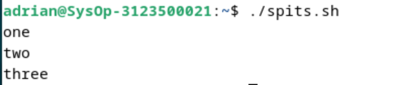

##### Use Parameter expansion and loop

Ekspansi parameter digunakan untuk mengubah nilai variabel berdasarkan opsi yang ditentukan. Dalam kasus ini, sebuah variabel string dikonversi menjadi sebuah array. Array tersebut kemudian diiterasi menggunakan sintaks loop for, mencetak setiap elemen ke konsol.

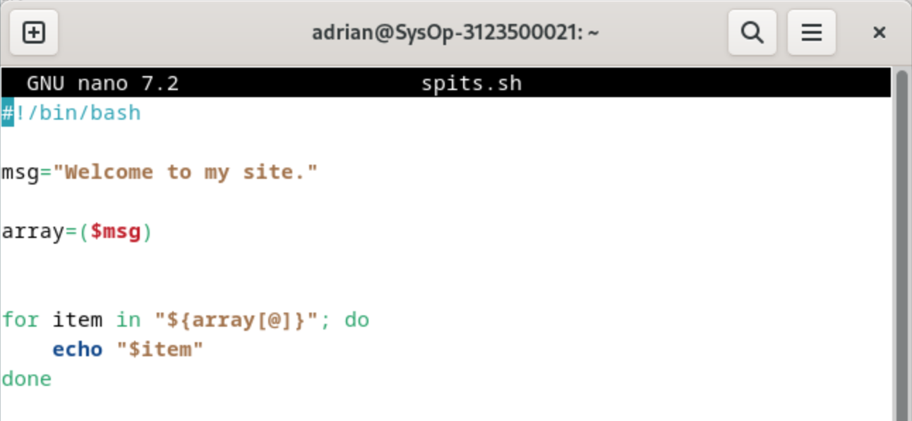

Output : 

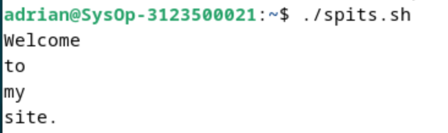

## Bash - String Length

Panjang sebuah string ditentukan oleh jumlah karakter yang terkandung di dalamnya, dan umumnya mudah untuk mengetahui panjang ini untuk teks normal.

Posting ini akan menjelajahi berbagai metode untuk menghitung jumlah karakter dalam sebuah string dengan encoding UTF.

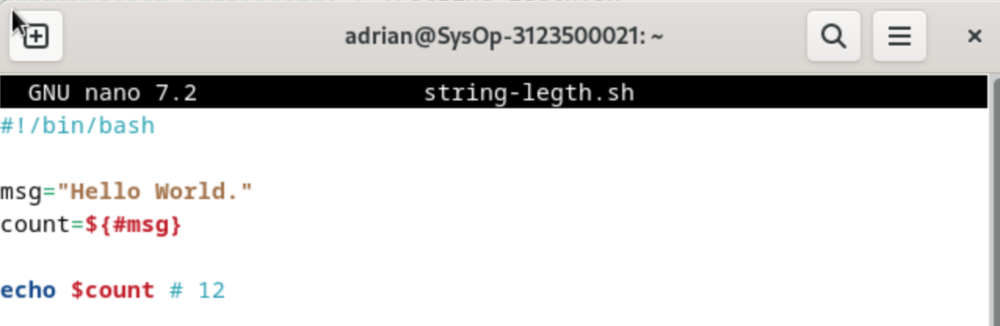

Output : 


Metode kedua melibatkan penggunaan perintah wc -m, baik langsung dengan sebuah string atau melalui sebuah variabel.


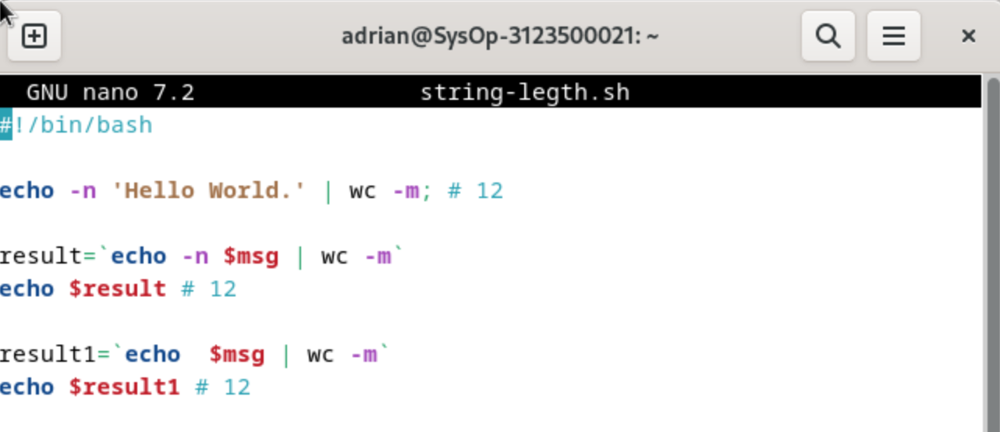

Output : 

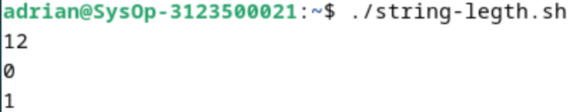

echo -n "string" digunakan untuk mencetak string tanpa baris baru (opsi -n). Operator pipa | mengarahkan output dari perintah di sebelah kiri ke perintah di sebelah kanan, dan wc -m menghitung jumlah karakter dalam sebuah string.

Menggunakan Perintah expr
Metode lain melibatkan penggunaan perintah expr untuk menemukan panjang sebuah string.

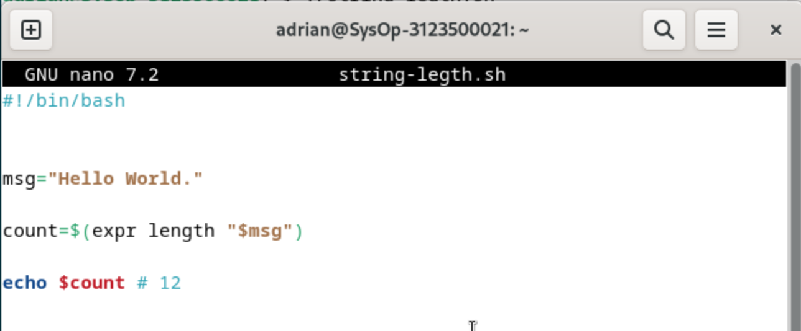

Output : 

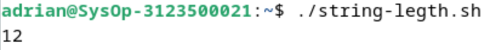

Di sini, ${} digunakan untuk substitusi ekspresi, mengganti nilai ekspresi ke dalam string. Perintah expr mengeksekusi ekspresi, dan length adalah argumen yang diberikan untuk menemukan panjang string.

## Bash - bashrc

File .bashrc adalah skrip bash yang dieksekusi saat:

1. Eksekusi skrip bash.
2. Shell bash dibuka secara interaktif.

File ini tersembunyi secara default karena dimulai dengan titik (.). Terletak di direktori home pengguna.

Anda dapat menggunakan editor Vi atau Nano untuk melihat file .bashrc.

Berikut adalah perintahnya:

```
nano ~/.bashrc
```

Anda juga dapat menggunakan:

```
vi ~/.bashrc
```

Kedua perintah tersebut akan membuka file .bashrc dalam editor Nano atau Vi.

Untuk memuat ulang pengaturan .bashrc tanpa masuk dan keluar lagi, Anda dapat menjalankan perintah berikut di prompt perintah:

```bash
source ~/.bashrc
```

Perintah ini akan memuat ulang pengaturan .bashrc saat ini tanpa perlu masuk dan keluar dari sesi bash.

## Bash - Ternary Operator

Cara lainnya adalah dengan menggunakan perintah `let` untuk menetapkan variabel berdasarkan hasil ekspresi kondisional.

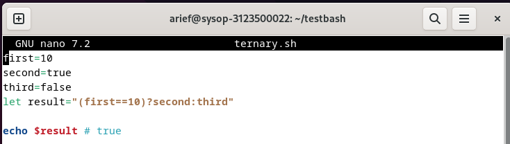

Output : 

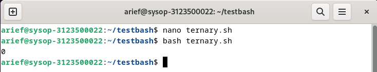

## Bash - Lowercase

Misalnya, jika string inputnya adalah "Hello World Welcome", maka outputnya akan menjadi "hello world welcome".

Ada beberapa cara untuk mencapai ini, tergantung pada jenis dan versi Bash.

Menggunakan perintah tr
Perintah tr, singkatan dari translator, adalah perintah Unix yang digunakan untuk mengonversi karakter dari satu format ke format lainnya.

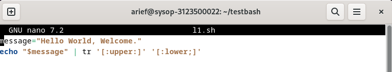

Output : 

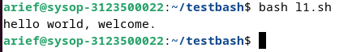

Alternatifnya : 

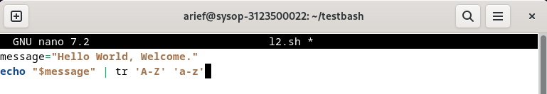

Output : 

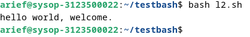

## Bash - Uppercase


Sebuah string huruf besar merujuk pada sebuah string yang mengandung semua huruf dalam huruf besar.

Misalnya, jika string inputnya adalah "Hello World Welcome", maka outputnya akan menjadi "HELLO WORLD WELCOME."

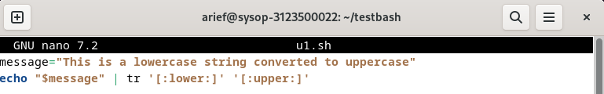

Output : 


Untuk mengkonversi sebuah string menjadi huruf besar menggunakan perintah awk, fungsi toupper digabungkan dengan awk. Hasilnya kemudian diteruskan ke perintah echo menggunakan operator pipa:


Output : 

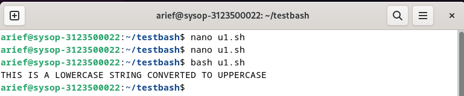

## Bash - Substring

Skrip Bash ini dirancang untuk menentukan apakah sebuah string mengandung sebuah substring tertentu.

Ada beberapa cara untuk melakukan pemeriksaan ini.

##### Using the Comparison Operator to Check for Substring exists or not

Gunakan pernyataan if untuk membandingkan string dengan substring yang diinginkan menggunakan operator kesetaraan (==) dan wildcard (*).
Terakhir, cetak string jika substring ditemukan.

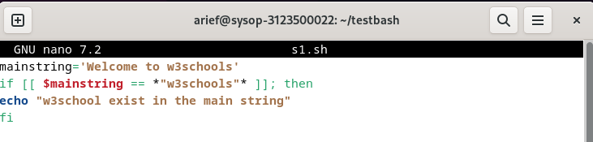

Output : 

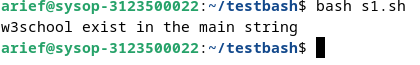

##### Use Regular Expressions to Find a Substring

Operator =~ memudahkan pencarian substring dalam sebuah string yang diberikan, digunakan dalam sebuah blok if.

```
mainstring='Welcome to w3schools'
if [[ $mainstring =~ "w3schools" ]]; then
  echo "w3schools exists in the main string"
fi
```

##### Use the grep command

Perintah grep digunakan untuk mencari string yang ditentukan, dipipakan ke string utama untuk dibandingkan.

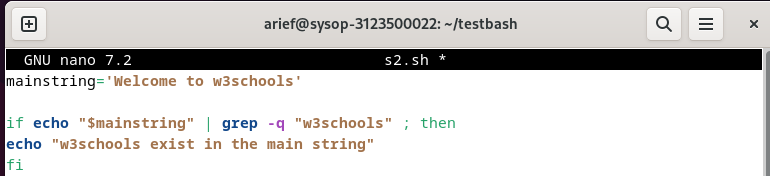

Output : 


## Bash - variable set

Dalam pemrograman skrip shell bash, Anda dapat melakukan pengecekan variabel untuk:

1. Memeriksa apakah variabel sudah diatur atau belum.
2. Memeriksa apakah variabel kosong atau tidak kosong.
3. Memeriksa apakah variabel adalah string kosong atau tidak.

Berikut adalah contoh sintaks untuk setiap kasus:

1. Memeriksa apakah variabel sudah diatur atau belum:
```bash
if [ -v variable ]; then
    echo "Variable is set."
else
    echo "Variable is not set."
fi
```

2. Memeriksa apakah variabel kosong atau tidak kosong:
```bash
if [ -z "$variable" ]; then
    echo "Variable is empty."
else
    echo "Variable is not empty."
fi
```

3. Memeriksa apakah variabel adalah string kosong atau tidak:
```bash
if [ -z "${variable+x}" ]; then
    echo "Variable is an empty string."
else
    echo "Variable is not an empty string."
fi
```

Dalam contoh di atas, ganti `variable` dengan nama variabel yang ingin Anda periksa.

contoh : 


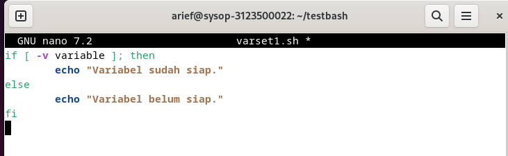

Output : 

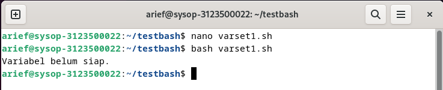


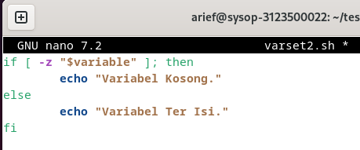

Output : 

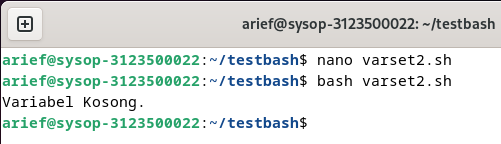

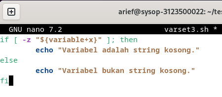

Output : 

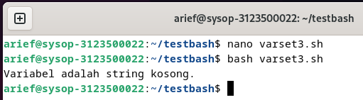

## Bash - Iterate Nos

Kadang-kadang, kita ingin membuat nama file dengan nama yang berisi angka yang dihasilkan dari urutan atau rentang angka.

##### Generate a range of numbers in the bash script

Perintah seq digunakan untuk menghasilkan urutan angka.

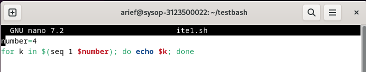

Output : 

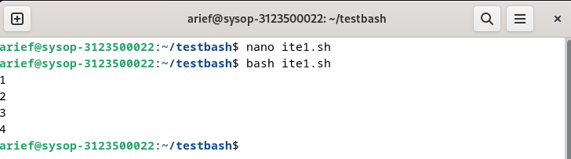

menggunakan perulangan for

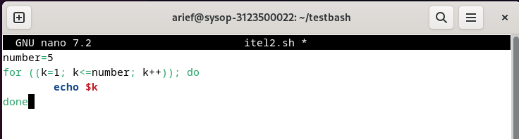

Output : 

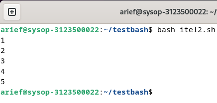

menggunakan perulangan while


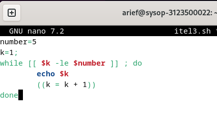

Output : 

