

  <h1 style="text-align: center;font-weight: bold">Praktikum 8 SysOp Proses dan Manajemen Proses</h1>
  <h4 style="text-align: center;">Dosen Pengampu : Dr. Ferry Astika Saputra, S.T., M.Sc.</h4>

 

  
  <h3 style="text-align: center;">Disusun Oleh : </h3>
  

    <strong>Muhammad Arief Wicaksono Putra Santoso (3123500022)</strong>
  

<h3 style="text-align: center;line-height: 1.5">Politeknik Elektronika Negeri Surabaya Departemen Teknik Informatika Dan Komputer Program Studi Teknik Informatika 2023/2024</h3>
  

# Daftar Isi
1. [Bash - tutorial](#bash-tutorial).
2. [Bash - Variabel](#bash-variabel).
3. [Bash - Loop File](#bash-loop-file).
4. [Bash - Comments](#bash-comments).
5. [Bash - Arrays](#bash-arrays).
6. [Bash - expansion](#bash-expansion).
7. [Bash - Condional Expression](#Bash-Condional-Expression).
8. [Bash - Case Statements](#Bash-Case-Statements).
9. [Bash - Special Characters](#Bash-Special-Characters).
10. [Bash - if elif else](#).
11. [Bash - Loops](#).
12. [Bash - Append String1](#Bash-Append-String1).
13. [Bash - Functions](#Bash-Functions).
14. [Bash - Append String2](#Bash-Append-String2).
15. [Bash - Operators](#Bash-Operators).
16. [Bash - Numbers Comparison](#Bash-Numbers-Comparison).
17. [Bash - Check Directory](#Bash-Check-Directory).
18. [Bash - File Name](#Bash-File-Name).
19. [Bash - Split String](#Bash-Split-String).
20. [Bash - String Length](#Bash-String-Length).
21. [Bash - bashrc](#Bash-bashrc).
22. [Bash - Ternary Operator](#Bash-Ternary-Operator).
23. [Bash - Lowercase](#Bash-Lowercase).
24. [Bash - Uppercase](#Bash-Uppercase).
25. [Bash - Substring](#Bash-Substring).
26. [Bash - variable set](#Bash-variable-set).
27. [Bash - Iterate Nos](#Bash-Iterate-Nos).

# Bash-tutorial
Posting ini menyediakan tutorial tentang perintah dan pemrograman Bash dengan contoh.
Kursus ini mencakup fitur pemrograman Bash dan shell, termasuk variabel, loop, ekspresi kondisional, dan operator. 

Shell adalah penerjemah baris perintah, Ini adalah aplikasi untuk memberikan perintah ke sistem operasi yang berbeda seperti Linux, Unix, dan Mac. 
Bash adalah versi shell yang disempurnakan, lapisan antara panggilan fungsi pengguna dan sistem operasi. 

Pengguna mengetik perintah melalui baris perintah atau kumpulan perintah yang juga disebut skrip.

#### Syarat
Untuk mengikuti kursus ini, Anda harus memiliki pemahaman dasar tentang bahasa komputer, dan hal-hal berikut diperlukan:
- Sistem operasi keluarga Linux
- Pengetahuan dasar tentang bahasa pemrograman apa pun
  
#### Apa itu Bash?
Bash, kependekan dari Bourne Again Shell, adalah penerjemah shell baris perintah sumber terbuka dan bahasa scripting. Ini menafsirkan perintah yang dimasukkan pengguna, baik secara interaktif atau dari file skrip.

Ini berfungsi sebagai antarmuka untuk memanggil perintah, memungkinkan panggilan fungsi sistem.

disini adalah dua jenis mode bash

- Mode interaktif: Juga disebut penerjemah perintah, ini memungkinkan eksekusi perintah di terminal. Ini mengeksekusi perintah secara berurutan jika ada beberapa perintah.
- Mode non-interaktif: Ini mengacu pada skrip, memungkinkan Anda untuk menulis sintaks Bash yang berisi urutan beberapa perintah untuk eksekusi skrip.

#### Apa perbedaan antara Bash dan shell
Shell, alias untuk Bourne Shell, adalah penerjemah baris perintah untuk Unix dan Linux OS. Bash, alias untuk Bourne Again Shell, adalah versi yang disempurnakan.

#### Untuk apa bash scripting digunakan?
Bash scripting memiliki beberapa kasus penggunaan, termasuk:

- Menulis skrip untuk mengotomatiskan tugas pemrograman
- Menyinkronkan tugas untuk menyalin file
- Menjalankan tugas cron untuk penjadwalan 

#### Bagaimana cara menulis kode di bash?

Untuk menulis kode dalam skrip Bash, ikuti langkah-langkah berikut:

#### Apakah bahasa bash adalah  bahasa program ?
Bash mengeksekusi perintah dari terminal atau file. Ini adalah bahasa pemrograman yang beroperasi di sistem operasi kernel Unix / Linux, yang berisi semua fitur untuk menulis kode lengkap.

Bash adalah jenis shell khusus yang mengambil input dari perintah, menjalankan kode, dan memproses input, mengembalikan hasil.

#### Jenis Shell
Ada berbagai jenis shell dalam OS Unix.
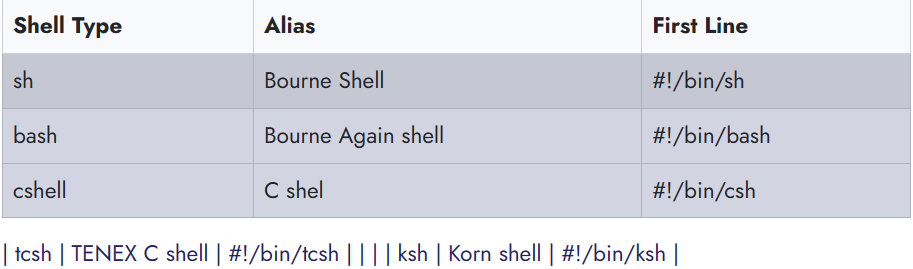
#### Perbedaan antara Command Line dan Script di bash
Mari kita lihat perbedaan antara baris perintah dan skrip

Opsi baris perintah

- Baris perintah memiliki prompt yang mengambil input dari pengguna
- Perintah tidak disimpan ke file.
- Ini hanya mendukung satu perintah pada satu waktu.
  
File skrip

- Mendukung banyak perintah dalam satu file
- Prompt masih dapat ditulis dalam file skrip
- Hanya satu baris dalam file yang dijalankan secara berurutan

# Bash - Variabel
Pelajari cara mendeklarasikan dan menggunakan variabel dalam skrip bash. Jenis variabel global, lokal, dan readonly, dan memahami sintaks yang tepat untuk mengakses variabel dalam skrip shell ..

#### Variabel Bash Shell
Variabel membentuk blok bangunan dasar dari setiap bahasa pemrograman. Pemrograman skrip shell dan bash menawarkan variabel, seperti bahasa lain.

Variabel berfungsi sebagai wadah yang digunakan untuk menyimpan data dalam pemrograman. Ini termasuk pointer ke lokasi memori data.

Mendeklarasikan variabel: Untuk membuat variabel, Anda harus menetapkan nilai ke variabel tersebut

variableName:

Ini adalah nama variabel, yang dapat berisi kombinasi huruf (a sampai z, A sampai Z), angka (0 sampai 9), dan garis bawah (_).

[VariableValue] adalah nilai yang disimpan dalam variabel, dan itu bisa berupa serangkaian angka atau boolean. Simbol sama dengan (=) digunakan untuk menetapkan nilai ke variabel.

Contoh : 

Variabel bernama AGE dibuat dan diberi nilai 25.

#### Cara Mengakses Variabel di Bash
Setelah mendeklarasikan dan menetapkan nilai ke variabel, Anda dapat mengaksesnya menggunakan simbol dolar ($) diikuti dengan nama variabel.

Kode di atas mendeklarasikan variabel bernama AGE dengan nilai 25 dan kemudian menggunakan echo untuk menampilkan nilai variabel AGE. Simbol dolar sebelum nama variabel sangat penting untuk mengakses nilainya.

#### Variabel Bash Shell Readonly
Setelah variabel diberi nilai, Anda dapat mengubahnya menjadi nilai baru menggunakan operator penugasan =.

Output:

Bagaimana Anda membuat variabel tidak dapat diperbarui?
Kata kunci readonly mencegah variabel diperbarui, secara efektif mengubahnya menjadi [constant]

AGE adalah constaints, menetapkan nilai baru melempar kesalahan, dan pesan kesalahannya adalah AGE: bersifat (read-only).

Output:

#### Bash variabel tidak disetel
Kata kunci (unset) membantu menghapus nilai dari variabel yang ditentukan. Variabel tetap dapat diakses tetapi mencetak nilai kosong.

Output : 

#### Kode di atas,

- pertama-tama menetapkan variabel AGE ke 25, mencetak nilainya,
- lalu batalkan pengaturannya menggunakan AGE yang tidak disetel.
- Selanjutnya, ia mencetak "kosong" diikuti oleh nilai AGE, yang - sekarang muncul sebagai ruang kosong.

#### Cakupan Variabel
Setiap variabel yang dideklarasikan harus memiliki ruang lingkup, menentukan di mana dalam program variabel dapat digunakan.

Misalnya, jika variabel dideklarasikan dalam suatu fungsi, itu hanya tersedia dalam fungsi itu dan tidak dapat diakses di luarnya.

Cakupan variabel di Bash dapat didefinisikan dengan dua cara

- Variabel global
- Variabel lokal:

#### Bash Variabel Global
Variabel yang dideklarasikan dalam skrip shell disebut sebagai variabel global.

Variabel global dapat diakses dalam fungsi atau blok bersarang dari file skrip shell.

Variabel default yang dideklarasikan dalam file skrip disebut variabel global.
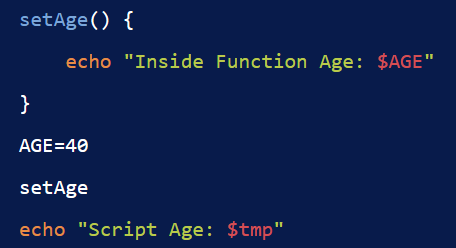

Output

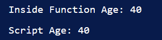

#### Bash Variabel lokal
Variabel lokal dideklarasikan di dalam blok kode atau fungsi. Ruang lingkup variabel-variabel ini hanya terlihat di dalam blok tempat mereka dideklarasikan.

Sintaks:

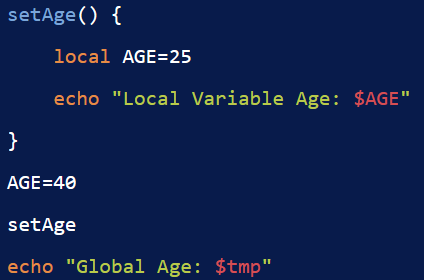

Dalam sintaks ini, variabel dideklarasikan dan ditetapkan dengan kata kunci (local).

Output

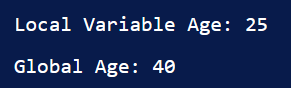

Variabel lokal dideklarasikan di dalam fungsi dan hanya terlihat di dalam fungsi itu. Variabel yang dideklarasikan di luar fungsi disebut variabel global dan tersedia untuk semua fungsi.

#### Pengetikan variabel

Bash scripting bukan bahasa yang diketik, namun Anda dapat mendeklarasikan variabel dengan jenis data menggunakan perintah declare Berdasarkan jenis variabel, ini memungkinkan jenis data 

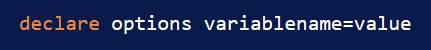

variabel dideklarasikan dan ditetapkan dengan nilai.

Opsi berisi opsi untuk membuat jenis varialbe

Array: Untuk membuat variabel array

declare -a variable=
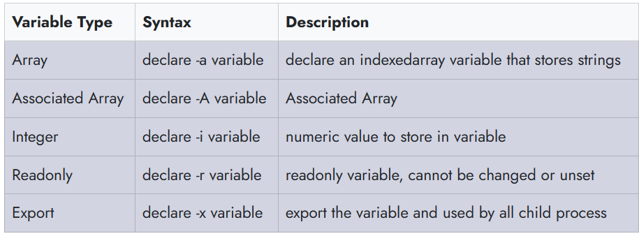

#### Tampilkan variabel Lingkungan di Bash

Di Bash, ada dua jenis perintah untuk mencetak variabel lingkungan.

- Perintah printenv
- Perintah env

Kedua perintah ini mencantumkan semua variabel lingkungan terminal.

- Konvensi penamaan variabel
- Variabel dibaca dengan awalan dengan simbol $.
Nama variabel terdiri dari huruf, angka, atau garis bawah.
- Variabel peka huruf besar/kecil; misalnya, Test dan Test dianggap sebagai dua variabel berbeda dalam scripting.
- Sementara nama variabel secara konvensional ditulis dalam HURUF BESAR, Anda dapat membuatnya menggunakan huruf BESAR atau BAWAH jika diperlukan. Dan variabel Lingkungan dan Shell keduanya dalam huruf besar.
- Nama variabel tidak boleh berisi spasi
- Nama biara harus camelCase. Contoh firstName
  
### Variabel shell
Variabel shell adalah variabel yang ditetapkan oleh shell, bukan oleh pengguna. Ini diperlukan oleh shell untuk bekerja dengan lancar
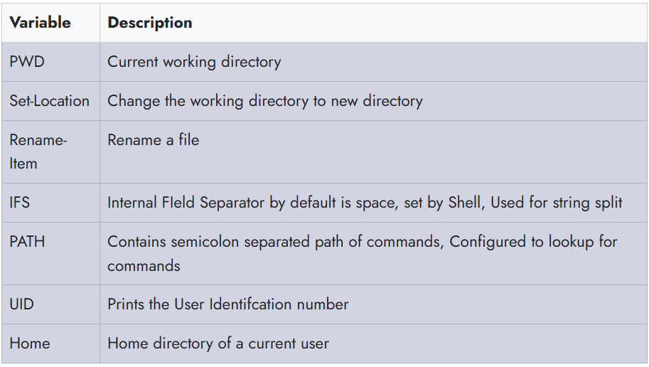

# Bash - Loop File
Cara mengulang konten file dalam tutorial skrip Bash Shell dan contoh pemrograman.

Terkadang, Anda ingin membaca konten file dengan pemrograman bash.

Ada beberapa cara yang bisa kita lakukan

#### Bagaimana cara membaca file per baris di bash shell?
- Menggunakan while loop
  
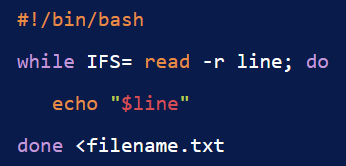

# Bash - Comments
Posting ini menjelaskan cara menulis komentar dalam skrip bash shell, dengan contoh yang menyertainya.

(Comments) adalah pernyataan kode yang berisi teks yang dapat dibaca pengguna yang dilewati shell selama eksekusi. Setiap bahasa pemrograman menyertakan fitur komentar, memberikan deskripsi untuk baris kode atau pernyataan.

Komentar sebaris dalam kode membantu pengembang dalam mengedit dan lebih memahami kode.

Bahasa bash scripting memungkinkan Anda untuk menggunakan jenis komentar berikut.

- Komentar tunggal
- Komentar multi-baris

Komentar berguna bagi manusia, kode ditulis untuk scripting

#### Komentar satu baris di bash shell
Komentar satu baris dalam skrip shell dilambangkan dengan simbol # di awal setiap baris.
Komentar ini mencakup string yang memberikan informasi tentang baris kode yang sesuai dalam skrip shell.
Sangat penting untuk menempatkan komentar satu baris pada baris terpisah untuk kejelasan.

Untuk komentar sebaris, gunakan simbol # di awal komentar. Komentar satu baris selalu dimulai dengan simbol #.

Sintaks:

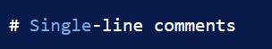

Spasi kosong setelah simbol # tidak diperlukan. Berikut ini adalah contoh komentar satu baris dalam skrip shell.

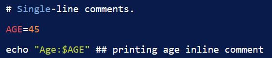

#### Komentar Multi-Line dalam skrip shell
Komentar multi-baris melibatkan penggunaan lebih dari satu baris untuk komentar.

Cara pertama, untuk membuat komentar multi-baris adalah dengan memanfaatkan komentar satu baris dengan setiap baris dimulai dengan simbol komentar satu baris.

Sintaks:

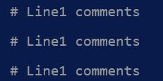

Cara kedua untuk membuat komentar multi-baris adalah dengan melampirkan beberapa baris di dalam (:) dan (').

Sintaks ini melibatkan:

- Komentar dimulai dengan titik dua (:) diikuti dengan '.
- Ini diikuti oleh beberapa baris komentar.
- Komentar diakhiri dengan '. Berikut sintaksnya:

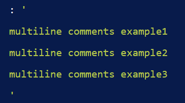

Berikut adalah contoh Komentar Multi-Baris

Ini berguna untuk menggabungkan lebih banyak teks yang mencakup beberapa baris, melayani tujuan dokumentasi juga.

#### Kesimpulan
Singkatnya, kita telah belajar cara menambahkan komentar tunggal dan multi-baris dalam pemrograman skrip shell.

# Bash - Arrays
Array dalam shell adalah variabel untuk menampung lebih dari satu nilai.

Misalkan, Anda memiliki daftar angka 1 2 3.. 10 dan ingin menyimpan angka-angka ini di Shell Script
Tanpa array, Anda harus mendeklarasikan sebagai berikut

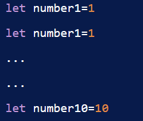

Iterasi itu sulit dan jika kita ingin menyimpan 100 angka, itu sangat sulit.

Jadi, Anda dapat menggunakan array yang mengacu pada satu variabel dan menyimpannya.

#### Bagaimana cara mendeklarasikan dan membuat array?
Ada dua jenis array yang bisa kita buat

- Array terindeks: elemen array disimpan dengan indeks mulai dari nol

- Array terkait: array disimpan dengan pasangan kunci-nilai

- Mendeklarasikan array

Untuk membuat array, Kita perlu mendeklarasikan array.

array dideklarasikan dengan kata kunci (declare) dengan opsi -a atau A

contoh array terindeks Dalam hal ini, nilai Array disimpan dengan index=0 dan seterusnya. Ini dibuat dengan opsi Declare dan -a

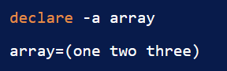

Array ini adalah penyimpanan dengan index=0, bertambah 1 sebagai berikut.

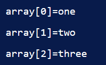

Contoh array asosiatif Dalam hal ini, nilai Array disimpan dengan kunci. ini dibuat dengan opsi (declare) dan -A

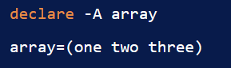

Dalam array ini adalah penyimpanan dengan index=0, bertambah 1 sebagai berikut

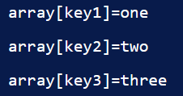

Mari kita tetapkan nilainya.

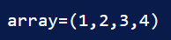

- Assign the values without declaring an array
  

  Ini berarti, bahwa arrayvariable dideklarasikan dan diberi indeks array dengan nilai.

Array diindeks nol berdasarkan nol hingga panjang array -1 index=0 - mengembalikan elemen pertama index=-1 mengembalikan elemen terakhir

Array dapat berisi angka, string, dan campurannya Mari kita buat array contoh.

#### Mengakses nilai array
Array berisi indeks untuk mendapatkan elemen. Elemen array dapat diakses menggunakan sintaks di bawah ini.

#### Mendeklarasikan Array angka dan loop melalui
Array dapat berisi angka Contoh ini berisi array angka dan untuk loop untuk mencetak

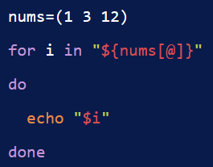

Output:

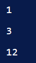

#### Mengakses elemen pertama array
Dalam elemen Array, indeks elemen Pertama adalah nol, dan array[0] mengembalikan elemen pertama

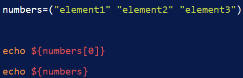

Output:

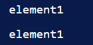

#### Mendapatkan elemen terakhir dari array
Dalam skrip bash, Anda dapat menggunakan index=-1 untuk mendapatkan elemen array terakhir.

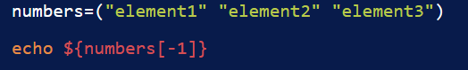

Dengan versi bash 4.0 terbaru, Anda dapat menggunakan sintaks di bawah ini untuk membaca elemen terakhir.

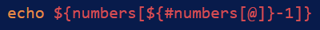

#### Iterasi atau ulangi elemen array
For loop digunakan untuk iterasi elemen.

Berikut adalah contoh contoh loop array untuk mencetak semua elemen

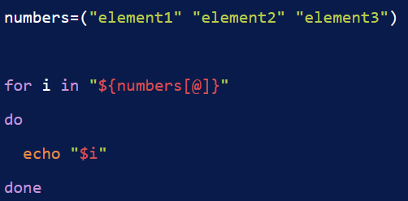

Output : 

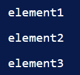

Cara lain untuk mencetak indeks dan elemen array menggunakan untuk loop.

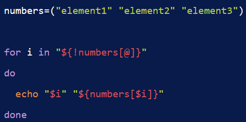

Output:

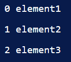

#### Mencetak semua elemen array
Gunakan [@] atau [*] untuk mencetak semua elemen array.

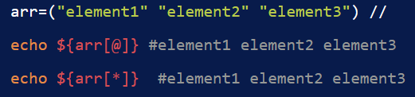

#### Menghapus elemen dari array
Anda dapat menghapus elemen dari array menggunakan unset untuk indeks tertentu.

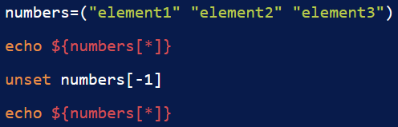

#### Menambahkan elemen ke array
Anda dapat menambahkan elemen pada posisi indeks apa pun menggunakan sintaks di bawah ini.

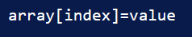

Contoh menambahkan elemen awal dan akhir serta tengah

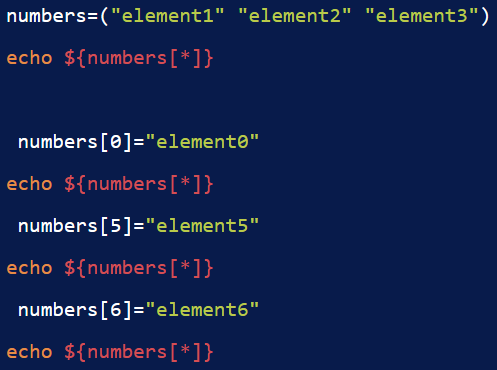

Output:

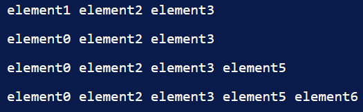

#### Panjang array
Dalam hal ini, Temukan hitungan semua elemen dalam array.

Skrip shell menyediakan #

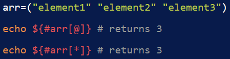

#### Contoh lembar contekan array

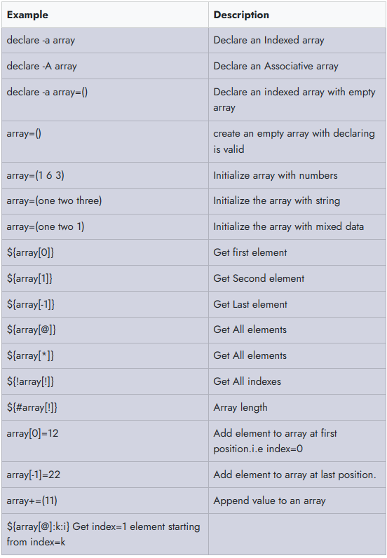

# Bash - expansion
Tutorial ini menjelaskan cara menulis skrip batch dalam skrip shell dan menjalankannya.

perintah dimasukkan ke OS untuk membuat panggilan sistem dan melakukan tindakan. Perintah input pengguna di terminal untuk melakukan operasi seperti LS, CD, MKDIR dll.

Cara lain, Beberapa perintah dapat ditempatkan dalam file, bash interpreter membaca perintah dan menjalankan

Cara menulis skrip shell di bash
- Pilih Editor atau editor teks
- Membuat file dengan ekstensi .sh atau .bash
- Menulis perintah dalam file
- Simpan file sebagai hello.sh

Mengubah izin untuk mengeksekusi file

# Bash - Condional Expression
Ekspresi bersyarat dievaluasi pada waktu eksekusi skrip, berdasarkan hasil, Ini mengeksekusi blok perintah tertentu.

Ada berbagai jenis ekspresi konitional di Bash

- Operator Perbandingan String
- Operator Perbandingan Numric
- Operator File
- Operator Logis

#### Operator File
Bash menyediakan operator logis pada FIle dan direktori untuk menguji ekspresi kondtional. Ini memungkinkan Anda untuk memeriksa operasi yang berbeda seperti keberadaan, dan izin, ukuran. Ini digunakan ekspresi kondisional dalam pernyataan kondisional seperti if else dan case.

Sintaks:

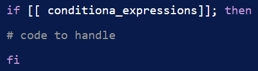

conditiona_expressions berisi opsi, dan jalur file, yang selalu mengembalikan true atau false.

Berikut adalah opsi yang disediakan

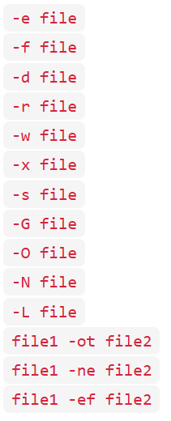

# Bash - Case Statements
Pernyataan kasus mirip dengan switch case dalam bahasa pemrograman lainnya.

Ini digunakan untuk membandingkan input yang diberikan dengan beberapa pola, dan perintah di dalam pola yang cocok dijalankan.

Syntax

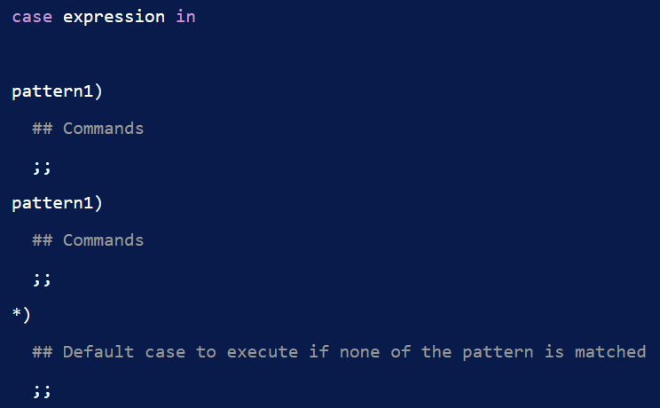

- Ekspresi adalah ekspresi variabel atau valid untuk dievaluasi
- Ini berisi pola menantang di dalam kasus yang dievaluasi dengan membandingkan ekspresi, mencocokkan kasus fuound, menjalankan perintah di dalamnya.
- default case[*)] untuk dijalankan jika tidak ada pola yang cocok
Setiap blok pola diakhiri dengan ;;
- [case] adalah kata awal dan ESAC adalah kata mengakhiri pernyataan kasus

Berikut ini contohnya

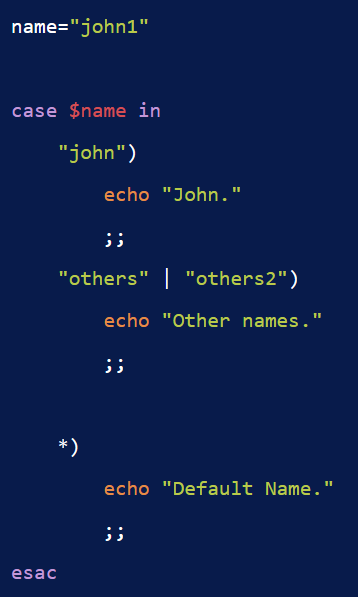

# Bash - Special Characters
Karakter khusus dalam bash dievaluasi dengan arti khusus dalam penafsiran perintah. Karakter-karakter ini memiliki instruksi khusus, tentang penggunaan karakter ini memiliki arti yang berbeda pada konteks yang berbeda. Mari kita ekspos karakter khusus yang didukung dalam bash scripting

#### Blankspace (" "):
Ini juga disebut spasi putih, berisi tab, spasi, kembali, baris baru. Ini memberitahu bash interepreter untuk memisahkan perintah dan konten. Ini adalah delimeter untuk memisahkan perintah serta string.

Contoh di atas, echo adalah perintah yang diikuti oleh spasi, dan strign berisi spasi untuk kata-kata

#### Expansion($)
Simbol tanda dolar digunakan untuk berbagai jenis ekspansi ekspansi parameter, ($variable, ${variable}) Substitusi ($(expression)) ekspresi artematis ($((expression)))

#### Ambersand (&)
Menambahkan & ke akhir perintah memungkinkan Anda menjalankan perintah di latar belakang.

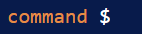

Misalnya, Untuk menjalankan server redis di latar belakang gunakan, perintah di bawah ini

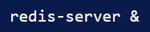

#### Pipe (|)
Ini digunakan untuk meneruskan output dari satu command ke input ke command lain dari kiri ke kanan. Hal ini memungkinkan untuk membuat rantai command

Sintaksnya adalah command1 | command2

Contoh : echo "hello" | wc mengembalikan jumlah karakter.

#### Titik koma(;)
Ini digunakan untuk memisahkan beberapa perintah menggunakan ; dalam satu baris.; adalah pemisah perintah untuk mendefinisikan beberapa perintah dalam satu baris Sintaks: command1; command2; command3

Contoh: cd /app/; Ls;

#### Kutipan tunggal
Tanda kutip tunggal (') digunakan untuk mendefinisikan string tanpa arti khusus. Ini berarti semua variabel dan ekspansi tidak interepreted dan mencetak string literal yang sama

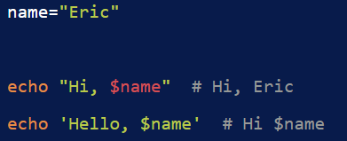

Contoh, Gema pertama, variabel nama diperluas dan ditafsirkan sebagai string dan dicetak. Gema kedua, menggunakan tanda kutip tunggal, dan variabel nama tidak diperluas dan dicetak sebagai string literal.

Jika tanda kutip tunggal berisi tanda kutip tunggal bertumpuk, Anda harus menghindarinya menggunakan '''.

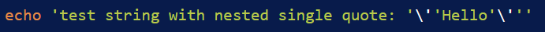

Examle berisi ''' adalah karakter kutipan tunggal di dalam satu kutipan

### Tanda kutip ganda
Tanda kutip ganda (') digunakan untuk mendefinisikan literal string dengan arti khusus.

jika string berisi variabel dan sintaks ekspansi, Ini intereprested dan diperluas, dengan nilai yang dievaluasi saat runtime.

Jika string tidak ingin memperluas variabelnya, maka Anda dapat melarikan diri  sebelum simbol $ dollar

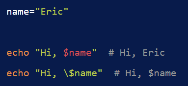

Contoh, Gema pertama, variabel nama diperluas dan ditafsirkan sebagai string dan dicetak. Gema kedua, $ awalan karakter escape , dicetak sebagai string literal.

#### Karakter garis miring terbalik()
Karakter garis miring terbalik digunakan untuk melarikan diri dari karakter dalam string. Ini digunakan dalam string kutipan ganda.

Misalnya

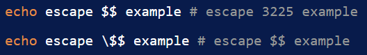

Dalam contoh pertama, echo berisi $$, yang menampilkan id proses. Dalam contoh kedua, echo berisi $$, yang menampilkan $$ sebagai string literal. awalan karakter melarikan diri.

#### Komentar ( #)
Komentar melambangkan digunakan untuk mengomentari baris kode. Baris komentar selalu dimulai dengan #.

Itu diabaikan oleh penerjemah bash.

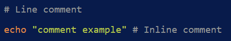

#### Tanda Tanya (?)
Tanda tanya memiliki arti yang berbeda dalam konteks.

Dalam konteks ekspresi reguler
Di
Periksa status keluar dari eksekusi perintah terakhir.

#### Titik (.)

# Bash - if elif else
Bash scripting menyediakan ekspresi kondisional untuk mengeksekusi kode yang berbeda berdasarkan kondisi yang ditentukan.

#### Pernyataan Bersyarat Bash Shell
Terkadang, Anda mungkin perlu mengeksekusi beragam blok kode tergantung pada berbagai keputusan berdasarkan kondisi tertentu.

Bash scripting memfasilitasi ini melalui pernyataan kondisional

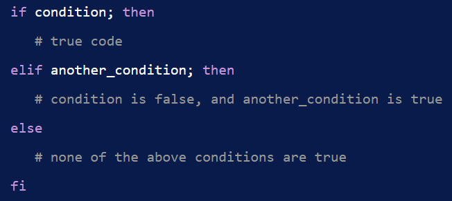

- Pernyataan if digunakan untuk mengeksekusi blok kode jika suatu kondisi benar, dengan sintaks if then fi.
- Pernyataan else digunakan untuk mengeksekusi kode jika suatu kondisi salah, mengikuti sintaks if then else fi.
- Itu jika.. elif.. Pernyataan else sangat berguna ketika Anda perlu mengeksekusi kode jika tidak ada kondisi sebelumnya yang benar. Sintaksnya adalah sebagai berikut:

Catatan:

- Kondisi adalah ekspresi yang mengevaluasi ke true atau false dalam skrip shell.
- Spasi diperlukan sebelum dan sesudah [ dan ].
Titik koma sebelum itu diperlukan.
- jika, lain, maka, elif, fi adalah kata-kata yang dicadangkan di Bash.
- Kondisi adalah ekspresi dengan perintah.
  - Perintah yang berisi sintaks tanda kurung tunggal, contoh sintaks [expression] dan digunakan untuk operasi string file.
  - Sintaks braket ganda, contohnya adalah [[expression]], yang digunakan untuk menggabungkan beberapa kondisi dan menangani pola regex.
  - Tanda kurung ganda, contoh sintaksis adalah ((expression)), digunakan untuk operasi aritmatika.

#### Jika Pernyataan Bersyarat
Pernyataan if di Bash digunakan untuk mengeksekusi blok kode ketika kondisi tertentu true.

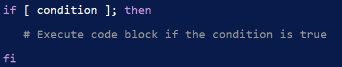

Dalam sintaks di atas:

- Ganti [ condition ] dengan ekspresi kondisional.
- Blok kode dalam pernyataan if dijalankan hanya jika kondisi yang ditentukan mengevaluasi ke true.
- Setiap pernyataan if harus diakhiri dengan fi.

Contoh

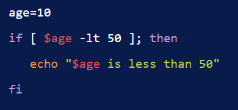

Output : 

#### Pernyataan Bersyarat If-Else
Pernyataan kondisional if-else di Bash memungkinkan Anda untuk mengeksekusi blok kode yang berbeda tergantung pada apakah suatu kondisi true atau false.

Dalam sintaks di atas:

- Ganti [ condition ] dengan ekspresi untuk menguji.
- Blok kode dalam pernyataan if dijalankan jika kondisi yang ditentukan true.
- Blok kode dalam pernyataan else dijalankan jika kondisinya false.
- Setiap pernyataan if-else harus diakhiri dengan fi.

Dalam contoh ini, jika usia lebih besar dari 60, itu menghasilkan "Senior Citizenr"; jika tidak, itu menghasilkan "Not Senior Citizen."

#### Pernyataan  if.. Elif.. Else
Gunakan if.. elif.. else kondisional lainnya di Bash untuk mengeksekusi blok kode yang berbeda berdasarkan beberapa kondisi.

- Blok kode dalam else if pertama dijalankan jika condition1 true.
- Blok kode dalam else elif pertama dijalankan jika kondisi1 false dan kondisi2 true''.
- Blok else dijalankan jika condition1 dan condition2 adalah false.
- Setiap if.. elif.. else lain harus diakhiri dengan fi.

Contoh

Dalam contoh ini, skrip memeriksa apakah usia lebih besar dari 60, kurang dari 14, atau termasuk dalam kategori baik, dan menampilkan pesan yang sesuai.

# Bash - Loops
Loop digunakan untuk mengeksekusi blok kode untuk beberapa kali.

Misalkan Anda ingin menjalankan perintah berulang kali atau prins loop array.for digunakan di Bash

Berbagai jenis loop

Skrip bash menyediakan beberapa jenis loop

- for loop
- for index loop
- while loop
- until loop

#### for loop
for loop yang digunakan untuk mengeksekusi kode multipe kali berdasarkan

Contoh ini mengulangi daftar dan mencetak ke konsol.

#### for loop index
for  loop index mirip dengan bahasa C for loop index Ini mengeksekusi kode beberapa kali berdasarkan kondisi benar, Ini dimulai dengan nilai awal dan iterasi memerlukan nilai yang akan bertambah sebesar 1.

contoh

Ini mencetak angka dari 0 hingga 5

#### while loop di bash
Loop while di Bash memungkinkan eksekusi kode berulang selama kondisi yang ditentukan true. Jika kondisi menjadi false, loop keluar.

Struktur dasar loop while adalah sebagai berikut:

Contoh :

while loop mengeksekusi kode selama kondisi yang ditentukan ([[ i -lt 100 ]]) adalah true.

Blok kode menambah nilai sebesar 1 dan mencetak nilainya.

if kondisinya salah, loop keluar.

#### until loop di bash
Kata kunci until di Bash digunakan untuk mengeksekusi kode berulang kali sampai kondisi tertentu menjadi true, di mana titik loop keluar.

Struktur dasar loop until adalah sebagai berikut.

until kata kunci digunakan di Bash dan diakhiri dengan done.

Dalam contoh, Blok kode dijalankan selama [[ i -eq 100 ]] adalah false. Ini menambah nilai dengan 1 dan mencetak nilai.

output mencetak angka dari 0 hingga 99 angka

# Bash - Append String1
#### Bash Athematic expressions
Ekspresi arthematic digunakan untuk melakukan operasi matematika

Ekspresi adalah istilah yang digunakan dalam matematika untuk menunjukkan operasi. Ini berisi operan dan operator untuk melakukan operasi matematika. (a < b) adalah ekspresi. Ini mungkin berisi operator biner atau unary
Di bash, expression dibuat menggunakan tanda kurung (()) dengan operan dan operator sebagai argumen. ((a)) adalah expression bash.

Sintaksnya adalah

expressions adalah operasi matematika, Ini dapat berisi sub expressions yang dipisahkan oleh koma.

Arthematic expressions dibangun menggunakan operator di bawah ini

- Arthmatic Operators
- Comparision Operator

Operator perbandingan digunakan untuk memeriksa satu dengan yang lain dengan membandingkan nilai Operator (<, <=, >, >=, ==, !=)

- Logical Operators
- Conditional Statements

#### Bash Athematic Expansion
Expansion sama dengan ekspresi, Ini menghitung nilai ekspresi dan hasilnya diganti dengan nilai. Itu selalu diawali dengan tanda dolar.

Misalnya, hitung rata-rata dua angka, cetak hasilnya. Di sini digunakan sintaks expansion, Ini mengevaluasi expression dan hasil diganti dengan output expression.

#### Kapan Menggunakan ekspresi dan ekspansi arthematic
[[]] digunakan untuk menguji ekspresi, mengembalikan nilai boolean(1 atau 0). Ini akan digunakan dalam kasus-kasus berikut

- Gunakan artheatic expression
  - Untuk melakukan operasi matematika dan perbandingan
- Gunakan artheatic expression[[]
  - Perbandingan string dan angka
  - Periksa file atau direktori ada

# Bash - Functions
Fungsi adalah kode yang dapat digunakan kembali yang dapat dikelompokkan dalam satu nama.

Mendeklarasikan fungsi Memanggil Fungsi Fungsi dengan argumen Cakupan variabel dalam Fungsi

#### Cara mendeklarasikan Fungsi dan memanggilnya
Definisi fungsi berisi beberapa baris kode untuk dieksekusi.

Fungsi berisi nama fungsi yang diapit oleh {}.

Itu dapat dideklarasikan dengan dua cara

#### Cara meneruskan parameter ke suatu fungsi

Parameter dapat diakses menggunakan $ 1 $ 2 $ 3 .. $n

# Bash - Append String2
Dalam tutorial ini, Anda akan mempelajari berbagai metode untuk menambahkan variabel string di Bash.

Ada beberapa cara untuk menambahkan satu string ke string lainnya.

#### Tambahkan variabel sederhana
Mulailah dengan mendeklarasikan dua variabel string dalam skrip Bash, yang dapat dicetak ke konsol menggunakan echo dengan melampirkan variabel dalam tanda kutip ganda.

Anda juga dapat menambahkan tanpa tanda kutip ganda

Output : 

Contoh lain melibatkan penggabungan string ke variabel yang sama dan mencetaknya ke konsol:

Output:

#### Pendekatan ini memiliki pro dan kontra

- Sederhana dan mudah untuk menambahkan string.
- Jika Anda menambahkan beberapa variabel, itu kurang dalam hal keterbacaan.
- Memahami sintaks mungkin awalnya sulit bagi pengguna Bash baru.

#### Gunakan Operator Aritmatika Singkatan
Operator aritmatika singkatan (+=) biasanya digunakan dalam aritmatika untuk menambahkan nilai ke variabel. Ini juga dapat digunakan untuk string untuk menambahkan string ke variabel.

Misalnya.

- A += 1 setara dengan A = A + 1 dalam kasus angka.
- str+="test" akan menjadi str=str+"test" dalam kasus string.

Berikut adalah contoh kode

Output:

Catatan:

- Mudah ditambahkan string dan dapat dibaca, karena operator aritmatika ada di setiap bahasa.
- Tidak direkomendasikan dan tidak efisien untuk string yang lebih besar

#### Gunakan perintah printf
PrintF digunakan untuk memformat string dengan berbagai opsi pemformatan yang kompleks. Kita dapat menggunakan perintah printf untuk menggabungkan string. Formatnya adalah %s%s, yang menambahkan dua variabel string.

#### Catatan: Tidak mudah untuk memahami printf dengan opsi yang diformat

- Tidak mudah dimengerti dengan opsi berformat printf.
- Tidak direkomendasikan dan tidak efisien untuk penambahan string.
- Kurang mudah dibaca oleh pengembang.

#### Menggunakan here string
here string adalah sintaks khusus untuk meneruskan string ke perintah dalam skrip Bash. Mereka digunakan untuk melewatkan string input tanpa menggunakan sumber lain, seperti file. Ini memungkinkan meneruskan string ke perintah Bash apa pun dari file atau baris perintah.

Sintaks:

perintah: perintah yang valid <<<: adalah here string operator

string adalah string input

Berikut ini contohnya

Dalam contoh ini, string kedua ditambahkan ke string pertama menggunakan operator string di sini

Catatan:

- Cara lain untuk menambahkan string secara sederhana.
- Pendekatan ini berguna untuk meneruskan string ke perintah dari file atau baris perintah saja, meskipun berfungsi untuk menambahkan string, itu kurang terbaca.

#### Kesimpulan
Dalam tutorial ini, Anda telah belajar cara menggabungkan variabel string dalam berbagai cara.

- Penambahan variabel sederhana dan operator aritmatika (+=) digunakan untuk rangkaian string dasar dan langsung.
- Jika Anda memerlukan pemrosesan string yang lebih kompleks bersama penggabungan, printf direkomendasikan.

# Bash - Operators
#### Apa itu operator?

Operator adalah simbol dalam pemrograman yang melakukan operasi pada operan

Syntax

Ada dua jenis operator.

- Operator Biner: Ini beroperasi pada dua operan seperti penambahan, pengurangan, perkalian, pembagian, dan modulus
- unary operator: Ini beroperasi pada operan tunggal seperti kenaikan dan penurunan

#### Bash Arithmetic Operators
Operator aritmatika di Bash menyediakan operasi aritmatika seperti operator penambahan, pembagian, pengurangan, dan perkalian pembagian.

Berikut adalah contoh operator aritmatika

#### Operator Penugasan
Operator penugasan digunakan untuk menetapkan nilai ke variabel. Operasi dasarnya sama (=)
Selain itu, mereka adalah operator penugasan lainnya.

Misalnya, p adalah 20

#### Bitwise Operators

#### Operator logis
Operator ini digunakan untuk melakukan operasi logicaton pada variabel/ekspresi/data.

Berikut ini contohnya

#### Operator Perbandingan String

#### Operator Perbandingan Numerik
Berikut ini adalah operator Perbandingan.
Menggunakan operator -eq dalam pernyataan kondisional if fi

| Operation | Name | Description | | :——– | —————— | | -eq | equal | Check if two variables are equal | | -ne | Not equal | Check if two variables are not equal | | -lt | Less than | Check if first variable is less than second variable | | -le | Less than equal | Check first variable is less than equal to second variable | | -gt | greater than | Check if frst variable is greater than second variable | | -ge | greater than equal | Check if first variable is greater than equal to second variable |

Berikut ini contohnya

#### Other operators
Operation	| Description
-v | variable	Returns true if an variable set an value, means value is assigned
-o | optname	Returns true if an shell optname is enabled
-R | variable	Returns true if an variable set an value, and it is a named reference

# Bash - Numbers Comparison
Tutorial ini menjelaskan membandingkan dua angka untuk sama atau tidak dalam pemrograman bash dan shell.

Angka dapat berupa bilangan bulat atau angka mengambang.

#### Cara Memeriksa apakah dua angka sama atau tidak di Bash
Program ini mengambil nilai input dan memeriksa apakah dua nilai sama atau tidak.

Beberapa skrip shell tidak mendukung (()), gunakan [[]] dengan operator Perbandingan

Following are Comparison operator.

- -eq: equal
  - Periksa apakah dua variabel sama
- -ne : Not equal
  - Periksa apakah dua variabel tidak sama
- -lt : Less than
  - Periksa apakah variabel pertama kurang dari variabel kedua
- -le : Less than equal
  - Periksa apakah variabel pertama kurang dari sama dengan variabel kedua
- -gt : Greater than
  - Periksa, jika variabel pertama lebih besar dari variabel kedua
- -ge: Greater than or equal
  - Bandingkan Periksa apakah variabel pertama lebih besar dari sama dengan variabel kedua

Menggunakan operator -eq dalam pernyataan kondisional if fi

Anda juga dapat melakukannya dengan operator ternary

# Bash - Check Directory
Dalam tutorial ini, kita akan mengeksplorasi cara menentukan apakah direktori ada dalam skrip Bash.

#### Bash scripting Check if the directory exists
Dalam contoh di bawah ini, blok if digunakan untuk menguji ekspresi kondisional untuk keberadaan direktori.

#### Check if a Directory Exists and Print a Message
Ekspresi kondisional menggunakan opsi -d untuk memeriksa apakah direktori ada.

-check direktori ada dan mencetak pesan. Ekspresi kondisional berisi opsi -d dan jalur direktori. Opsi -d yang memeriksa direktori ada atau tidak.

Berikut ini contohnya

Harap dicatat bahwa tambahkan spasi setelah [ dan sebelum -d.

- Bagaimana cara mkdir hanya jika direktori belum ada?

Dalam contoh ini, menggunakan blok kondisional if-else.

- Memeriksa apakah direktori ada menggunakan -d.
- blok else akan memiliki kode untuk tidak ada dan membuat direktori menggunakan jalur direktori

Berikut adalah kodenya

#### Periksa direktori yang ada menggunakan sintaks ternery
Selain itu, Ekspresi kondisional terner digunakan sebagai pengganti ekspresi kondisional IF.

Berikut adalah contoh expression kondisional

#### Periksa apakah ada beberapa direktori double, Kami ingin memeriksa apakah ada beberapa direktori.
Kita harus menggunakan pernyataan kondisional if dengan operator AND logis (&&).

#### Periksa direktori ada dan dapat ditulis dan dieksekusi
Dalam contoh ini, Code memeriksa hal-hal di bawah ini

- folder ada atau tidak
- jika ada, Folder memiliki izin untuk menulis dan dapat dieksekusi.
- Terakhir, Mencetak pesan string

#### Periksa file atau direktori yang ada
Terkadang, kami ingin memeriksa apakah file atau direktori itu ada. -e opsi memeriksa file atau direktori untuk jalur yang diberikan ada atau tidak.

# Bash - File Name
Dalam skrip Bash, Anda mungkin perlu mengekstrak nama file dan ekstensi dan menyimpannya ke dalam variabel. Tutorial ini menunjukkan cara mencapainya untuk file tertentu.

Artikel ini mencakup

- Ekstrak nama file untuk jalur lengkap tertentu
- Mendapatkan nama file lengkap
- Nama ekstensi

#### Ekstrak nama file dengan ekstensi
Untuk mendapatkan nama file bersama dengan ekstensinya, perintah basename dapat digunakan untuk menghapus direktori dan hanya mengembalikan nama file untuk jalur yang diberikan, apakah itu variabel atau string.

Misalnya, jika jalurnya adalah /home/john/run.sh, nama file yang dikembalikan akan run.sh. Proses ini melibatkan pengambilan path lengkap dan mengekstrak hanya nama file dengan menghapus path. Nama file yang dihasilkan kemudian disimpan dalam variabel dan dicetak ke konsol.

Nama dasar digunakan untuk menghapus direktori dan mengembalikan nama file untuk jalur yang diberikan. Jalurnya adalah variabel atau string. Misalnya, jalurnya adalah /home/john/run.sh, dan nama file yang dikembalikan adalah run.sh Dalam hal ini, path lengkap diberikan dan mengembalikan nama file dengan menghapus path.

Nama file disimpan ke variabel dan dicetak ke konsol.

output:

Ekstrak nama file tanpa ekstensi
Untuk mendapatkan hanya nama file tanpa ekstensi, Anda dapat menggunakan sintaks ${filename%.*}.

Misalnya, pertimbangkan jalur /home/john/run.sh nama file yang dihasilkan akan run.sh.

Awalnya, perintah basename digunakan untuk menghilangkan direktori dan menghasilkan nama file untuk jalur yang ditentukan dan mengembalikan variabel , dan variabel ini kemudian digunakan bersama dengan sintaks ekspresi untuk menghapus ekstensi dari nama file.

Ekspresi ini secara efektif menghapus ekstensi dari nama file.

Output :

#### Ekstrak ekstensi untuk jalur file
Untuk mengisolasi ekstensi file dari jalur file yang diberikan, ${filename##*.} dapat digunakan. Ekspresi ini hanya mengembalikan ekstensi file.

Misalnya, perhatikan jalur /home/john/run.sh ekstensi yang dihasilkan adalah sh.

Awalnya, perintah basename digunakan untuk menghapus jalur direktori dan mengembalikan nama file untuk jalur yang ditentukan, dan nama file ini kemudian digunakan bersama dengan sintaks ekspresi untuk mengembalikan hanya ekstensi.

Output : 

Berikut adalah contoh komprehensif yang menunjukkan cara mendapatkan nama file dengan atau tanpa ekstensi file. Setelah mengeksekusi skrip di bawah ini, ia mencetak

- file dengan ekstensi,
- hanya nama file tanpa ekstensi,
- dan ekstensi saja.

Contoh:

Output :

#### Kesimpulan
Skrip ini menunjukkan beberapa pendekatan untuk menangani nama file dan ekstensi di lingkungan Bash.

# Bash - Split String
Dalam beberapa kasus, ketika bekerja dengan skrip bash, muncul kebutuhan untuk memisahkan string berdasarkan pembatas dan mengekstrak beberapa string untuk diproses lebih lanjut atau penyimpanan dalam variabel.

Tutorial ini memandu Anda melalui pemisahan string dengan contoh-contoh dalam pemrograman bash shell.

Artikel ini mencakup tiga metode.

- Pisahkan string menggunakan perintah awk
- Gunakan variabel IFS
- Ekspansi Parameter dengan for loop

#### Pisahkan string menggunakan perintah awk dalam skrip bash shell
Perintah awk, utilitas Linux yang kompatibel dengan semua distribusi bash dan shell, digunakan untuk membagi string berdasarkan pembatas yang ditentukan.

Input disediakan menggunakan simbol pipa (|), dan contoh di bawah ini menunjukkan pemisahan string yang mengandung titik dua (:)

Output :

#### split menggunakan variabel IFS
Di sini, string input terdiri dari elemen yang dipisahkan oleh tanda hubung. Variabel shell IFS (Internal Field Separator) diatur ke tanda hubung, dan string diiterasi menggunakan loop for.

Setiap elemen dicetak setelah menghapus tanda hubung.

Output :

#### Gunakan Ekspansi dan loop parameter
Perluasan parameter digunakan untuk mengubah nilai variabel berdasarkan opsi yang ditentukan. Dalam hal ini, variabel string dikonversi menjadi array. Array kemudian diiterasi menggunakan sintaks for loop, mencetak setiap elemen ke konsol:

Berbagai cara untuk menangani manipulasi string, memungkinkan Anda memilih metode yang sesuai dengan kebutuhan Anda.

# Bash - String Length
Panjang string ditentukan oleh jumlah karakter yang dikandungnya, dan umumnya mudah untuk memastikan panjang ini untuk teks normal.

Posting ini akan mengeksplorasi berbagai metode untuk menghitung jumlah karakter dalam string dengan pengkodean UTF.

Menggunakan Sintaks ${#variable}
Metode pertama melibatkan penggunaan sintaks ${#variable} untuk mendapatkan panjang variabel string.

Dalam hal ini, jumlah karakter dalam variabel string

Output :

Menggunakan wc -m Command

Metode kedua melibatkan penggunaan perintah wc -m, baik secara langsung dengan string atau melalui variabel.

Dalam contoh ini, echo -n "string" digunakan untuk mencetak string tanpa baris baru (opsi -n). Itu | Operator pipa mengarahkan output perintah sisi kiri ke perintah sisi kanan, dan wc -m menghitung jumlah karakter dalam string.

Output : 

Menggunakan Perintah expr Metode lain melibatkan penggunaan perintah expr untuk menemukan panjang string.

Di sini, ${} mewakili substitusi ekspresi, menggantikan nilai ekspresi ke dalam string. expr mengeksekusi ekspresi, dan length adalah argumen yang diteruskan ke expr untuk menemukan panjang string.

$ (expr length "$msg") mengembalikan jumlah karakter dalam string, yang ditetapkan ke variabel, nilai variabel yang dicetak ke konsol

- Menggunakan perintah awk Awk menyediakan cara lain untuk menghitung panjang string menggunakan ekspresi.

Dalam hal ini, echo -n "$variable" mengeluarkan string tanpa baris baru, dan output disalurkan ke awk menggunakan simbol pipe(|). Perintah awk '{print length}' menghitung dan mencetak panjang baris input.

Dengan menggabungkan metode di atas dalam ekspresi ${}, Anda bisa mendapatkan panjang string.

#### Kesimpulan
Posting ini telah membahas beberapa cara untuk menentukan panjang string di Bash. Pilihan pendekatan dapat bergantung pada preferensi Anda.

# Bash - bashrc
File .bashrc adalah file skrip bash yang dijalankan dalam kasus berikut

- Menggunakan eksekusi skrip bash
- bash shell dibuka dan dimulai secara interaktif

File ini disembunyikan secara default karena file dimulai dengan . disembunyikan.

#### Di mana file bashrc di Linux?
File .bashrc adalah skrip yang berjalan saat pengguna masuk. Itu terletak di direktori home pengguna.
Ini berisi variabel lingkungan dan preferensi pengguna untuk dikonfigurasi dalam file ini.

#### Bagaimana cara melihat file .bashrc?
Anda dapat menggunakan editor Vi atau Nano untuk melihat file bashrc.

Berikut ini adalah perintah

#### Di manakah lokasi file bashrc?
File bashrc terletak di dua tempat

- direktori home pengguna
- Direktori sistem

Dalam kasus direktori home pengguna, file ini disembunyikan secara default. Lokasinya adalah ~/.bashrc di mana ~ adalah pengguna saat ini yang masuk ke direktori home.

Dalam kasus direktori System, file ini terletak di /etc/bash.bashrc.

#### Bagaimana cara memuat ulang pengaturan .bashrc tanpa keluar dan masuk kembali?
jika Anda membuat perubahan apa pun pada file .bashrc, Perubahan tidak segera terlihat. Anda perlu menutup dan memulai ulang sesi bash untuk membuat perubahan.

Bagaimana cara memuat ulang konfigurasi .bashrc tanpa masuk lagi? Jalankan perintah berikut di prompt perintah.

or shorter way using the below command

or execute bash again using the below command

exec command reset the current session, and starts again.

# Bash - Ternary Operator
Pemrograman bash tidak memiliki dukungan untuk sintaks operator terner.

Operator ternary ditulis dalam bahasa Java

Sintaksnya mirip dengan if dan ekspresi kondisional else. Jika ekspresi true, value1 dikembalikan, Else value2 dikembalikan.

#### Cara menggunakan Operator ternary di Bash
Ada beberapa cara kita dapat menulis sintaks sebagai pengganti sintaks operator terner.

Cara pertama, gunakan if-else dengan sintaks ekspresi.

Cara kedua, gunakan ekspresi Aritmatika menggunakan && dan || Sintaksnya adalah

jika Expression1 benar, Expression2 dievaluasi, lain Expression3 dievaluasi

Berikut adalah contoh program

Ada cara lain di mana kita dapat menetapkan variabel alih-alih ekspresi.

Menggunakan Let kita dapat menetapkan variabel berdasarkan hasil ekspresi kondisi

# Bash - Lowercase
Tutorial ini menjelaskan cara mengonversi string menjadi huruf kecil dalam skrip Bash.

Misalnya, jika string input adalah "Hello World Welcome," outputnya akan menjadi "hello world welcome.".

Ada beberapa cara untuk mencapai ini, tergantung pada jenis dan versi Bash.

- Menggunakan perintah tr

Perintah tr, kependekan dari translator, adalah perintah Unix yang digunakan untuk mengonversi karakter dari satu format ke format lainnya.

Sintaksnya adalah sebagai berikut:

Berikut sintaksnya.

Berikut adalah skrip bash shell menggunakan tr untuk mengonversi string menjadi huruf kecil:

Output:

Atau, Anda dapat menggunakan.

Catatan: tr bekerja dengan ASCII dan tidak mendukung karakter UTF.

- Menggunakan perintah AWK

Untuk mengonversi string menjadi huruf kecil menggunakan perintah awk, fungsi tolower digabungkan dengan awk.

Hasilnya kemudian diteruskan ke perintah echo menggunakan operator pipa:

Metode ini paling baik untuk karakter ASCII dan UTF.

- Gunakan Perl di Bash Script Mencetak lc dengan Perl 
mengonversi string menjadi huruf kecil.

LC adalah alias untuk huruf kecil.

- gunakan ekspansi Parameter Bash 4.0 memperkenalkan utilitas manipulasi string bawaan. Untuk mengonversi string menjadi huruf kecil, cukup tambahkan dua koma ke string. Ini juga disebut sintaks ekspansi parameter.

Sintaksnya adalah ${variable[options]}.

Misalnya

Di sini, ${msg,,} menggunakan opsi ,, untuk mengonversi variabel menjadi huruf kecil.

Perhatikan bahwa ini berfungsi di Bash versi 4.0 dan yang lebih baru.

# Bash - Uppercase
Tutorial ini memandu Anda melalui proses mengonversi string menjadi huruf besar dalam skrip bash dan shell.

String huruf besar mengacu pada string yang berisi semua huruf dalam huruf besar.
Misalnya, jika string input adalah "Hello World Welcome," outputnya akan menjadi "HELLO WORLD WELCOME."
Tergantung pada jenis dan versi bash, ada beberapa metode untuk mengonversi string menjadi huruf besar.

- Menggunakan perintah tr

Perintah tr, yang dikenal sebagai penerjemah, adalah perintah Unix yang digunakan untuk mengonversi karakter dari satu format ke format lainnya.

Sintaksnya adalah sebagai berikut:

Berikut adalah skrip shell untuk mengonversi ke huruf besar.

Output:

Cara lain untuk mengganti kode di atas

Catatan: tr bekerja dengan ASCII dan tidak mendukung karakter UTF.

- Menggunakan perintah AWK

Untuk mengonversi string menjadi huruf besar menggunakan perintah awk, fungsi toupper digabungkan dengan awk. Hasilnya kemudian diteruskan ke perintah echo menggunakan operator pipa:

Code diatas paling bagus digunakan dengan karakter ASCII dan UTF.

Dalam versi Bash 4.0 bash 4.0 menyediakan string inbuilt dalam utilitas manipulasi. Menambahkan dua sirkumfleks (^) ke string membuat string dalam string huruf besar.

- using Perl in the bash script

print uc command in Perl converts a string into upper-case letters

- Gunakan sintaks ekspansi parameter Bash 4.0 menyediakan utilitas manipulasi string bawaan. Menambahkan dua sirkumfleks (^) ke string membuatnya menjadi string huruf besar, juga disebut sintaks ekspansi parameter.

Sintaksnya adalah ${variable[options]}

variabel untuk dimodifikasi berdasarkan opsi. Opsi bersifat opsional yang berisi perluasan parameter

Sintaks ekspansi parameter mengonversi string menjadi huruf besar. ${message^^} berisi ^^ opsi untuk mengonversi string pesan variabel menjadi huruf besar.
Fitur ini tersedia di Bash versi 4.0 ke atas.

# Bash - Substring
Dalam tutorial ini, skrip Bash dirancang untuk menentukan apakah string berisi substring tertentu.

Ada beberapa cara untuk melakukan pemeriksaan ini, masing-masing diuraikan di bawah ini untuk kejelasan.

#### Menggunakan Operator Perbandingan untuk Memeriksa Substring ada atau tidak
- Menentukan variabel string yang berisi teks
- Gunakan pernyataan if untuk membandingkan string dengan substring yang diinginkan menggunakan operator kesetaraan (==) dan wildcard (*).
- Terakhir, cetak string jika substring ditemukan.

#### Menggunakan ekspresi reguler untuk menemukan substring
Operator =~ memfasilitasi pencarian substring dalam string tertentu, yang digunakan dalam blok if.

Contoh kode:

#### Gunakan perintah grep
Perintah grep digunakan untuk mencari string tertentu, disalurkan ke string utama untuk perbandingan.

Metode ini menawarkan pendekatan yang berbeda untuk memeriksa apakah string berisi substring tertentu, memberikan fleksibilitas untuk kasus penggunaan yang berbeda.

# Bash - variable set
Tutorial ini adalah tentang memeriksa variabel dalam pemrograman skrip bash shell untuk

- Periksa variabel diatur atau tidak
- variabel kosong atau tidak kosong
- Periksa variabel apakah string kosong atau tidak

Berikut adalah beberapa contoh penggunaan variabel untuk harga variabel

#### Bagaimana cara memeriksa apakah suatu variabel diatur dalam skrip bash?
Misalnya, variabel diatur berarti,

- Itu dinyatakan dan ditugaskan dengan kosong atau tidak kosong.

Dalam contoh di bawah ini,

- variable1 dideklarasikan tetapi kosong
- variable2 tidak dideklarasikan dan tidak diatur.

Output:

Cara lain untuk memeriksa variabel adalah dengan mengatur menggunakan opsi -v

Output:

#### Bagaimana cara memeriksa apakah variabel tidak disetel dalam skrip bash?
Misalnya, variabel adalah unset means

- Itu tidak ada dan tidak dinyatakan.

Dalam contoh di bawah ini,

- variable1 dideklarasikan tetapi kosong
- variabel2 tidak dideklarasikan dan tidak disetel.

Output:

#### Cara memeriksa variabel kosong atau tidak kosong
Tutorial ini memeriksa variabel pemeriksaan dibandingkan dengan spasi dan membungkus ekspresi ini di dalam [[]].

Hal yang sama juga dapat ditulis menggunakan variabel dalam tanda kutip ganda yang dibungkus dalam tanda kurung tunggal[].

Output:

Mari kita periksa juga untuk tidak mengosongkan menggunakan! Operator.
Berikut adalah kode, misalnya, memeriksa apakah variabel tidak kosong.

Satu arah,

Cara lain,

Pilihan lain menggunakan -z untuk memeriksa variabel diatur dan kosong atau tidak kosong menggunakan kode di bawah ini

Output:

# Bash - Iterate Nos
Tutorial ini adalah tentang beberapa cara untuk mengulangi rentang angka yang disimpan dalam variabel dan mencetaknya ke konsol.

Dalam contoh ini, Hasilkan urutan rentang angka dan simpan dalam variabel.

Terkadang, Kami ingin menghasilkan nama file dengan nama yang berisi angka yang dihasilkan dari urutan atau rentang angka.

#### Hasilkan rentang angka dalam skrip bash
- Menggunakan alat seq seq menghasilkan urutan angka.

Output:

- Menggunakan for loop

Output:

- while loop

#### Kesimpulan
seq lebih baik dibandingkan dengan loop for dan while