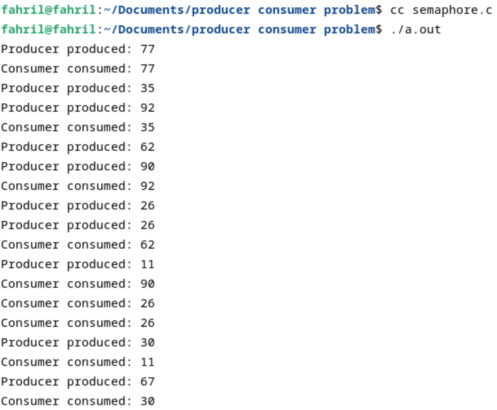
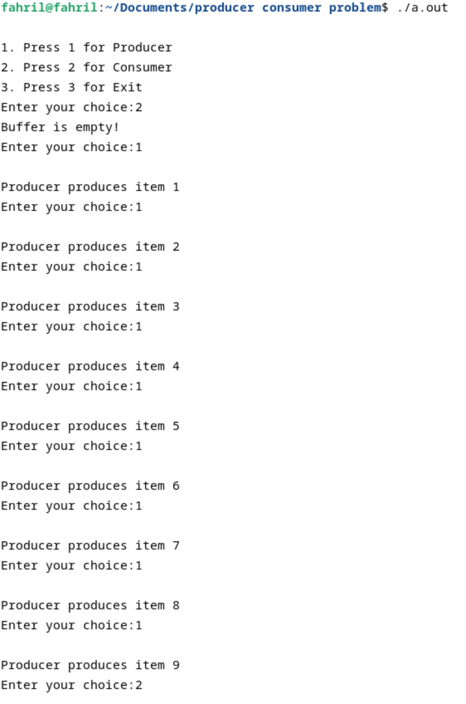
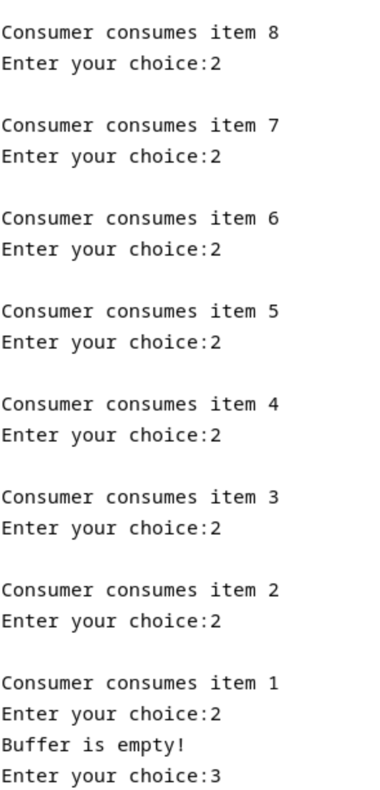

<div align="center">
  <h1 style="text-align: center;font-weight: bold">Praktikum 9<br>Producer Consumer Problem</h1>
  <h4 style="text-align: center;">Dosen Pengampu : Dr. Ferry Astika Saputra, S.T., M.Sc.</h4>
</div>
<br />
<div align="center">
  
  <h3 style="text-align: center;">Disusun Oleh : </h3>
  <p style="text-align: center;">
    <strong>Muhammad Arief Wicaksono Putra Santoso (3123500022)</strong><br>
  </p>
<h3 style="text-align: center;line-height: 1.5">Politeknik Elektronika Negeri Surabaya<br>Departemen Teknik Informatika Dan Komputer<br>Program Studi Teknik Informatika<br>2023/2024</h3>
  <hr><hr>
</div>

# Producer Consumer Semaphore
```
#include <stdio.h>
#include <stdlib.h>
#include <pthread.h>
#include <semaphore.h>
#include <unistd.h>

#define BUFFER_SIZE 5 // Ukuran buffer

int buffer[BUFFER_SIZE];
int in = 0;
int out = 0;

sem_t empty;
sem_t full;
pthread_mutex_t mutex;

void *producer(void *param) {
    int item;
    while (1) {
        sleep(rand() % 3); // Simulasi waktu produksi
        item = rand() % 100; // Menghasilkan item acak
        sem_wait(&empty); // Tunggu jika buffer penuh
        pthread_mutex_lock(&mutex);

        buffer[in] = item;
        printf("Producer produced: %d\n", item);
        in = (in + 1) % BUFFER_SIZE;

        pthread_mutex_unlock(&mutex);
        sem_post(&full); // Sinyalkan bahwa buffer tidak kosong
    }
}

void *consumer(void *param) {
    int item;
    while (1) {
        sleep(rand() % 3); // Simulasi waktu konsumsi
        sem_wait(&full); // Tunggu jika buffer kosong
        pthread_mutex_lock(&mutex);

        item = buffer[out];
        printf("Consumer consumed: %d\n", item);
        out = (out + 1) % BUFFER_SIZE;

        pthread_mutex_unlock(&mutex);
        sem_post(&empty); // Sinyalkan bahwa buffer tidak penuh
    }
}

int main() {
    pthread_t tid1, tid2;

    sem_init(&empty, 0, BUFFER_SIZE);
    sem_init(&full, 0, 0);
    pthread_mutex_init(&mutex, NULL);

    pthread_create(&tid1, NULL, producer, NULL);
    pthread_create(&tid2, NULL, consumer, NULL);

    pthread_join(tid1, NULL);
    pthread_join(tid2, NULL);

    sem_destroy(&empty);
    sem_destroy(&full);
    pthread_mutex_destroy(&mutex);

    return 0;
}
```

Output:


## Analisis Program
Program dengan pendekatan semaphore menunjukkan keunggulan dalam sinkronisasi yang sederhana dan efisien. Dengan menggunakan dua semaphore, yaitu empty dan full, program ini mampu mengendalikan jumlah slot kosong dan item yang ada dalam buffer secara jelas. Operasi semaphore seperti sem_wait dan sem_post biasanya memiliki overhead rendah, membuat metode ini cocok untuk implementasi yang sederhana dan langsung. Namun, kompleksitas manajemen semaphore meningkat seiring dengan bertambahnya jumlah semaphore yang digunakan. Selain itu, debugging menjadi lebih sulit jika terjadi kesalahan sinkronisasi seperti deadlock atau race condition, karena semaphore tidak memberikan informasi kontekstual mengenai keadaan saat ini selain hanya menghitung.

# Producer Consumer Mutex
```
// C program for the above approach
#include <stdio.h>
#include <stdlib.h>

// Initialize a mutex to 1
int mutex = 1;

// Number of full slots as 0
int full = 0;

// Number of empty slots as size
// of buffer
int empty = 10, x = 0;

// Function to produce an item and
// add it to the buffer
void producer()
{
    // Decrease mutex value by 1
    --mutex;

    // Increase the number of full
    // slots by 1
    ++full;

    // Decrease the number of empty
    // slots by 1
    --empty;

    // Item produced
    x++;
    printf("\nProducer produces"
           "item %d",
           x);

    // Increase mutex value by 1
    ++mutex;
}

// Function to consume an item and
// remove it from buffer
void consumer()
{
    // Decrease mutex value by 1
    --mutex;

    // Decrease the number of full
    // slots by 1
    --full;

    // Increase the number of empty
    // slots by 1
    ++empty;
    printf("\nConsumer consumes "
           "item %d",
           x);
    x--;

    // Increase mutex value by 1
    ++mutex;
}

// Driver Code
int main()
{
    int n, i;
    printf("\n1. Press 1 for Producer"
           "\n2. Press 2 for Consumer"
           "\n3. Press 3 for Exit");

// Using '#pragma omp parallel for'
// can  give wrong value due to
// synchronization issues.

// 'critical' specifies that code is
// executed by only one thread at a
// time i.e., only one thread enters
// the critical section at a given time
#pragma omp critical

    for (i = 1; i > 0; i++) {

        printf("\nEnter your choice:");
        scanf("%d", &n);

        // Switch Cases
        switch (n) {
        case 1:

            // If mutex is 1 and empty
            // is non-zero, then it is
            // possible to produce
            if ((mutex == 1)
                && (empty != 0)) {
                producer();
            }

            // Otherwise, print buffer
            // is full
            else {
                printf("Buffer is full!");
            }
            break;

        case 2:

            // If mutex is 1 and full
            // is non-zero, then it is
            // possible to consume
            if ((mutex == 1)
                && (full != 0)) {
                consumer();
            }

            // Otherwise, print Buffer
            // is empty
            else {
                printf("Buffer is empty!");
            }
            break;

        // Exit Condition
        case 3:
            exit(0);
            break;
        }
    }
}
```

Output:



## Analisis Program
Program di atas mengimplementasikan masalah Producer-Consumer menggunakan teknik dasar untuk mengelola akses ke buffer dengan menggunakan variabel integer sederhana sebagai mutex, serta variabel full dan empty untuk melacak jumlah slot yang terisi dan kosong dalam buffer. Program ini memungkinkan pengguna untuk memilih antara memproduksi item oleh produser atau mengonsumsi item oleh konsumen melalui menu input. Produser hanya akan menambahkan item ke buffer jika ada slot kosong (empty tidak nol) dan mutex tersedia (mutex bernilai 1), sedangkan konsumen hanya akan mengonsumsi item dari buffer jika ada item yang tersedia (full tidak nol) dan mutex tersedia.

Dalam setiap operasi produser atau konsumen, nilai mutex diubah untuk mengunci dan membuka akses kritis ke buffer, memastikan bahwa hanya satu thread yang dapat mengakses buffer pada satu waktu. Namun, pendekatan ini memiliki beberapa kelemahan signifikan. Pertama, menggunakan integer sebagai mutex tanpa mekanisme atomic atau alat sinkronisasi yang tepat seperti semaphore atau mutex sebenarnya dalam pustaka threading dapat menyebabkan kondisi balapan (race condition) dan perilaku tak terduga, terutama dalam lingkungan multiproses atau multithreading. Kedua, karena tidak ada mekanisme untuk menunggu mutex menjadi tersedia (seperti wait atau signal pada semaphore), program ini dapat gagal dalam skenario persaingan tinggi atau jika buffer penuh/empty. Selain itu, penggunaan pragma #pragma omp critical dalam komentar mengisyaratkan bahwa kode ini mungkin telah dipertimbangkan untuk paralelisasi menggunakan OpenMP, namun implementasi saat ini tidak benar-benar menggunakan fasilitas OpenMP dengan benar. Secara keseluruhan, meskipun program ini memberikan gambaran dasar tentang bagaimana produser dan konsumen dapat beroperasi, implementasinya perlu disempurnakan dengan alat sinkronisasi yang tepat untuk memastikan keandalan dan keamanan dalam lingkungan multithreading.

# Kesimpulan
Dari segi kesederhanaan, semaphore lebih mudah diimplementasikan dan cocok untuk kasus penggunaan dasar seperti buffer terbatas. Sebaliknya, mutex dan condition variables menawarkan fleksibilitas lebih dalam menangani kondisi sinkronisasi yang kompleks. Kinerja kedua metode dapat bervariasi tergantung pada konteks spesifik. Semaphore cenderung memiliki kinerja yang lebih baik dalam kasus sederhana karena overhead yang lebih rendah, sementara mutex dan condition variables memberikan kontrol yang lebih baik dalam situasi yang kompleks meskipun dengan potensi overhead yang lebih tinggi. Debugging juga lebih mudah dilakukan dengan mutex dan condition variables karena kondisi menunggu lebih jelas dalam kode.